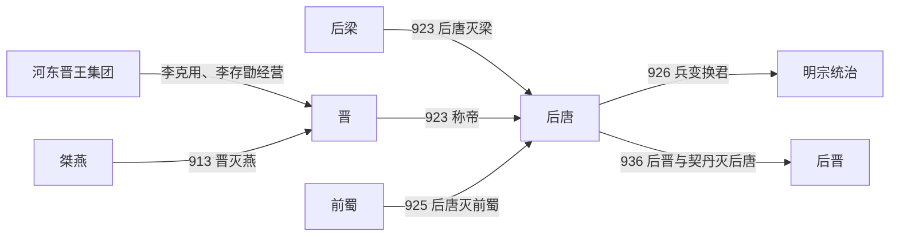

# 后唐

## 时间

923年-936年

## 别称

- 唐
- 李唐
- 沙陀后唐

## 概括

后唐由河东沙陀军事集团建立，开国者李存勖以恢复唐朝为号召灭后梁。后唐疆域一度较广，后唐明宗李嗣源时期国力较强，但继承斗争和军镇矛盾削弱政权。936年石敬瑭借契丹兵反叛，同年后唐灭亡。

## 兴起、发展与覆亡

- **建立背景**：后唐源自李克用经营的河东晋王集团。它依托太原、沙陀军队及与河北藩镇的联盟，在唐亡后继续以“复唐”为政治号召，与后梁争夺黄河以北。
- **崛起机制**：李存勖继承晋王后，先稳住河东，再取得柏乡等战役胜利，吞并桀燕，并利用后梁拆分魏博军引发的兵变控制河北南部。923年他称帝，同年突袭汴京灭后梁，把河东军事集团转换为中原王朝。
- **扩张与鼎盛**：灭梁后，后唐控制华北、中原，并于925年攻灭前蜀，疆域达到高点。李嗣源在926年兵变中即位后，减轻部分苛敛、整顿吏治并倚重州县行政，形成后唐相对稳定的阶段。
- **统治矛盾**：政权同时依赖沙陀亲军、收编的后梁军、河北军镇和文官财政，各集团利益难以整合。庄宗宠任伶人和近臣、赏罚失衡，引发军心离散；明宗晚年后，枢密重臣、禁军和地方节度使又围绕继承人反复角力。
- **结构性衰落**：926年兴教门之变说明皇帝无法稳定控制军队；933—934年的废立与内战进一步破坏继承秩序。河东节度使石敬瑭掌握独立军镇，中央若强行调动便可能引发反叛。
- **直接灭亡**：936年李从珂下令调石敬瑭离开河东，石敬瑭在太原起兵并向契丹求援，承诺称臣及割让燕云地区。契丹军击败后唐讨伐军，石敬瑭建立后晋并进逼洛阳；李从珂携宗室自焚，后唐灭亡。

## 重要事件

| 时间 | 事件 | 过程与影响 |
|---|---|---|
| 908—915年 | 晋王集团扩张 | 李存勖稳固河东、争取河北军镇，形成对后梁的北方优势。 |
| 923年 | 称帝并灭后梁 | 后唐建立后突袭汴京，取代后梁成为中原王朝。 |
| 925年 | 灭前蜀 | 后唐迅速控制四川，但远征后的赏罚与军政处置也加深内部矛盾。 |
| 926年 | 邺都兵变与兴教门之变 | 李嗣源被军队拥立，李存勖在洛阳兵变中身亡，统治集团重组。 |
| 934年 | 李从珂夺位 | 李从厚试图调动强藩失败，李从珂起兵入洛阳，继承秩序再次破裂。 |
| 936年 | 石敬瑭借契丹灭唐 | 河东反叛与契丹干预结合，后唐在洛阳覆亡。 |

## 演进流程

## 说明

- 后唐前身是唐末河东晋王集团，核心人物包括李克用和李存勖。
- 923年，李存勖灭后梁，在中原建立后唐。
- 后唐明宗李嗣源时期政治相对稳定，国力有所恢复。
- 934年以后，继承争夺加剧，李从珂夺位。
- 石敬瑭以割让燕云十六州为代价引契丹援军南下，后唐末帝李从珂自焚，后唐亡。

## 统治结构

| 角色 | 人物 / 机构 | 说明 |
|---|---|---|
| 君主 | 李存勖、李嗣源、李从厚、李从珂 | 以后唐皇帝为最高统治者。 |
| 军事基础 | 河东沙陀集团 | 后唐政权的核心军政集团。 |
| 外部力量 | 契丹 | 参与石敬瑭灭后唐过程。 |

## 晋王与追尊先祖

| 姓名 | 身份 / 庙号 | 谥号 | 时间 | 说明 |
|---|---|---|---|---|
| 朱邪尽忠 | 晋王系先祖 | 无 | 不详-808年 | 沙陀朱邪氏先人。 |
| 朱邪执宜 | 唐懿祖 | 昭烈皇帝 | 808年-835年 | 唐庄宗追崇。 |
| 李国昌（朱邪赤心） | 唐献祖 | 文景皇帝 | 835年-887年 | 唐庄宗追崇。 |
| **李克用** | 唐太祖 | 武帝 | 887年-907年 | 河东晋王，后唐奠基者，唐庄宗追崇。 |
| 李存勖 | 晋王 | 无 | 908年-923年 | 先为晋王，后称帝建立后唐。 |
| 李聿 | 唐惠祖 | 孝恭皇帝 | 不详 | 唐明宗追崇。 |
| 李教 | 唐毅祖 | 孝质皇帝 | 不详 | 唐明宗追崇。 |
| 李琰 | 唐烈祖 | 孝靖皇帝 | 不详 | 唐明宗追崇。 |
| 李霓 | 唐德祖 | 孝成皇帝 | 不详 | 唐明宗追崇。 |

## 君主世系

| 顺序 | 姓名 | 庙号 | 谥号 | 年号 | 在位时间 | 生卒时间 | 与前任关系 | 关键事件 / 备注 |
|---:|---|---|---|---|---|---|---|---|
| 1 | **李存勖** | 唐庄宗 | 光圣神闵孝皇帝 | 同光 | 923年-926年 | 885年-926年 | 开国君主 | 灭后梁建后唐；后因兵变遇害。 |
| 2 | **李嗣源**（李亶） | 唐明宗 | 圣德和武钦孝皇帝 | 天成、长兴 | 926年-933年 | 867年-933年 | 李克用养子，李存勖义兄弟辈 | 明宗时期政治相对稳定，后唐国力较强。 |
| 3 | 李从厚 | 无 | 闵帝 | 应顺 | 933年-934年 | 914年-934年 | 李嗣源子 | 在位短暂，被李从珂推翻。 |
| 4 | **李从珂** | 无 | 末帝 | 清泰 | 934年-937年 | 885年-937年 | 李嗣源养子 | 石敬瑭引契丹兵攻入洛阳，李从珂自焚，后唐亡。 |

## 演变关系

- 前一节点：[后梁](/%E4%BA%BA%E6%96%87%E7%A7%91%E5%AD%A6/%E5%8E%86%E5%8F%B2/%E4%B8%9C%E4%BA%9A/%E4%B8%AD%E5%9B%BD/%E4%BA%94%E4%BB%A3/%E4%BA%94%E4%BB%A3/%E6%A2%81%EF%BC%88%E6%9C%B1%EF%BC%89.md)。李存勖灭后梁而建立后唐。
- 后一节点：[后晋](/%E4%BA%BA%E6%96%87%E7%A7%91%E5%AD%A6/%E5%8E%86%E5%8F%B2/%E4%B8%9C%E4%BA%9A/%E4%B8%AD%E5%9B%BD/%E4%BA%94%E4%BB%A3/%E4%BA%94%E4%BB%A3/%E6%99%8B%EF%BC%88%E7%9F%B3%EF%BC%89.md)。石敬瑭依契丹灭后唐，建立后晋。
