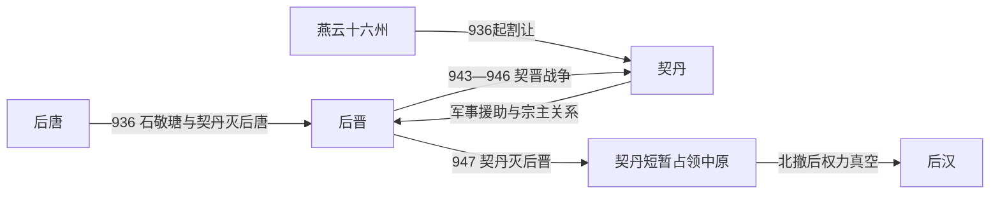

# 后晋

## 时间

936年-947年

## 别称

- 晋
- 石晋

## 概括

后晋由石敬瑭在契丹支持下建立。石敬瑭以称臣、割让燕云十六州为代价灭后唐，建立后晋。后晋继位者石重贵与契丹关系恶化，947年契丹南下攻入开封，后晋灭亡。

## 兴起、发展与覆亡

- **建立背景**：石敬瑭是后唐河东节度使，也是明宗李嗣源的女婿。末帝李从珂即位后，中央与河东军镇互相猜忌；936年调镇命令触发石敬瑭起兵，使后唐内部的军镇矛盾转化为王朝更替。
- **崛起机制**：石敬瑭自身兵力不足，向契丹主耶律德光求援，以称臣、岁输财物并割让燕云十六州为条件换取骑兵支持。契丹解太原之围并击溃后唐军，石敬瑭由此称帝，随后进入开封。
- **维系统治**：后晋沿用后唐的官僚、禁军和州县税收体系，定都开封；石敬瑭对契丹谨慎臣服，同时镇压范延光、安重荣、安从进等反叛。政权因此暂时稳定，却持续消耗军费并加深将领离心。
- **鼎盛与局限**：中原农业区和汴洛交通使后晋尚能维持朝廷运作，但燕云十六州的割让使北部山地防线与重要军镇落入契丹，后晋在安全和外交上都缺乏自主空间。
- **结构性衰落**：建立合法性依赖外援，国内军将又多由后唐旧部组成；臣服契丹造成政治压力，反契丹路线则缺少可依托的边防纵深。942年石重贵继位后“称孙不称臣”，契晋关系迅速恶化。
- **直接灭亡**：943—946年契丹多次南下。946年后晋主力北伐时，统帅杜重威在滹沱河一带向契丹投降，中原门户洞开；947年契丹军进入开封，石重贵出降，后晋灭亡。契丹难以长期控制中原并随后北撤，留下后汉兴起的权力真空。

## 重要事件

| 时间 | 事件 | 过程与影响 |
|---|---|---|
| 936年 | 太原起兵 | 石敬瑭反后唐并请求契丹出兵，军镇冲突演变为跨政权战争。 |
| 936—938年 | 燕云割让 | 契丹取得北方战略州郡，后晋安全长期受制于北方强邻。 |
| 937—938年 | 范延光之乱 | 魏博强藩反叛，后晋以围困和招降方式平定，暴露地方军镇仍具独立力量。 |
| 941—942年 | 安重荣、安从进反叛 | 两场叛乱被镇压，但进一步消耗中央军力与财政。 |
| 943—946年 | 契晋战争 | 石重贵转向强硬，契丹连续南征，双方进入消耗战。 |
| 947年 | 契丹灭晋 | 杜重威降敌，开封失守，石重贵被俘。 |

## 演进流程

## 说明

- 936年，石敬瑭反后唐，依靠契丹军事支持称帝。
- 石敬瑭向契丹称臣，并割让燕云十六州，使辽取得南下战略要地。
- 石重贵继位后对契丹态度转硬，契晋关系恶化。
- 947年，契丹军攻入开封，石重贵被俘，后晋灭亡。
- 契丹灭后晋后曾短暂占据中原，随后北撤。

## 统治结构

| 角色 | 人物 / 机构 | 说明 |
|---|---|---|
| 君主 | 石敬瑭、石重贵 | 石氏皇帝为最高统治者。 |
| 外部宗主 / 军事支持 | 契丹 / 辽 | 后晋建立依赖契丹支持，后又被契丹灭亡。 |
| 中原军政基础 | 河东、后唐旧军镇系统 | 后晋仍延续五代军镇政治。 |

## 追尊先祖

| 姓名 | 庙号 | 谥号 | 说明 |
|---|---|---|---|
| 石璟 | 晋靖祖 | 孝安皇帝 | 晋高祖追崇。 |
| 石彬 | 晋肃祖 | 孝简皇帝 | 晋高祖追崇。 |
| 石昱 | 晋睿祖 | 孝平皇帝 | 晋高祖追崇。 |
| 石绍雍 | 晋献祖 / 晋宪祖 | 孝元皇帝 | 晋高祖追崇。 |

## 君主世系

| 顺序 | 姓名 | 庙号 | 谥号 | 年号 | 在位时间 | 生卒时间 | 与前任关系 | 关键事件 / 备注 |
|---:|---|---|---|---|---|---|---|---|
| 1 | **石敬瑭** | 晋高祖 | 圣文章武明德孝皇帝 | 天福 | 936年-942年 | 892年-942年 | 开国君主 | 依契丹灭后唐，建立后晋；割让燕云十六州。 |
| 2 | **石重贵** | 无 | 出帝 / 少帝 | 天福、开运 | 942年-947年 | 914年-974年 | 石敬瑭侄，养子 | 与契丹关系恶化；947年后晋被契丹灭亡。 |

## 演变关系

- 前一节点：[后唐](/%E4%BA%BA%E6%96%87%E7%A7%91%E5%AD%A6/%E5%8E%86%E5%8F%B2/%E4%B8%9C%E4%BA%9A/%E4%B8%AD%E5%9B%BD/%E4%BA%94%E4%BB%A3/%E4%BA%94%E4%BB%A3/%E5%94%90%EF%BC%88%E6%9D%8E%EF%BC%89.md)。石敬瑭借契丹兵灭后唐。
- 后一节点：[后汉](/%E4%BA%BA%E6%96%87%E7%A7%91%E5%AD%A6/%E5%8E%86%E5%8F%B2/%E4%B8%9C%E4%BA%9A/%E4%B8%AD%E5%9B%BD/%E4%BA%94%E4%BB%A3/%E4%BA%94%E4%BB%A3/%E6%B1%89%EF%BC%88%E5%88%98%EF%BC%89.md)。契丹灭后晋后北撤，刘知远据中原建立后汉。
- 并行影响：契丹取得燕云十六州，辽宋对峙格局由此埋下关键伏笔。
