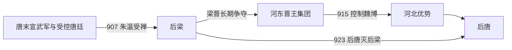

# 后梁

## 时间

907年-923年

## 别称

- 梁
- 朱梁

## 概括

后梁是朱温篡唐后建立的五代第一个中原王朝。它继承唐末宣武军节度使集团，以汴州、洛阳为核心，但始终受到河东李克用、李存勖集团挑战。923年后唐军攻入开封，后梁灭亡。

## 兴起、发展与覆亡

- **建立背景**：朱温原为黄巢军将，降唐后获赐名朱全忠，并以宣武军节度使身份控制汴州。唐末藩镇混战中，他先后击败或兼并河南、山东一带的对手，掌握运河交通和中原财赋，又在控制唐昭宗后迁都洛阳、清除异己，逐步把唐廷变成权力合法化工具。
- **崛起机制**：后梁的基础不是完整继承唐帝国，而是“强藩军事集团＋中原州县财赋＋唐朝禅让名义”的组合。907年朱温受禅称帝后，仍需以战争迫使河北、关中和南方诸镇承认其正统。
- **发展阶段**：前期以汴州为军政中心，与河东李克用、李存勖的晋王集团围绕河北展开长期战争；后期虽一度占有中原腹地，却无法消灭河东，并在魏博等军镇倒向晋后丧失北方屏障。
- **鼎盛条件**：汴州临近黄河与大运河，便于汇集粮税、快速调兵；朱温长期经营宣武军，且能利用唐朝官僚与州县行政维持征收。这使后梁在建国初年拥有比多数地方政权更强的动员能力。
- **结构性衰落**：政权过度依赖朱温个人威望与军将忠诚，宗室继承缺少稳定规则；频繁战争和苛重征敛削弱地方承受力。912年弑君夺位、913年再次兵变后，宫廷与军队互不信任，边镇更易转向晋王集团。
- **直接灭亡**：923年李存勖称帝建立后唐，乘后梁主力配置失误，令李嗣源等由郓州方向突袭汴京。后梁援军未及回救，朱友贞命近臣杀死自己，后梁的州县与军队随即被后唐接收。

## 重要事件

| 时间 | 事件 | 过程与影响 |
|---|---|---|
| 904年 | 迁唐都洛阳 | 朱温迫唐昭宗东迁并进一步控制朝廷，随后唐室政治自主性基本丧失。 |
| 907年 | 代唐建梁 | 唐哀帝禅位，后梁建立；唐末藩镇竞争转化为多个政权公开争夺正统。 |
| 912年 | 朱友珪弑父 | 朱温遇害，皇位以宫廷暴力转移，削弱朱氏统治的凝聚力。 |
| 915年 | 魏博倒向晋 | 后梁分割魏博军的计划激起兵变，李存勖乘机控制河北南部的重要军镇。 |
| 923年 | 后唐灭梁 | 后唐军突入汴京，朱友贞死，后梁政权终结。 |

## 演进流程

## 说明

- 907年，朱温迫唐哀帝禅位，唐朝灭亡，五代时期开始。
- 后梁与河东晋王李克用、李存勖长期争夺中原正统。
- 912年，朱温被次子朱友珪所杀，后梁内部继承秩序进一步动摇。
- 913年，朱友贞夺位，是后梁末代君主。
- 923年，后唐军进逼开封，朱友贞自杀，后梁灭亡。

## 统治结构

| 角色 | 人物 / 机构 | 说明 |
|---|---|---|
| 君主 | 朱温、朱友珪、朱友贞 | 朱氏皇帝掌握名义最高权力。 |
| 军事基础 | 宣武军、汴州军政集团 | 后梁由唐末藩镇势力转化而来。 |
| 主要对手 | 河东李氏集团 | 后唐前身，最终灭后梁。 |

## 追尊先祖

| 姓名 | 庙号 | 谥号 | 说明 |
|---|---|---|---|
| 朱黯 | 梁肃祖 | 宣元皇帝 | 梁太祖追崇。 |
| 朱茂琳 | 梁敬祖 | 光献皇帝 | 梁太祖追崇。 |
| 朱信 | 梁宪祖 | 昭武皇帝 | 梁太祖追崇。 |
| 朱诚 | 梁烈祖 | 文穆皇帝 | 梁太祖追崇。 |

## 君主世系

| 顺序 | 姓名 | 庙号 | 谥号 | 年号 | 在位时间 | 生卒时间 | 与前任关系 | 关键事件 / 备注 |
|---:|---|---|---|---|---|---|---|---|
| 1 | **朱温**（朱全忠、朱晃） | 梁太祖 | 神武元圣孝皇帝 | 开平、乾化 | 907年-912年 | 852年-912年 | 开国君主 | 907年篡唐建后梁；912年为朱友珪所杀。 |
| 2 | 朱友珪 | 无 | 郢王 | 凤历 | 912年-913年 | 不详-913年 | 朱温次子 | 弑父夺位；913年为禁军所杀。 |
| 3 | **朱友贞** | 无 | 末帝 | 乾化、贞明、龙德 | 913年-923年 | 888年-923年 | 朱温子 | 923年后唐军入开封，自杀，后梁亡。 |

## 演变关系

- 前一节点：[唐朝](/%E4%BA%BA%E6%96%87%E7%A7%91%E5%AD%A6/%E5%8E%86%E5%8F%B2/%E4%B8%9C%E4%BA%9A/%E4%B8%AD%E5%9B%BD/%E5%94%90/README.md)。朱温篡唐，唐朝灭亡。
- 后一节点：[后唐](/%E4%BA%BA%E6%96%87%E7%A7%91%E5%AD%A6/%E5%8E%86%E5%8F%B2/%E4%B8%9C%E4%BA%9A/%E4%B8%AD%E5%9B%BD/%E4%BA%94%E4%BB%A3/%E4%BA%94%E4%BB%A3/%E5%94%90%EF%BC%88%E6%9D%8E%EF%BC%89.md)。李存勖灭后梁，建立后唐。
