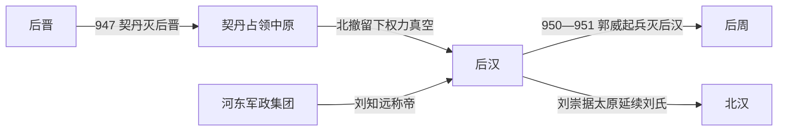

# 后汉

## 时间

947年-951年

## 别称

- 汉
- 刘汉

## 概括

后汉由刘知远在契丹灭后晋后建立，是五代中寿命最短的中原王朝。刘知远趁契丹军北撤进入中原，恢复汉人政权号召，但继位者刘承祐与功臣、军将关系恶化，最终郭威起兵，后汉灭亡。

## 兴起、发展与覆亡

- **建立背景**：947年契丹灭后晋并占领开封，但北方军队面临补给、反抗和统治成本压力。河东节度使刘知远保存了太原军力，先观望局势，继而称帝，利用契丹北撤后的权力真空接收洛阳、开封和后晋旧官僚军队。
- **崛起机制**：刘知远以河东精兵为核心，以恢复中原秩序和承接后晋行政为号召，避免与撤退中的契丹主力正面决战，因而能较快取得州县承认。但这种“接收式建国”没有消除各军镇的独立性。
- **短暂维系**：刘知远入汴后改国号汉，依靠杨邠、郭威、史弘肇、王章等文武重臣掌军、理财和维持朝廷。948年刘知远病逝，十八岁的刘承祐继位，开国功臣形成辅政集团。
- **结构性衰落**：后汉疆域尚未稳固，财政征敛沉重，皇帝又缺乏自己的成熟班底。年轻皇帝与顾命大臣之间不存在制度化制衡；宫廷试图用一次性清洗重夺权力，反而迫使掌兵将领以叛乱自保。
- **直接灭亡**：950年刘承祐诛杀杨邠、史弘肇、王章，并命人谋杀在外统军的郭威。郭威从邺都起兵，后汉军在开封附近溃败，刘承祐遇杀。朝廷一度拟立刘赟，但郭威控制军队并在951年称帝建立后周。
- **政权余脉**：刘知远之弟刘崇不承认郭威，以太原和河东军镇为基础建立北汉，并依辽抗周、抗宋；因此后汉的灭亡既产生中原的后周，也留下北方并立政权。

## 重要事件

| 时间 | 事件 | 过程与影响 |
|---|---|---|
| 947年 | 刘知远称帝 | 契丹占领中原后，刘知远在太原建国并接收汴洛。 |
| 947年 | 契丹北撤 | 中原统治成本与各地反抗迫使契丹撤退，后汉取得扩张机会。 |
| 948年 | 隐帝继位 | 刘知远去世，年轻的刘承祐依靠顾命大臣执政。 |
| 950年 | 诛杀辅臣 | 皇帝集中清洗杨邠等重臣，并图杀郭威，打破朝廷与军队的脆弱平衡。 |
| 950—951年 | 郭威起兵 | 邺都军南下，后汉军瓦解，刘承祐死。 |
| 951年 | 周、北汉分立 | 郭威建后周；刘崇据太原建北汉，后汉政治遗产分成两支。 |

## 演进流程

## 说明

- 947年，契丹灭后晋后北撤，刘知远在太原称帝，随后进入中原。
- 刘知远在位时间很短，948年去世。
- 刘承祐继位后猜忌大臣和军将，引发政局动荡。
- 951年，郭威取代后汉，建立后周。
- 刘知远弟刘崇后来在太原建立北汉，作为后汉刘氏余脉继续存在。

## 统治结构

| 角色 | 人物 / 机构 | 说明 |
|---|---|---|
| 君主 | 刘知远、刘承祐 | 刘氏皇帝为最高统治者。 |
| 军事基础 | 河东军政集团 | 刘知远以太原为起点进入中原。 |
| 重要将领 | 郭威 | 后汉重臣，后取代后汉建立后周。 |

## 追尊先祖

| 姓名 | 庙号 | 谥号 | 说明 |
|---|---|---|---|
| 刘湍 | 汉文祖 | 明元皇帝 | 汉高祖追崇。 |
| 刘昂 | 汉德祖 | 恭僖皇帝 | 汉高祖追崇。 |
| 刘僎 | 汉翼祖 | 昭宪皇帝 | 汉高祖追崇。 |
| 刘琠 | 汉显祖 | 章圣皇帝 | 汉高祖追崇。 |

## 君主世系

| 顺序 | 姓名 | 庙号 | 谥号 | 年号 | 在位时间 | 生卒时间 | 与前任关系 | 关键事件 / 备注 |
|---:|---|---|---|---|---|---|---|---|
| 1 | **刘知远** | 汉高祖 | 睿文圣武昭肃孝皇帝 | 天福、乾祐 | 947年-948年 | 895年-948年 | 开国君主 | 乘契丹陷开封、北撤之际称帝，建立后汉。 |
| 2 | **刘承祐** | 无 | 隐帝 | 乾祐 | 948年-951年 | 930年-951年 | 刘知远子 | 猜忌功臣引发郭威兵变；后汉亡。 |

### 未正式即位者

| 姓名 | 身份 / 称号 | 时间 | 与皇室关系 | 说明 |
|---|---|---|---|---|
| 刘赟 | 湘阴公；后被北汉追谥为顺帝 | 951年被迎立，未即位 | 刘崇子、刘知远侄 | 刘承祐死后，后汉旧臣拟迎其继位；郭威掌权后将其控制并杀害。因未完成即位，不列入正式君主顺序。 |

## 演变关系

- 前一节点：[后晋](/%E4%BA%BA%E6%96%87%E7%A7%91%E5%AD%A6/%E5%8E%86%E5%8F%B2/%E4%B8%9C%E4%BA%9A/%E4%B8%AD%E5%9B%BD/%E4%BA%94%E4%BB%A3/%E4%BA%94%E4%BB%A3/%E6%99%8B%EF%BC%88%E7%9F%B3%EF%BC%89.md)。契丹灭后晋后，刘知远承接中原权力真空。
- 后一节点：[后周](/%E4%BA%BA%E6%96%87%E7%A7%91%E5%AD%A6/%E5%8E%86%E5%8F%B2/%E4%B8%9C%E4%BA%9A/%E4%B8%AD%E5%9B%BD/%E4%BA%94%E4%BB%A3/%E4%BA%94%E4%BB%A3/%E5%91%A8%EF%BC%88%E9%83%AD%EF%BC%89.md)。郭威取代后汉建立后周。
- 分支节点：[北汉](/%E4%BA%BA%E6%96%87%E7%A7%91%E5%AD%A6/%E5%8E%86%E5%8F%B2/%E4%B8%9C%E4%BA%9A/%E4%B8%AD%E5%9B%BD/%E4%BA%94%E4%BB%A3/%E5%8D%81%E5%9B%BD/%E5%8C%97%E6%B1%89.md)。刘崇据太原延续后汉刘氏势力。
