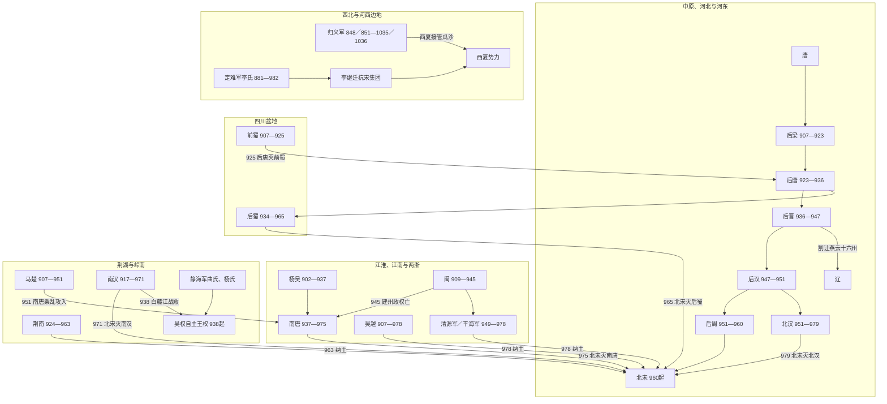

# 五代十国时空图

## 阅读范围

这张时空图把五代十国放在同一张“时间—区域”框架中理解：

- **时间轴**从唐末藩镇割据延伸到979年北汉灭亡，并旁及延续更久的归义军、定难军。
- **空间轴**区分中原与河东、江淮与两浙、荆湖与岭南、四川、河西与西北边地。
- 同一时期并不存在一个覆盖全域的“五代十国体系”；中原五代争夺全国正统，南方王国多经营区域秩序，边地军镇则以册封、贸易和军事缓冲维持自治。

## 时空演进图

## 分时段观察

| 时间截面 | 中原与河东 | 江淮、江南 | 荆湖、岭南与四川 | 边地 |
|---|---|---|---|---|
| 约900年 | 唐廷受朱温、李克用等强藩挤压；岐、赵、卢龙等军镇并立 | 杨行密控制淮南，钱镠经营两浙，王氏经营福建 | 王建据四川，马殷据湖南，刘氏扩展岭南 | 归义军已收缩到瓜沙核心；夏州李氏形成世袭 |
| 约925年 | 后唐刚灭后梁，并向河北、四川扩张 | 杨吴由徐温集团掌实权；吴越、闽奉中原正朔 | 前蜀被后唐攻灭；荆南形成王国；南汉已称帝 | 定难军、归义军随中原更替改奉正朔 |
| 约950年 | 后汉短命，后周将起；北汉随后据太原 | 南唐扩张，吴越守两浙；闽已分裂，清源军形成 | 后蜀长期稳定；马楚陷入继承战争；南汉控制岭南 | 曹氏归义军通过联姻贸易维持瓜沙；定难军李氏稳定 |
| 约965年 | 北宋承接后周，先稳固中原 | 南唐、吴越、清源军已向宋称臣或寻求册封 | 宋先收荆南、湖南，再灭后蜀；南汉失去北方缓冲 | 定难军奉宋而保持自治，归义军仍独立于瓜沙 |
| 979年以后 | 北汉灭，北宋完成对主要汉地割据政权的整合，但燕云仍属辽 | 吴越、清源军纳土，江南州县并入宋 | 南汉、南唐已亡；交趾吴氏王权延续自身发展 | 李继迁抗宋集团与曹氏归义军仍说明边地整合尚未完成 |

## 空间格局与交通

| 区域 | 核心城市 / 通道 | 战略意义 | 典型政权 |
|---|---|---|---|
| 中原—河北 | 开封、洛阳、太原；黄河与太行山通道 | 掌握全国正统名义、北方粮赋与对辽防线，也是军镇兵变最频繁区域 | 五代、赵、桀燕、北汉 |
| 江淮—江南 | 扬州、金陵、杭州；淮河、长江和运河 | 水运与财赋密集；淮南是中原政权南下的第一道屏障 | 杨吴、南唐、吴越 |
| 荆湖 | 江陵、潭州；长江中游与湘江 | 连接四川、岭南和江南，控制此区即可分割南方诸国 | 荆南、马楚 |
| 四川 | 成都；剑门、秦岭与三峡 | 盆地易守、物产丰富，但一旦北方与峡江两路同时受敌便难以互援 | 前蜀、后蜀 |
| 岭南—交趾 | 广州、交州；南岭通道与沿海航路 | 海贸提供财赋；南汉与静海军的战争重塑交趾政治走向 | 南汉、静海军 |
| 福建 | 福州、建州、泉州；山岭与海路 | 山地造成内部区域分隔，港口又使地方政权可依赖海贸 | 闽、清源军 |
| 河西—陕北 | 敦煌、夏州；河西走廊与草原—农耕交界 | 距中原远、周边力量多，名义册封与实际自治常长期并存 | 归义军、定难军 |

## 统一并非单一路线

北宋的统一顺序反映了交通和风险计算：先在963年以荆南为通道控制湖南，再于965年取后蜀、971年灭南汉、975年灭南唐；吴越和清源军在978年纳土，最后集中力量于979年攻克有辽援的北汉。西北的定难军、归义军以及交趾吴氏王权并未随这一过程同步纳入北宋，说明“五代十国结束”主要是中原与南方主要割据政权整合完成，而不是所有边疆政治空间在同一年统一。

## 导航

- [五代](/%E4%BA%BA%E6%96%87%E7%A7%91%E5%AD%A6/%E5%8E%86%E5%8F%B2/%E4%B8%9C%E4%BA%9A/%E4%B8%AD%E5%9B%BD/%E4%BA%94%E4%BB%A3/%E4%BA%94%E4%BB%A3/README.md)
- [十国](/%E4%BA%BA%E6%96%87%E7%A7%91%E5%AD%A6/%E5%8E%86%E5%8F%B2/%E4%B8%9C%E4%BA%9A/%E4%B8%AD%E5%9B%BD/%E4%BA%94%E4%BB%A3/%E5%8D%81%E5%9B%BD/README.md)
- [其他政权与边地军镇](/%E4%BA%BA%E6%96%87%E7%A7%91%E5%AD%A6/%E5%8E%86%E5%8F%B2/%E4%B8%9C%E4%BA%9A/%E4%B8%AD%E5%9B%BD/%E4%BA%94%E4%BB%A3/%E5%90%8E%E6%B1%89%E5%8F%8A%E5%85%B6%E4%BB%96%E6%94%BF%E6%9D%83/README.md)

## 原有时空图

