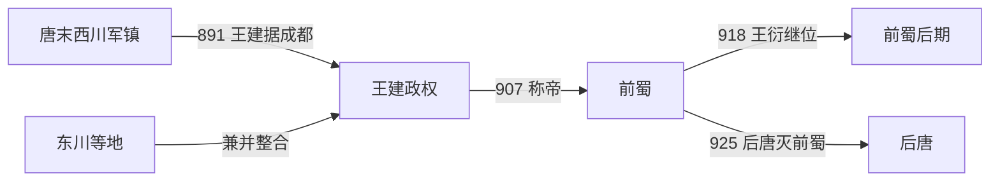

# 前蜀

## 时间

907年-925年

## 概括

前蜀是王建据四川建立的十国之一。它以成都为中心，承接唐末西川节度使势力，在五代初期控制四川盆地。925年后唐出兵攻蜀，前蜀灭亡。

## 建立、发展与覆亡

- **建立背景**：唐末四川先后经历军阀冲突，王建由忠武军将领进入蜀地，891年攻取成都并控制西川。此后他兼并东川等地，依托剑门险阻和成都平原，把多个军镇整合为区域政权。
- **崛起机制**：王建一面接受唐廷的节度使、蜀王等名号，一面收编地方军队、任用士人并掌握盐铁与州县赋税。907年唐亡后称帝，使既有藩镇统治转化为王朝。
- **鼎盛条件**：四川盆地地形封闭、农业和手工业基础较强，又接纳晚唐战乱中的人口与文士。中原五代忙于梁晋战争，前蜀得以减少外部干预，并控制通往汉中、峡江和西南的交通。
- **转折与衰落**：918年王建死后，王衍继位。宫廷与近臣争权、巡游和消费增加，边防将领缺少统一指挥；依靠地理屏障形成的安全感，也使朝廷低估后唐完成中原整合后的进攻能力。
- **直接灭亡**：925年后唐从凤翔、陕南方向大举入蜀，前蜀北部防线迅速崩溃。枢密使宋光嗣等决策失当，王宗弼控制成都并主张投降，王衍出降；后唐随后处置降臣，四川转入后唐军政体系。

## 重要事件

| 时间 | 事件 | 过程与影响 |
|---|---|---|
| 891年 | 王建入成都 | 王建取得西川，形成前蜀政权的核心。 |
| 903年 | 受封蜀王 | 唐廷承认王建的区域地位，政权获得名义合法性。 |
| 907年 | 称帝建蜀 | 唐亡后王建称帝，前蜀正式建立。 |
| 918年 | 王衍继位 | 创业君主去世，宫廷政治与军事管理逐渐失衡。 |
| 925年 | 后唐伐蜀 | 北部防线瓦解，王衍投降，前蜀灭亡。 |

## 演进流程

## 说明

- 王建原为唐末军将，后据西川称帝。
- 前蜀地处四川盆地，较少直接卷入中原五代更替。
- 王衍继位后政局趋于衰弱。
- 925年，后唐攻灭前蜀，四川短暂归入后唐控制。

## 统治结构

| 角色 | 人物 / 机构 | 说明 |
|---|---|---|
| 君主 | 王建、王衍 | 王氏皇帝为最高统治者。 |
| 地域核心 | 成都、四川盆地 | 前蜀的统治基础。 |
| 外部压力 | 后唐 | 后唐最终灭前蜀。 |

## 君主世系

| 顺序 | 姓名 | 庙号 | 谥号 | 在位时间 | 与前任关系 | 关键事件 / 备注 |
|---:|---|---|---|---|---|---|
| 1 | **王建** | 高祖 | 神武圣文孝德明惠皇帝 | 907年-918年 | 开国君主 | 据蜀称帝，建立前蜀。 |
| 2 | **王衍** | 无 | 圣德明孝皇帝 | 918年-925年 | 王建子 | 925年后唐灭前蜀。 |

## 演变关系

- 前一节点：唐末西川藩镇割据。
- 后一节点：[后蜀](/%E4%BA%BA%E6%96%87%E7%A7%91%E5%AD%A6/%E5%8E%86%E5%8F%B2/%E4%B8%9C%E4%BA%9A/%E4%B8%AD%E5%9B%BD/%E4%BA%94%E4%BB%A3/%E5%8D%81%E5%9B%BD/%E5%90%8E%E8%9C%80.md)。前蜀亡后，四川后来由孟知祥建立后蜀。
