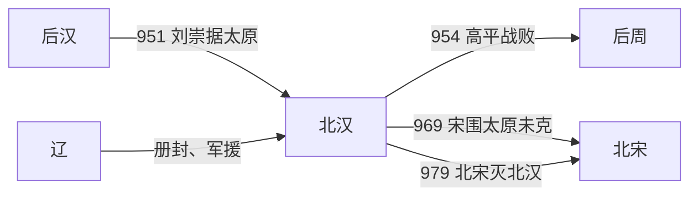

# 北汉

## 时间

951年-979年

## 概括

北汉是后汉刘氏余部据太原建立的十国政权，也是十国中最后灭亡的一国。刘崇在郭威取代后汉后称帝，依靠辽的支持抗衡后周和北宋。979年宋太宗赵光义攻灭北汉，五代十国格局结束。

## 建立、抗争与覆亡

- **建立背景**：951年郭威取代后汉后，后汉高祖之弟、河东节度使刘崇拒绝承认后周，在太原称帝并沿用后汉国号与年号。北汉由此既是河东军镇，也是后汉刘氏的继承政权。
- **生存机制**：北汉控制太原盆地及山西北中部部分州县，地形险要、城防坚固。因人口和财赋远少于中原，刘氏向辽称臣，借辽骑兵和北部通道牵制后周、北宋，以外援弥补兵力不足。
- **关键挫折**：954年刘旻联合辽军南下，在高平被后周世宗击败，主动夺取中原的可能性基本消失。此后北汉转为守势，依靠太原城、山地关隘和辽援抵抗多次围攻。
- **长期维系**：刘承钧在位十六年，维持官僚和军镇运作；刘继恩遇刺后刘继元继位。969年宋太祖围太原，因辽援、补给及水患等因素撤军，说明北汉虽弱，仍能把地理与外部联盟转化为防御能力。
- **结构性衰落**：长期战争使有限户口承担沉重军费，对辽援的依赖又限制外交选择。宋朝逐步统一南方后，可以集中全国财赋围攻太原，并先以军队阻断辽的救援路线。
- **直接灭亡**：979年宋太宗亲征，宋军一面围困太原，一面在北方击退辽援。城中粮援断绝，刘继元出降，北汉灭亡；传统五代十国主要政权由此全部结束。

## 重要事件

| 时间 | 事件 | 过程与影响 |
|---|---|---|
| 951年 | 刘旻建北汉 | 承接后汉刘氏与河东军镇，依辽抗周。 |
| 954年 | 高平之战 | 北汉、辽联军败于后周，战略转入长期防御。 |
| 954—970年 | 刘承钧统治 | 依托太原和辽援维持政权，是北汉相对稳定阶段。 |
| 969年 | 宋太祖围太原 | 宋军未能攻克，北汉防御体系暂时经受住考验。 |
| 970年 | 连续继承危机 | 刘继恩短暂即位后遇刺，刘继元继位。 |
| 976年 | 宋再次进攻 | 北汉继续依地形和辽援守御，但国力日益悬殊。 |
| 979年 | 宋灭北汉 | 辽援受阻、太原被围，刘继元投降。 |

## 演进流程

## 说明

- 951年，郭威灭后汉后，刘崇在太原称帝，建立北汉。
- 北汉地处河东，疆域较小，但凭借险要地形和辽的支援长期抵抗中原王朝。
- 后周、北宋多次进攻北汉。
- 979年，宋太宗灭北汉，完成对五代十国主要割据政权的统一。

## 统治结构

| 角色 | 人物 / 机构 | 说明 |
|---|---|---|
| 君主 | 刘氏皇帝 | 后汉刘氏余脉。 |
| 地域核心 | 太原、河东 | 北汉主要控制区域。 |
| 外部依靠 | 辽 | 北汉长期依辽抗宋。 |
| 主要对手 | 后周、北宋 | 中原统一政权持续进攻北汉。 |

## 君主世系

| 顺序 | 姓名 | 庙号 | 谥号 | 在位时间 | 与前任关系 | 关键事件 / 备注 |
|---:|---|---|---|---|---|---|
| 1 | **刘旻**（刘崇） | 世祖 | 神武皇帝 | 951年-954年 | 开国君主 | 后汉刘氏余部，据太原建北汉。 |
| 2 | 刘承钧 | 睿宗 | 孝和皇帝 | 954年-970年 | 刘旻子 | 依辽维持北汉。 |
| 3 | 刘继恩 | 无 | 少主 | 970年 | 刘承钧养子 | 在位极短。 |
| 4 | **刘继元** | 无 | 英武皇帝 | 970年-979年 | 刘承钧养子 | 979年宋太宗灭北汉，十国时期结束。 |

## 演变关系

- 前一节点：[后汉](/%E4%BA%BA%E6%96%87%E7%A7%91%E5%AD%A6/%E5%8E%86%E5%8F%B2/%E4%B8%9C%E4%BA%9A/%E4%B8%AD%E5%9B%BD/%E4%BA%94%E4%BB%A3/%E4%BA%94%E4%BB%A3/%E6%B1%89%EF%BC%88%E5%88%98%EF%BC%89.md)。北汉由后汉刘氏余部建立。
- 后一节点：北宋。979年北汉灭亡，五代十国主要割据格局结束。
- 并行关系：北汉长期依辽抗衡后周和北宋。
