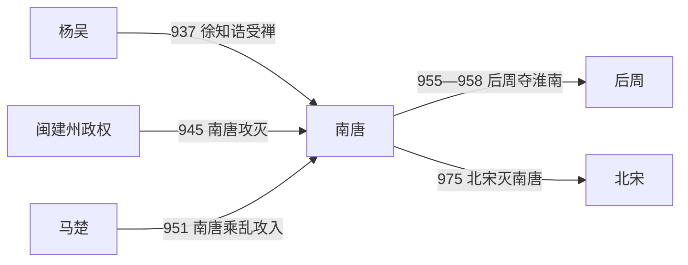

# 南唐

## 时间

937年-975年

## 概括

南唐是李昪取代杨吴后建立的江南政权，是十国中较强的一国。南唐承接吴的江淮、江南基础，文化发达，后期在后周和北宋压力下不断削弱。975年北宋攻破金陵，南唐灭亡。

## 建立、扩张与覆亡

- **建立背景**：徐知诰继承徐温在杨吴的权臣地位，以金陵为基地控制军政。937年杨溥禅位，徐知诰先建国号齐；939年恢复李姓、改名李昪，并以继承唐室为号召改国号唐，后世称南唐。
- **崛起与治理**：南唐完整接收杨吴的江淮官僚、军队和财赋，金陵及长江下游农业、手工业和水运发达。李昪重在休养和整合，吸纳北方流亡士人，使政权在十国中具有较强的行政与文化资源。
- **扩张阶段**：李璟时期趁邻国内乱，945年攻灭闽的建州政权，951年又出兵马楚。疆域一度扩展，但福建、湖南地方势力复杂，南唐难以稳定消化全部占领区，军事与财政负担随之上升。
- **战略转折**：955—958年后周三征淮南，南唐水陆防线失利，被迫割让长江以北州县、去帝号并奉中原正朔。失去淮河屏障后，金陵直接面对北方王朝，国力与外交主动权显著下降。
- **结构性衰落**：扩张所得地区整合不足，军队在与后周禁军的正面战争中处于劣势；对后周、北宋称臣虽换来短期缓冲，却不能恢复战略纵深。李煜时期文化活动兴盛，但朝廷在军事、财赋和外交上持续受制。
- **直接灭亡**：974年宋朝发兵，利用浮桥等工程渡过长江并围攻金陵。吴越从东面配合作战，南唐外援断绝；975年金陵陷落，李煜出降，南唐州县纳入北宋。

## 重要事件

| 时间 | 事件 | 过程与影响 |
|---|---|---|
| 937—939年 | 代吴建国 | 徐知诰受禅，后改名李昪、改国号唐，建立南唐。 |
| 945年 | 攻灭闽主力 | 取得建州、俘王延政，但未能长期控制福建全部地区。 |
| 951年 | 出兵马楚 | 趁马氏内乱进入湖南，扩张同时增加治理负担。 |
| 955—958年 | 淮南战争 | 后周夺取江北州县，南唐去帝号、称臣纳贡。 |
| 961年 | 李煜继位 | 在战略收缩和北方压力下维持江南政权。 |
| 974—975年 | 宋灭南唐 | 宋军渡江围金陵，李煜出降。 |

## 演进流程

## 说明

- 李昪原名徐知诰，出自徐氏权臣集团，937年取代杨吴称帝。
- 南唐控制江南核心区域，经济和文化较发达。
- 后周世宗柴荣南征后，南唐国力和疆域受损。
- 李煜时期降号称臣，仍被北宋攻灭。
- 975年，宋军攻破金陵，南唐亡。

## 统治结构

| 角色 | 人物 / 机构 | 说明 |
|---|---|---|
| 君主 | 李昪、李璟、李煜 | 李氏皇帝为最高统治者。 |
| 地域核心 | 江南、金陵 | 南唐主要统治中心。 |
| 外部压力 | 后周、北宋 | 后期持续受中原统一战争压迫。 |

## 君主世系

| 顺序 | 姓名 | 庙号 | 谥号 | 在位时间 | 与前任关系 | 关键事件 / 备注 |
|---:|---|---|---|---|---|---|
| 1 | **李昪** | 烈祖 | 光文肃武孝高皇帝 | 937年-943年 | 开国君主 | 取代杨吴建立南唐。 |
| 2 | 李璟 | 元宗 | 明道崇德文宣孝皇帝 | 943年-961年 | 李昪子 | 后期受后周军事压力，国势削弱。 |
| 3 | **李煜** | 无 | 后主 | 961年-975年 | 李璟子 | 975年宋灭南唐；以词名世。 |

## 演变关系

- 前一节点：[吴](/%E4%BA%BA%E6%96%87%E7%A7%91%E5%AD%A6/%E5%8E%86%E5%8F%B2/%E4%B8%9C%E4%BA%9A/%E4%B8%AD%E5%9B%BD/%E4%BA%94%E4%BB%A3/%E5%8D%81%E5%9B%BD/%E5%90%B4.md)。李昪取代杨吴建立南唐。
- 后一节点：北宋。北宋攻灭南唐，江南纳入宋朝。
