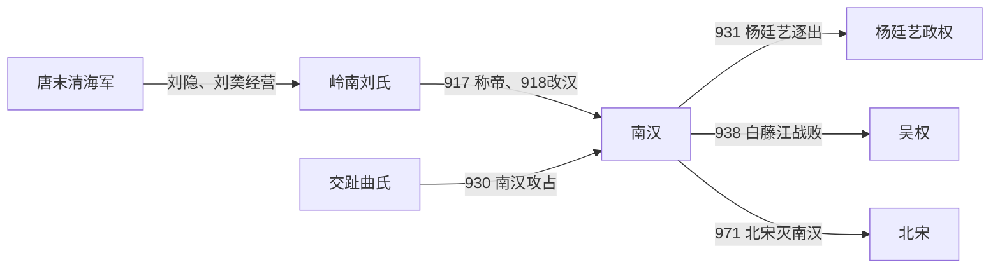

# 南汉

## 时间

917年-971年

## 概括

南汉是刘氏据岭南建立的十国政权，以广州为都。它控制今广东、广西一带，并一度影响交趾。971年北宋南征，南汉灭亡。

## 建立、发展与覆亡

- **建立背景**：唐末刘谦、刘隐家族在岭南扩展势力，刘隐控制广州和清海军后，逐步兼并岭南东部诸州。911年刘隐死，弟刘䶮继承；917年刘䶮称帝，初号大越，次年改国号汉。
- **崛起机制**：南汉依托广州港、盐业、岭南农业及海上贸易获得财赋，利用南岭阻隔减少中原直接干预，并向西控制广西部分地区。其官僚制度承袭唐制，但君主亲军、宗室与宦官在宫廷政治中影响很大。
- **扩张与挫折**：930年南汉攻占交趾、俘曲承美，次年即被杨廷艺驱逐；938年又应矫公羡求援南下，舰队在白藤江被吴权击败。此后南汉基本失去恢复交趾直接统治的能力。
- **继承与权力收缩**：942年刘䶮死后，刘玢旋遭弟刘晟弑杀。刘晟通过清洗宗室和重臣集中皇权，却削弱可独立统兵的政治军事骨干；958年刘鋹继位后更多依赖宦官和近臣，边防协调能力继续下降。
- **结构性衰落**：岭南地形能延缓北方进攻，却不能弥补军队训练、将领信任和跨州调度问题。北宋先后控制荆南、湖南和后蜀后，可从湖南直抵岭南，南汉的缓冲政权已全部消失。
- **直接灭亡**：970年宋军由潘美等率领南下，连续突破贺州、韶州等防线。971年广州外围失守，刘鋹投降，南汉灭亡，岭南州县并入北宋。

## 重要事件

| 时间 | 事件 | 过程与影响 |
|---|---|---|
| 911年 | 刘䶮继承岭南 | 接收刘隐的清海军势力，为称帝做准备。 |
| 917—918年 | 称帝改国号 | 先建大越，后改汉，南汉正式建立。 |
| 930—931年 | 占领并退出交趾 | 南汉俘曲承美，旋被杨廷艺逐出。 |
| 938年 | 白藤江之战 | 吴权击败南汉水军，交趾自主成为长期格局。 |
| 942—943年 | 宫廷继承冲突 | 刘玢即位后被刘晟杀害，宗室清洗扩大。 |
| 970—971年 | 宋灭南汉 | 宋军自湖南南下，刘鋹在广州投降。 |

## 演进流程

## 说明

- 刘隐、刘䶮兄弟在唐末岭南节度使基础上扩张势力。
- 917年，刘䶮称帝，建立南汉。
- 南汉地处岭南，与中原政权距离较远，具有明显区域割据色彩。
- 刘鋹时期政治腐败，971年为北宋所灭。

## 统治结构

| 角色 | 人物 / 机构 | 说明 |
|---|---|---|
| 君主 | 刘氏皇帝 | 以广州为都统治岭南。 |
| 地域核心 | 岭南、广州 | 南汉主要控制区域。 |
| 外部压力 | 北宋 | 北宋统一战争中灭南汉。 |

## 君主世系

| 顺序 | 姓名 | 庙号 | 谥号 | 在位时间 | 与前任关系 | 关键事件 / 备注 |
|---:|---|---|---|---|---|---|
| 1 | **刘䶮** | 高祖 | 天皇大帝 | 917年-942年 | 开国君主 | 据岭南称帝，建立南汉。 |
| 2 | 刘玢 | 无 | 殇皇帝 | 942年-943年 | 刘䶮子 | 在位短暂。 |
| 3 | 刘晟 | 中宗 | 文武光圣明孝皇帝 | 943年-958年 | 刘玢弟 | 继承南汉统治。 |
| 4 | **刘鋹** | 无 | 后主 | 958年-971年 | 刘晟子 | 971年北宋灭南汉。 |

## 演变关系

- 前一节点：唐末岭南藩镇割据。
- 后一节点：北宋。宋军南征灭南汉。
