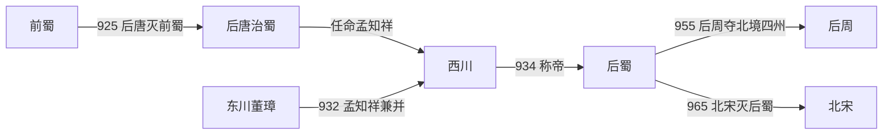

# 后蜀

## 时间

934年-965年

## 概括

后蜀是孟知祥据四川建立的十国政权。前蜀被后唐灭亡后，孟知祥以西川军政势力逐渐自立，934年称帝。965年，北宋攻灭后蜀，四川并入宋朝统一进程。

## 建立、发展与覆亡

- **建立背景**：925年后唐灭前蜀后，任命孟知祥为西川节度使、董璋为东川节度使。庄宗旋即在926年兵变中死亡，中央难以直接控制远离洛阳的两川，孟、董遂扩充军队并截留财赋。
- **崛起机制**：930年孟知祥与董璋共同反抗后唐调度，击退中央军；两人随后决裂，孟知祥于932年消灭董璋、合并东川。934年他先受封蜀王，继而称帝建立后蜀，把后唐任命的军镇转换为独立政权。
- **维系与鼎盛**：孟昶即位后清除部分跋扈将领，利用四川农业、盐井和交通体系维持长期统治。947年中原政局震荡时，后蜀一度取得秦、凤、成、阶等州，北部疆域达到高点。
- **结构性衰落**：长期安居盆地使军队实战能力下降，边防和朝廷之间信息迟缓；955年后周夺回秦、凤等州，后蜀北方门户收缩。963年北宋控制荆南和湖南后，既可由峡江进军，也可由陕南越过剑门，四川不再只面对单一路线。
- **直接灭亡**：964年底宋军分两路攻蜀，北路突破剑门，东路沿长江上行；后蜀将领各自应战，王昭远主力败溃。965年孟昶在成都投降，后蜀灭亡，宋朝开始直接治理四川。

## 重要事件

| 时间 | 事件 | 过程与影响 |
|---|---|---|
| 925—926年 | 两川易主 | 后唐灭前蜀并任命孟知祥，中央兵变为地方自立创造条件。 |
| 930年 | 两川抗命 | 孟知祥、董璋击退后唐军，事实上脱离中央控制。 |
| 932年 | 合并东川 | 孟知祥消灭董璋，统一两川军政。 |
| 934年 | 建立后蜀 | 孟知祥称帝，同年去世，孟昶继位。 |
| 947年 | 北境扩张 | 利用后晋灭亡后的混乱取得若干西北州郡。 |
| 955年 | 后周夺四州 | 后蜀北方屏障受损，战略空间缩小。 |
| 964—965年 | 宋灭后蜀 | 两路宋军突破防线，孟昶出降。 |

## 演进流程

## 说明

- 孟知祥原为后唐任命的西川节度使，后来割据四川。
- 934年，孟知祥称帝，建立后蜀，但同年去世。
- 孟昶长期在位，后蜀保持四川相对独立。
- 965年，北宋出兵灭后蜀。

## 统治结构

| 角色 | 人物 / 机构 | 说明 |
|---|---|---|
| 君主 | 孟知祥、孟昶 | 孟氏皇帝统治四川。 |
| 地域核心 | 成都、四川盆地 | 后蜀主要控制区域。 |
| 外部压力 | 北宋 | 北宋统一战争中灭后蜀。 |

## 君主世系

| 顺序 | 姓名 | 庙号 | 谥号 | 在位时间 | 与前任关系 | 关键事件 / 备注 |
|---:|---|---|---|---|---|---|
| 1 | **孟知祥** | 高祖 | 文武圣德英烈明孝皇帝 | 934年 | 开国君主 | 据蜀称帝，建立后蜀。 |
| 2 | **孟昶** | 无 | 楚恭孝王 | 934年-965年 | 孟知祥子 | 孟知祥死后继位；965年北宋灭后蜀。 |

## 演变关系

- 前一节点：[前蜀](/%E4%BA%BA%E6%96%87%E7%A7%91%E5%AD%A6/%E5%8E%86%E5%8F%B2/%E4%B8%9C%E4%BA%9A/%E4%B8%AD%E5%9B%BD/%E4%BA%94%E4%BB%A3/%E5%8D%81%E5%9B%BD/%E5%89%8D%E8%9C%80.md)。前蜀灭亡后，四川短暂归后唐，后由孟知祥建立后蜀。
- 后一节点：北宋。宋军灭后蜀，控制四川。
