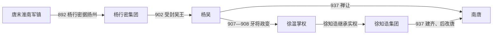

# 杨吴

## 时间

902年-937年

## 别称

- 杨吴
- 淮南吴

## 概括

吴是唐末五代时期杨氏据淮南、江淮建立的地方政权。杨行密奠定基础，杨溥时称帝，但实权逐渐落入徐温、徐知诰集团。937年徐知诰取代吴，建立南唐。

## 建立、发展与政权转移

- **建立背景**：唐末淮南在高骈失势后陷入孙儒、杨行密等集团混战。杨行密于892年击败孙儒并控制扬州，逐步兼并江淮军镇；902年受唐封吴王，通常据此作为杨吴政权的起点。
- **崛起机制**：江淮粮产、盐业和运河水网提供财赋与机动条件。杨行密联合地方将领、安置流民，并在与朱温集团的战争中守住淮河，使吴没有被后梁吞并。
- **权力结构变化**：905年杨行密死后，杨渥继位。徐温、张颢等牙将于907年发动政变，次年杀杨渥；徐温又除掉张颢，此后以杨氏君主为名义中心，自任权臣并由养子徐知诰掌握金陵与军政。
- **鼎盛与制度化**：杨隆演于919年称吴国王，杨溥于927年称帝，江淮州县和官僚制度日益完整。但王号、帝号的提升没有改变徐氏掌兵、理财和决定官员升降的事实。
- **结构性衰落**：开国者去世过早，杨氏继承人缺乏独立军队；牙兵集团通过弑君和拥立取得否决权。徐温死后，徐知诰把地方军权、中央官职和金陵基地集中于一身，完成和平篡夺所需的条件。
- **直接转移**：937年杨溥禅位于徐知诰，吴亡。徐知诰先建齐，后恢复李姓、改名李昪并改国号唐，史称南唐。行政体系和主要疆域并未在禅让中崩溃，而是由徐氏—李氏接收。

## 重要事件

| 时间 | 事件 | 过程与影响 |
|---|---|---|
| 892年 | 杨行密据扬州 | 击败孙儒，奠定江淮政权核心。 |
| 902年 | 受封吴王 | 唐廷确认杨行密地位，杨吴纪年通常由此开始。 |
| 905—908年 | 继承与牙将政变 | 杨行密死，杨渥被杀，徐温掌握实际权力。 |
| 919年 | 杨隆演称王 | 吴的王国官制进一步成形，徐氏继续辅政控权。 |
| 927年 | 杨溥称帝 | 名义君权升格，但军政实权仍在徐知诰集团。 |
| 937年 | 禅让于徐知诰 | 杨吴结束，南唐承接其疆域与制度。 |

## 演进流程

## 说明

- 吴的核心区域在淮南、江淮一带。
- 杨行密由唐末淮南节度使发展为吴王，是吴政权奠基者。
- 后期徐氏掌握实权，杨氏皇帝成为名义君主。
- 937年，徐知诰受禅，吴亡，南唐建立。

## 统治结构

| 角色 | 人物 / 机构 | 说明 |
|---|---|---|
| 君主 | 杨氏 | 名义最高统治者。 |
| 实际掌权者 | 徐温、徐知诰 | 后期控制军政，最终取代杨氏。 |
| 地域核心 | 淮南、江淮 | 江南北部重要割据区域。 |

## 统治者世系

| 顺序 | 姓名 | 庙号 | 谥号 | 在位 / 统治时间 | 与前任关系 | 关键事件 / 备注 |
|---:|---|---|---|---|---|---|
| 1 | **杨行密** | 太祖 | 孝武皇帝 | 902年-905年 | 奠基者 | 902年受封吴王；庙谥由杨溥追尊。 |
| 2 | 杨渥 | 烈宗 | 景皇帝 | 905年-908年 | 杨行密子 | 吴睿帝追谥。 |
| 3 | 杨隆演 | 高祖 | 宣皇帝 | 908年-921年 | 杨渥弟 | 徐氏势力逐渐坐大。 |
| 4 | **杨溥** | 无 | 睿皇帝 | 921年-937年 | 杨隆演弟 | 937年被徐知诰取代，吴亡。 |

## 演变关系

- 前一节点：唐末淮南藩镇割据。
- 后一节点：[南唐](/%E4%BA%BA%E6%96%87%E7%A7%91%E5%AD%A6/%E5%8E%86%E5%8F%B2/%E4%B8%9C%E4%BA%9A/%E4%B8%AD%E5%9B%BD/%E4%BA%94%E4%BB%A3/%E5%8D%81%E5%9B%BD/%E5%8D%97%E5%94%90.md)。徐知诰取代杨吴建立南唐。
