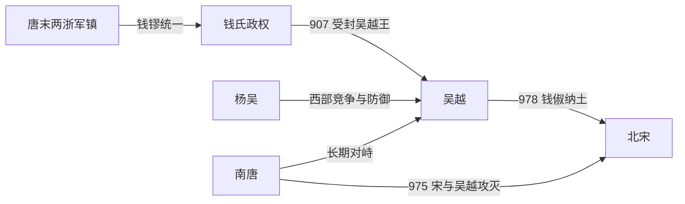

# 吴越

## 时间

907年-978年

## 概括

吴越是钱氏据两浙建立的地方政权，以杭州为中心。吴越长期奉中原王朝正朔，采取保境安民、发展海塘与佛教文化的政策。978年钱俶纳土归宋，吴越和平并入北宋。

## 建立、维系与归宋

- **建立背景**：钱镠在唐末浙西军阀混战中崛起，先保卫杭州，后击败董昌并控制镇海、镇东两镇。907年后梁封其为吴越王，钱氏区域统治由唐朝藩镇转化为王国。
- **生存机制**：吴越西面长期面对杨吴、南唐，疆域和人口不占优势，因而持续奉中原五代及北宋正朔，以册封和贡赐关系换取政治承认，并避免同时与北方王朝和江南强邻作战。
- **鼎盛条件**：钱氏利用两浙稻作、盐业、港口贸易和城市网络维持财政，长期修筑海塘、疏浚水道并支持佛教寺塔。地方建设既服务民生，也巩固杭州及沿海州县的统治。
- **继承与内政**：钱镠之后大体保持父子、兄弟顺序继承；947年胡进思发动政变，废钱倧、立钱俶，说明军将仍能干预王位。钱俶随后在奉后汉、后周和北宋正朔之间维持政权。
- **战略收缩**：南唐衰落后，吴越失去作为北方王朝牵制江南对手的独特价值。974—975年钱俶奉宋命协攻南唐；南唐灭亡后，吴越已被宋境包围，独立所需的外交平衡不复存在。
- **直接归宋**：978年钱俶入朝并献出所辖州县、军队和户籍，吴越和平结束。其终结主要是力量对比和生存策略改变的结果，而不是先经历全面内乱或军事崩溃。

## 重要事件

| 时间 | 事件 | 过程与影响 |
|---|---|---|
| 893—896年 | 钱镠统一两浙核心 | 取得镇海、镇东等军镇，奠定杭州政权。 |
| 907年 | 受封吴越王 | 后梁册封使钱氏王国地位正式化。 |
| 932年 | 钱元瓘继位 | 钱氏统治进入较稳定的世袭阶段。 |
| 947年 | 胡进思政变 | 钱倧被废、钱俶被立，军将干政但政权未分裂。 |
| 974—975年 | 协助宋攻南唐 | 吴越从区域平衡者转为宋统一战争的盟从。 |
| 978年 | 纳土归宋 | 钱俶献地，避免大规模征服战争。 |

## 演进流程

## 说明

- 钱镠为唐末两浙节度使，后成为吴越国奠基者。
- 吴越控制今浙江及周边区域，地处江南经济文化发展区。
- 与邻近的吴、南唐长期保持竞争与防御关系。
- 钱俶时期主动纳土归宋，避免大规模战争。

## 统治结构

| 角色 | 人物 / 机构 | 说明 |
|---|---|---|
| 君主 | 钱氏诸王 | 吴越多以国王身份统治，奉中原正朔。 |
| 地域核心 | 杭州、两浙 | 吴越长期经营区域。 |
| 外部关系 | 五代、北宋 | 多采取称臣或奉正朔策略。 |

## 统治者世系

| 顺序 | 姓名 | 庙号 | 谥号 / 王号 | 统治时间 | 与前任关系 | 关键事件 / 备注 |
|---:|---|---|---|---|---|---|
| 1 | **钱镠** | 太祖 | 武肃王 | 907年-932年 | 开国君主 | 奠定吴越政权。 |
| 2 | 钱元瓘 | 世宗 | 文穆王 | 932年-941年 | 钱镠子 | 继承钱氏统治。 |
| 3 | 钱佐 | 成宗 | 忠献王 | 941年-947年 | 钱元瓘子 | 在位较短。 |
| 4 | 钱倧 | 无 | 忠逊王 | 947年 | 钱佐弟 | 在位短暂。 |
| 5 | **钱俶** | 无 | 忠懿王 | 947年-978年 | 钱倧弟 | 978年纳土归宋。 |

## 演变关系

- 前一节点：唐末两浙藩镇割据。
- 后一节点：北宋。钱俶纳土归宋，吴越和平结束。
- 并列关系：[吴](/%E4%BA%BA%E6%96%87%E7%A7%91%E5%AD%A6/%E5%8E%86%E5%8F%B2/%E4%B8%9C%E4%BA%9A/%E4%B8%AD%E5%9B%BD/%E4%BA%94%E4%BB%A3/%E5%8D%81%E5%9B%BD/%E5%90%B4.md)、[南唐](/%E4%BA%BA%E6%96%87%E7%A7%91%E5%AD%A6/%E5%8E%86%E5%8F%B2/%E4%B8%9C%E4%BA%9A/%E4%B8%AD%E5%9B%BD/%E4%BA%94%E4%BB%A3/%E5%8D%81%E5%9B%BD/%E5%8D%97%E5%94%90.md)是吴越西北方向的重要邻近政权。
