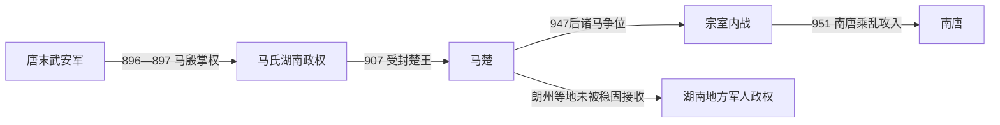

# 马楚

## 时间

907年-951年（896/897年起据湖南；927年获册为楚国王）

## 别称

- 马楚
- 南楚

## 概括

楚是马氏据湖南建立的十国政权，以潭州为核心。马殷奠定基础，早期保持区域稳定并发展商业。后期马氏兄弟争位，政权内乱，951年被南唐攻灭。

## 建立、发展与覆亡

- **建立背景**：唐末湖南在军阀混战中脱离中央直接控制。马殷先随刘建锋进入潭州，刘建锋死后接掌武安军，约896—897年起成为湖南实际统治者；907年后梁封其为楚王，927年后唐又册为楚国王。
- **崛起机制**：马殷接受历代中原王朝册封，不争夺全国正统，以潭州为中心兼并湖南及桂北部分地区。朝廷利用茶税、铅铁、城市手工业和南北商路维持财政，并以贡奉换取北方王朝承认。
- **鼎盛条件**：湖南位于长江、湘江与岭南交通之间，能与荆南、南唐、南汉等多方贸易。马殷在位时间长，诸子虽被分置军政职位，但在其个人权威下尚能维持统一。
- **结构性衰落**：马殷没有建立明确、可执行的嫡长继承规则，诸子各掌亲军和州镇。马希范死后，马希广、马希萼、马希崇争位，外引南唐、内部兵变和地方军人割据互相强化，财政与军事体系迅速碎裂。
- **直接灭亡**：950—951年马希萼攻入潭州，随后又被部将推翻，马希崇继位。南唐以调停和接收为名出兵，马希崇投降，马楚王国终结。但南唐未能长期控制全湖南，朗州等地方军人继续割据，说明灭亡首先是马氏中央权力崩溃。

## 重要事件

| 时间 | 事件 | 过程与影响 |
|---|---|---|
| 896—897年 | 马殷掌武安军 | 取得潭州和湖南军政核心。 |
| 907年 | 受封楚王 | 后梁承认马氏地位，楚政权正式化。 |
| 927年 | 册为楚国王 | 后唐提高封号，马殷继续奉中原正朔。 |
| 930年 | 马殷去世 | 长期个人统治结束，诸子依次继承。 |
| 947—950年 | 诸马争位 | 马希广、马希萼冲突使军队和州镇分裂。 |
| 951年 | 南唐入潭州 | 马希崇降，马楚灭亡，湖南仍有地方势力反抗南唐。 |

## 演进流程

## 说明

- 马殷由唐末军政势力发展为湖南地区统治者。
- 楚国位于南方交通与商业要地，早期经济较活跃。
- 马希范以后，宗室争夺加剧。
- 951年，南唐趁楚内乱出兵，楚亡。

## 统治结构

| 角色 | 人物 / 机构 | 说明 |
|---|---|---|
| 君主 | 马氏诸王 | 楚国统治者多称王。 |
| 地域核心 | 湖南、潭州 | 楚政权主要控制区域。 |
| 外部压力 | 南唐 | 南唐最终吞并楚。 |

## 统治者世系

| 顺序 | 姓名 | 庙号 | 谥号 / 王号 | 统治时间 | 与前任关系 | 关键事件 / 备注 |
|---:|---|---|---|---|---|---|
| 1 | **马殷** | 无 | 武穆王 | 897年-930年 | 奠基者 | 据湖南建立马楚基础。 |
| 2 | 马希声 | 无 | 衡阳王 | 930年-932年 | 马殷子 | 继承楚国。 |
| 3 | 马希范 | 无 | 文昭王 | 932年-947年 | 马希声弟 | 楚国相对稳定时期。 |
| 4 | 马希广 | 无 | 废王 | 947年-950年 | 马希范弟 | 宗室争位开始激化。 |
| 5 | 马希萼 | 无 | 恭孝王 | 950年-951年 | 马希广兄 | 夺位后又被部将推翻。 |
| 6 | **马希崇** | 无 | 留王 | 951年 | 马希萼弟 | 继位后向南唐投降，马楚终结。 |

## 演变关系

- 前一节点：唐末湖南藩镇割据。
- 后一节点：[南唐](/%E4%BA%BA%E6%96%87%E7%A7%91%E5%AD%A6/%E5%8E%86%E5%8F%B2/%E4%B8%9C%E4%BA%9A/%E4%B8%AD%E5%9B%BD/%E4%BA%94%E4%BB%A3/%E5%8D%81%E5%9B%BD/%E5%8D%97%E5%94%90.md)。南唐趁楚内乱吞并马楚。
