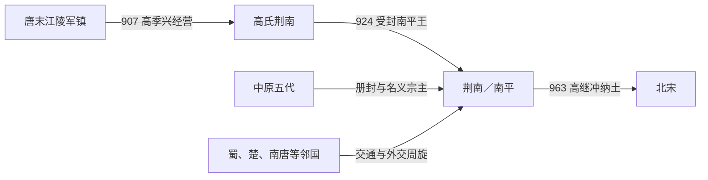

# 荆南

## 时间

924年-963年

## 别称

- 南平
- 北楚

## 概括

荆南是高氏据江陵建立的小型割据政权，位于中原、巴蜀、江南诸国之间。由于地域狭小，荆南长期采取向强邻称臣、周旋多方的策略。963年高继冲降宋，荆南并入北宋。

## 建立、维系与归宋

- **建立背景**：江陵在唐末战乱中人口、城防和水利受损。907年后梁任高季兴为荆南节度使，他修复城池、招集流民并恢复州县秩序，以荆州为核心建立高氏军镇。
- **政权形成**：924年后唐封高季兴为南平王，通常以此作为荆南政权起点。其辖境主要位于长江中游，面积和兵力有限，却扼守中原通往四川、湖南及江南的交通。
- **生存机制**：高氏先后向后梁、后唐、后晋、后汉、后周和南方邻国称臣，根据力量变化调整名义归属；同时利用江陵的转运位置、商税和过境使节维持财政。多方承认比扩张领土更重要。
- **相对稳定**：高从诲长期统治，避免与强邻进行决定性战争，并让高氏内部大体按父子、兄弟顺序交接。小国外交使荆南延续近四十年，但也说明其安全依赖周边没有一个王朝完全控制长江中游。
- **结构性局限**：辖境狭小、缺乏战略纵深，无法承受长期围攻；北宋建立后，南方诸国陆续孤立。荆南一旦允许宋军进入，其自身军队便无力重新封锁交通。
- **直接归宋**：963年宋朝以平定湖南武平军内乱为名向高继冲借道，军队抵达江陵后形成压倒性威慑。高继冲献城归附，荆南州县、户籍和军队被宋接收，政权和平结束。

## 重要事件

| 时间 | 事件 | 过程与影响 |
|---|---|---|
| 907年 | 高季兴镇江陵 | 修复战后秩序，奠定高氏军镇。 |
| 924年 | 受封南平王 | 荆南王国地位正式化。 |
| 929年 | 高从诲继位 | 长期采取多方称臣和交通贸易策略。 |
| 948—960年 | 高氏第三代统治 | 高保融延续既有外交，面对后周、北宋崛起。 |
| 962年 | 高继冲继位 | 年轻统治者接手资源有限的小国。 |
| 963年 | 宋军借道、纳土 | 宋军进入江陵，高继冲归附，荆南结束。 |

## 演进流程

## 说明

- 高季兴以江陵为核心奠定荆南政权。
- 荆南处交通要冲，但辖境有限，常依靠外交平衡生存。
- 高氏统治延续至北宋初年。
- 963年，高继冲降宋，荆南政权结束。

## 统治结构

| 角色 | 人物 / 机构 | 说明 |
|---|---|---|
| 君主 | 高氏诸王 | 以江陵为中心的小型政权。 |
| 地域核心 | 江陵、荆州一带 | 长江中游交通要地。 |
| 外部关系 | 五代、南方诸国、北宋 | 多向强者称臣以求自保。 |

## 统治者世系

| 顺序 | 姓名 | 庙号 | 谥号 / 王号 | 统治时间 | 与前任关系 | 关键事件 / 备注 |
|---:|---|---|---|---|---|---|
| 1 | **高季兴** | 无 | 武信王 | 924年-929年 | 奠基者 | 据江陵建立荆南基础。 |
| 2 | 高从诲 | 无 | 文献王 | 929年-948年 | 高季兴子 | 维持多方周旋。 |
| 3 | 高保融 | 无 | 贞懿王 | 948年-960年 | 高从诲子 | 延续高氏统治。 |
| 4 | 高保勖 | 无 | 贞安王 | 960年-962年 | 高保融弟 | 北宋建立后仍据江陵。 |
| 5 | **高继冲** | 无 | 德仁王 | 962年-963年 | 高保融子 | 963年降宋，荆南亡。 |

## 演变关系

- 前一节点：唐末荆南地区藩镇割据。
- 后一节点：北宋。高继冲降宋，荆南并入北宋。
