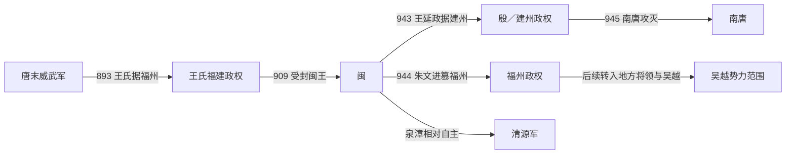

# 闽

## 时间

909年-945年

## 概括

闽是王氏据福建建立的十国政权，以福州为核心。王审知奠定统治基础，后期王氏内部争夺使福州、建州并立；945年南唐攻灭建州核心，但福州、泉漳随后分属不同地方势力。

## 建立、分裂与覆亡

- **建立背景**：唐末王潮、王审知兄弟随军进入福建，893年取得福州并逐步控制威武军。王潮死后王审知继位，接受唐及后梁册封；909年受封闽王，地方军镇由此转化为王国。
- **维系与鼎盛**：福建山岭分隔、对外陆路有限，有利于抵御邻国；福州、泉州等港口和海上贸易又提供物资与税源。王审知尊奉中原正朔、延揽流亡士人并协调地方大族，使925年前后的闽保持相对稳定。
- **继承危机**：王审知死后，王延翰、王延钧及下一代以政变、弑杀反复夺位。933年王延钧称帝虽提高君主名号，却未建立稳定的继承和军队控制制度，宗室、禁军与近臣各拥权力。
- **并立阶段**：943年王延政在建州称帝，国号殷，与福州的王延曦对立；944年朱文进杀王延曦、控制福州。福建由单一王国分裂为建州王氏、福州篡立者及相对自主的泉漳力量，南唐得以逐一介入。
- **直接覆亡**：945年南唐军攻破建州，王延政投降，闽作为王氏统一政权终结。福州并未立即被南唐稳固控制，随后转入地方将领和吴越势力范围；泉州、漳州则发展为清源军。因此“闽亡”是中央王权瓦解，而非福建全境同年被一个政权完整接收。

## 重要事件

| 时间 | 事件 | 过程与影响 |
|---|---|---|
| 893—898年 | 王氏据福州 | 王潮、王审知控制威武军，建立区域政权基础。 |
| 909年 | 王审知受封闽王 | 闽国地位正式化，仍奉中原王朝正朔。 |
| 925—926年 | 首次继承政变 | 王审知死后，王延翰被王延钧等推翻，暴力继承成为先例。 |
| 933年 | 王延钧称帝 | 闽改建帝制，但宫廷和军队矛盾继续累积。 |
| 943年 | 建州、福州分立 | 王延政建殷，福建政治中心公开分裂。 |
| 944年 | 朱文进篡立 | 王延曦被杀，福州脱离王氏控制。 |
| 945年 | 南唐破建州 | 王延政降，闽国灭亡；福建进入多政权分据阶段。 |

## 演进流程

## 说明

- 闽的核心区域为福建，山海阻隔使其具有较强地方性。
- 王审知长期经营福建，被视为闽政权奠基者。
- 后期王氏宗室内乱频繁，王延政在建州另立政权，削弱闽国。
- 945年前后，南唐攻入福建，闽亡。

## 统治结构

| 角色 | 人物 / 机构 | 说明 |
|---|---|---|
| 君主 | 王氏、朱文进、卓俨明 | 后期政权内乱导致统治者更替复杂。 |
| 地域核心 | 福州、建州、福建地区 | 闽政权主要控制区域。 |
| 外部压力 | 南唐 | 南唐攻灭建州核心，但未在945年完整接收福建全境。 |

## 统治者世系

| 顺序 | 姓名 | 庙号 | 谥号 | 统治时间 | 与前任关系 | 关键事件 / 备注 |
|---:|---|---|---|---|---|---|
| 1 | **王审知** | 太祖 | 昭武孝皇帝 | 909年-925年 | 奠基者 | 稳定经营福建。 |
| 2 | 王延翰 | 无 | 废帝 | 925年-926年 | 王审知子 | 在位短暂。 |
| 3 | 王延钧 | 惠宗 | 齐肃明孝皇帝 | 926年-935年 | 王延翰弟 | 称帝，闽国制度进一步成形。 |
| 4 | 王继鹏 | 康宗 | 圣神英睿文明广武应道大弘孝皇帝 | 935年-939年 | 王延钧子 | 宗室争斗加剧。 |
| 5 | 王延曦 | 景宗 | 睿文广武明圣元德隆道大孝皇帝 | 939年-943年 | 王审知子 | 闽国内乱继续。 |
| 6 | **王延政** | 无 | 和帝 | 943年-945年 | 王审知子、王延曦弟 | 先据建州建殷，与福州并立；后改称闽帝，945年降南唐。 |
| 7 | 朱文进 | 无 | 武帝 | 944年-945年 | 篡立者 | 杀王延曦后据福州，与王延政并立；945年被部下所杀。 |
| 8 | 卓俨明 | 无 | 末帝 | 945年 | 福州军人拥立 | 李仁达等拥立，约三个月后又被李仁达杀害；仅控制福州一带。 |

## 演变关系

- 前一节点：唐末福建藩镇割据。
- 后一节点：[南唐](/%E4%BA%BA%E6%96%87%E7%A7%91%E5%AD%A6/%E5%8E%86%E5%8F%B2/%E4%B8%9C%E4%BA%9A/%E4%B8%AD%E5%9B%BD/%E4%BA%94%E4%BB%A3/%E5%8D%81%E5%9B%BD/%E5%8D%97%E5%94%90.md)攻灭建州王延政；福州后转入吴越势力范围，泉漳则发展为清源军。
