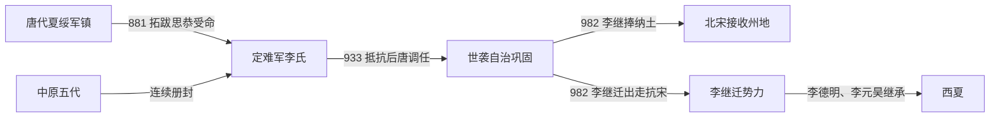

# 定难军

## 时间

881年-982年（982年后分化为归宋与李继迁抗宋两支）

## 别称

- 夏州李氏
- 党项李氏政权

## 概括

定难军是唐末五代至宋初党项李氏据夏州一带形成的边地军镇政权。它在唐、五代和宋辽之间保持较强自治性，是后来西夏政权的重要前身。

## 建立、世袭与分化

- **建立背景**：881年党项首领拓跋思恭参与镇压黄巢，被唐廷授予夏州军政权并赐姓李，定难军由此进入党项李氏长期控制阶段。其核心为夏州，兼及银、绥、宥等州，连接鄂尔多斯草原、河套与陕北农耕区。
- **崛起与维系机制**：李氏以宗族、党项部落和军镇牙兵为基础，同时不断请求唐、五代和北宋授予节度使、王爵等名号。中央王朝更替时，定难军迅速改奉新正朔，以贡奉和名义臣属换取世袭事实。
- **阶段发展**：881—909年继承数次变动，李思谏曾复任，李成庆、李彝昌等在位年代也有缺口；909—933年李仁福长期统治，军镇趋于稳定。933年后唐企图调走李彝超并另任安从进，夏州军民抵抗围攻，迫使中央承认既成事实。
- **鼎盛条件**：边地城寨、骑兵和熟悉荒漠交通的部落力量使外来军队补给困难；盐池、牧业和沿边贸易提供资源。李彝殷（后改名李彝兴）在位三十余年，先后接受后唐、后晋、后汉、后周及宋册命，显示军镇适应政权更迭的能力。
- **结构性矛盾**：世袭依靠宗族和军队拥立，而非固定继承法；中央每次尝试调任都可能触发冲突。北宋统一大部中原后，不再需要把定难军仅视为远方藩镇，李氏内部则在归附与保持自主之间分裂。
- **982年分化**：李继捧入朝并献出夏、绥等州，传统夏州李氏军镇第一次被宋直接接收；族弟李继迁拒绝归宋，率部出走、联辽并重新争夺州地。故982年是原定难军统治序列的断点，而非党项李氏消失；李继迁一支后来发展为西夏。

## 重要事件

| 时间 | 事件 | 过程与影响 |
|---|---|---|
| 881年 | 拓跋思恭受命 | 参与镇压黄巢，获唐廷授予夏州军权，李氏世袭开端。 |
| 895—908年 | 早期继承反复 | 李思谏、李成庆等先后掌权，部分任期和关系在史料中有歧异。 |
| 909年 | 李仁福被拥立 | 平定军内变乱后掌权，开启二十余年稳定统治。 |
| 933年 | 夏州抗命 | 后唐另任安从进未能赴任，围攻失败后承认李彝超。 |
| 935—967年 | 李彝殷长期统治 | 跨越五代多朝，以反复受册维持自治。 |
| 960年后 | 奉北宋正朔 | 李氏接受宋册命，但仍掌握本地军政。 |
| 982年 | 李继捧纳土 | 宗族分裂；宋接收州地，李继迁出走反抗。 |

## 节度使与实际统治序列

| 顺序 | 姓名 | 原名 / 称号 | 统治时间 | 与前任关系 | 关键事件 / 备注 |
|---:|---|---|---|---|---|
| 1 | **李思恭** | 拓跋思恭；夏州节度使 | 881年-886年 | 开创者 | 因军功受唐册命、赐姓李；奠定夏州李氏。 |
| 2 | 李思谏 | 定难军节度使 | 886年-895年 | 李思恭弟或近支宗族 | 承接李氏军镇；后曾复任。 |
| 3 | 李成庆 | 定难军节度使 | 896年-900年 | 关系不详 | 传世记载较少，895—896年交接仍有年代缺口。 |
| 4 | 李思谏 | 复任节度使 | 起年不详-908年 | 再任 | 第二次掌权的确切起年存在争议。 |
| 5 | 李彝昌 | 定难军节度使 | 908年-909年 | 李思谏子或孙，史书记载不一 | 被牙将高宗益杀害。 |
| 6 | **李仁福** | 朔方王、定难军节度使 | 909年-933年 | 李氏宗族长辈 | 平乱后被拥立，长期维持军镇。 |
| 7 | 李彝超 | 定难军节度使 | 933年-935年 | 李仁福子 | 拒绝后唐调任，守夏州成功；安从进虽获任命但未实际就任。 |
| 8 | **李彝殷**（后改李彝兴） | 定难军节度使 | 935年-967年 | 李彝超弟 | 先后奉五代与北宋；为避宋宣祖赵弘殷名讳改名李彝兴。 |
| 9 | 李光睿 | 定难军节度使 | 967年-978年 | 李彝殷子 | 接受北宋册命，继续世袭自治。 |
| 10 | 李继筠 | 定难军节度使 | 978年-980年 | 李光睿子 | 在位短暂。 |
| 11 | **李继捧** | 定难军节度使 | 980年-982年 | 李继筠弟 | 982年首次入朝纳土；988—994年间又曾被宋任用，属后续阶段。 |

## 演进流程

## 说明

- 唐末党项首领拓跋思恭因镇压黄巢起义有功，被授夏州节度使，赐姓李。
- 定难军控制夏州、银州、绥州、宥州等西北边地，处于中原、契丹、吐蕃、回鹘等势力之间。
- 五代时期，定难军多向中原王朝称臣，但实际保持世袭割据。
- 北宋初年，夏州李氏与宋朝关系反复，后来发展为西夏建国基础。

## 统治结构

| 角色 | 人物 / 机构 | 说明 |
|---|---|---|
| 统治家族 | 党项李氏 | 世袭控制定难军。 |
| 地域核心 | 夏州及银、绥、宥等州 | 西北边地军镇。 |
| 外部关系 | 五代、北宋、辽 | 在多方势力之间保持自治。 |

## 演变关系

- 前一节点：唐末夏州党项势力。
- 后一节点：西夏前身。定难军李氏最终发展为西夏政权的核心家族。
- 并列关系：[归义军](/%E4%BA%BA%E6%96%87%E7%A7%91%E5%AD%A6/%E5%8E%86%E5%8F%B2/%E4%B8%9C%E4%BA%9A/%E4%B8%AD%E5%9B%BD/%E4%BA%94%E4%BB%A3/%E5%90%8E%E6%B1%89%E5%8F%8A%E5%85%B6%E4%BB%96%E6%94%BF%E6%9D%83/%E5%BD%92%E4%B9%89%E5%86%9B.md)同属五代前后边地军镇。
