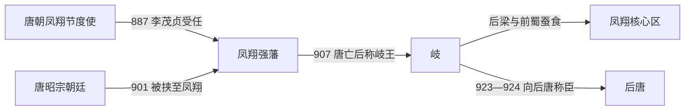

# 岐

## 时间

887年-924年

## 别称

- 岐王政权
- 凤翔李氏政权

## 概括

岐是李茂贞据凤翔一带形成的唐末五代地方政权。李茂贞先后受唐朝册封为岐王，与唐末朝廷、朱温后梁和河东李氏集团周旋。924年，李茂贞向后唐称臣，岐政权结束独立状态。

## 建立、抗争与终结

- **建立背景**：李茂贞原名宋文通，因镇压唐末兵乱获赐姓名，887年出任凤翔节度使。凤翔扼守关中西部与入蜀通道，他以牙军和州县为基础扩张，逐渐从唐廷任命的节度使转为可干预中央的强藩。
- **崛起阶段**：893年李茂贞逼迫唐廷处置宰相杜让能，显示其已能挑战皇权；895年前后又与王行瑜、韩建等进入长安。唐廷虽借李克用等外援暂时压制关中诸镇，却无法撤换李茂贞。
- **权力高点与转折**：901年宦官集团将唐昭宗挟往凤翔，朱温随即围城。凤翔长期被围、粮食枯竭，李茂贞于903年交还皇帝并处置宦官，丧失直接控制唐廷的机会，辖境也在后梁和前蜀夹击下缩小。
- **维系机制**：907年唐亡后，李茂贞仍以岐王身份据凤翔，沿用唐天祐年号，借“奉唐”名义与后梁对抗，并在后梁、前蜀和晋王集团之间寻求支援。岐从争夺关中的强藩退为以凤翔为中心的区域政权。
- **结构性衰落**：连年战争削弱人口和财赋，外围州县陆续被后梁、前蜀夺取；只有一位长期统治者，继承和官僚制度未发展为稳定王朝。后梁一旦被后唐取代，岐继续独立已缺乏战略价值。
- **直接终结**：923年后唐灭后梁，李茂贞转而向李存勖称臣；924年他正式接受后唐册命并去世。其子李从曮以后唐节度使身份继承凤翔，而不再维持独立岐国。

## 重要事件

| 时间 | 事件 | 过程与影响 |
|---|---|---|
| 887年 | 李茂贞镇凤翔 | 获得关中西部军镇，奠定割据基础。 |
| 893年 | 逼杀杜让能 | 迫使唐廷让步，成为干预中央的强藩。 |
| 895年 | 关中诸镇入长安 | 李茂贞等控制朝政，后受李克用军事压力而退。 |
| 901—903年 | 凤翔围城 | 挟持昭宗引来朱温围攻，岐遭严重消耗并交还皇帝。 |
| 907年 | 唐亡后继续称岐王 | 拒绝立即承认后梁，以唐年号维持政治号召。 |
| 923—924年 | 臣服后唐 | 后梁灭亡后转奉后唐，独立政权结束。 |

## 统治者

| 顺序 | 姓名 | 原名 / 称号 | 统治时间 | 与前任关系 | 关键事件 / 备注 |
|---:|---|---|---|---|---|
| 1 | **李茂贞** | 宋文通；岐王 | 887年-924年 | 由唐朝凤翔节度使转为割据者 | 岐唯一的独立统治者；未称帝，沿用唐天祐年号。924年后其子以後唐官员身份继任凤翔。 |

## 演进流程

## 说明

- 李茂贞原为唐末凤翔节度使，是唐末强藩之一。
- 岐地处关中西部，曾直接影响唐昭宗朝政。
- 后梁建立后，岐长期与后梁对抗，但实力逐渐衰弱。
- 后唐灭后梁后，李茂贞向后唐称臣。

## 统治结构

| 角色 | 人物 / 机构 | 说明 |
|---|---|---|
| 统治者 | 李茂贞 | 唐末被封岐王，长期据凤翔。 |
| 地域核心 | 凤翔、关中西部 | 岐政权的基本控制区。 |
| 外部关系 | 唐、后梁、后唐 | 在多方势力之间周旋。 |

## 演变关系

- 前一节点：唐末凤翔藩镇割据。
- 后一节点：后唐。924年李茂贞称臣，岐失去独立政权地位。
- 并列关系：[燕](/%E4%BA%BA%E6%96%87%E7%A7%91%E5%AD%A6/%E5%8E%86%E5%8F%B2/%E4%B8%9C%E4%BA%9A/%E4%B8%AD%E5%9B%BD/%E4%BA%94%E4%BB%A3/%E5%90%8E%E6%B1%89%E5%8F%8A%E5%85%B6%E4%BB%96%E6%94%BF%E6%9D%83/%E7%87%95.md)、[赵](/%E4%BA%BA%E6%96%87%E7%A7%91%E5%AD%A6/%E5%8E%86%E5%8F%B2/%E4%B8%9C%E4%BA%9A/%E4%B8%AD%E5%9B%BD/%E4%BA%94%E4%BB%A3/%E5%90%8E%E6%B1%89%E5%8F%8A%E5%85%B6%E4%BB%96%E6%94%BF%E6%9D%83/%E8%B5%B5.md)同属五代前期重要但未列入传统十国的割据政权。
