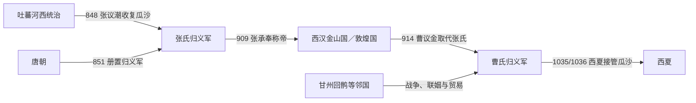

# 归义军

## 时间

848/851年-1035/1036年

## 概括

归义军是唐末至宋初河西敦煌地区的地方军镇政权。张议潮收复河西后归附唐朝，形成归义军体系；唐亡后，张氏、曹氏继续在敦煌、瓜州、沙州一带维持地方统治。

## 建立、收缩与覆亡

- **建立背景**：吐蕃帝国分裂后，河西统治松动。848年张议潮在沙州起兵，先收复瓜、沙等州；851年派使向唐廷献图籍，唐设置归义军并任张议潮为节度使。因“起义收复”与“朝廷建军”口径不同，起年常写848年或851年。
- **扩张与早期鼎盛**：张议潮一度控制河西多州，恢复通往中原的驿路。867年他入朝后，侄张淮深接任；归义军依靠节度使府、押衙、地方大族和寺院经济维持军政，并与回鹘、吐蕃诸部作战或通婚。
- **收缩与张氏内争**：中晚唐中央无法持续支援河西，甘州回鹘等邻国兴起，归义军辖区逐步缩至瓜、沙。890年前后张淮深死亡及继承过程记载不一，张淮鼎、索勋、张承奉相继掌权，说明军府和大族间竞争加剧。
- **西汉金山国阶段**：909年张承奉称“白衣天子”，建西汉金山国；与甘州回鹘战争失利后，911年改称天王并调整国号。914年曹议金取代张氏、恢复归义军名号，独立帝号阶段结束。
- **曹氏维系机制**：曹氏通过与甘州、西州回鹘、于阗等政权联姻、遣使，在强邻之间保持贸易和安全；同时接受后唐、后晋、宋、辽等远方王朝名号。曹元忠长期在位时是曹氏相对稳定期，但实际疆域仍以瓜沙为主。
- **结构性衰落与终结**：1002年曹宗寿迫曹延禄兄弟自尽，显示内部继承再度暴力化；西面于阗覆亡、东面党项李氏扩张，使敦煌失去外交缓冲。1035年或1036年，李元昊势力接管瓜沙，曹贤顺出降，归义军终结；具体年份因材料口径不同而有争议。

## 重要事件

| 时间 | 事件 | 过程与影响 |
|---|---|---|
| 848年 | 张议潮起兵 | 收复沙州等地，结束吐蕃在当地的直接统治。 |
| 851年 | 唐置归义军 | 张议潮归唐受节，地方政权取得制度名号。 |
| 867年 | 张淮深继任 | 张议潮入朝，归义军进入本地继承阶段。 |
| 890—894年 | 张氏继承动荡 | 张淮鼎、索勋、张承奉先后掌权，军府内部重组。 |
| 909—914年 | 西汉金山国 | 张承奉称帝、对甘州回鹘作战，失败后权力衰落。 |
| 914年 | 曹议金掌权 | 曹氏取代张氏，恢复归义军名号并调整对外关系。 |
| 944—974年 | 曹元忠长期统治 | 通过册封、联姻和贸易维持瓜沙稳定。 |
| 1002年 | 曹氏内变 | 曹宗寿取代曹延禄，继承再次诉诸武力。 |
| 1035/1036年 | 西夏接管瓜沙 | 曹贤顺降，归义军政权终结。 |

## 节度使与实际统治序列

| 顺序 | 姓名 | 身份 / 称号 | 统治时间 | 与前任关系 | 关键事件 / 备注 |
|---:|---|---|---|---|---|
| 1 | **张议潮** | 归义军节度使 | 848/851年-867年 | 开创者 | 848年起兵，851年受唐册命；867年入朝。 |
| 2 | 张淮深 | 归义军节度使 | 867年-890年 | 张议潮侄 | 抵御回鹘，死亡过程与继承细节存在争议。 |
| 3 | 张淮鼎 | 归义军节度使 | 890年-892年 | 张淮深弟 | 在位短暂。 |
| 4 | 索勋 | 归义军节度使 | 892年-894年 | 张议潮女婿 | 借姻亲关系掌权，后被张承奉取代。 |
| 5 | **张承奉** | 节度使；西汉白衣天子、天王 | 894年-914年 | 张议潮孙 | 909年建西汉金山国，911年改称天王；战争失败后失势。 |
| 6 | **曹议金**（曹仁贵） | 归义军节度使、拓西大王 | 914年-935年 | 敦煌曹氏首领，取代张氏 | 恢复归义军名号，以联姻改善周边关系。 |
| 7 | 曹元德 | 归义军节度使 | 935年-939年 | 曹议金子 | 曹氏第二代。 |
| 8 | 曹元深 | 归义军节度使 | 939年-944年 | 曹议金子、曹元德弟 | 延续曹氏统治。 |
| 9 | **曹元忠** | 归义军节度使、西平王 | 944年-974年 | 曹议金子、曹元深弟 | 长期掌权；970年受北宋封西平王。 |
| 10 | 曹延恭 | 归义军节度使 | 974年-976年 | 曹元忠子，部分亲属关系记载有异 | 在位较短。 |
| 11 | 曹延禄 | 归义军节度使 | 976年-1002年 | 曹延恭弟或同族近支 | 1002年在内变中与弟曹延瑞被迫自尽。 |
| 12 | 曹宗寿 | 归义军节度使 | 1002年-1014年 | 曹延禄族子 | 发动内变掌权，同时向宋、辽通使。 |
| 13 | **曹贤顺** | 归义军节度使 | 1014年-1035/1036年 | 曹宗寿子 | 最后一任；西夏进入瓜沙后出降。 |

## 演进流程

## 说明

- 归义军起源于张议潮驱逐吐蕃势力、归附唐朝。
- 五代十国时期，中原政权更替频繁，归义军在河西地区维持相对独立。
- 统治家族先后以张氏、曹氏为主。
- 归义军处于中原、回鹘、吐蕃、党项等势力之间，是河西地方政治的重要节点。
- 11世纪前期，归义军体系逐渐被西夏势力取代。

## 统治结构

| 角色 | 人物 / 机构 | 说明 |
|---|---|---|
| 统治家族 | 张氏、曹氏 | 先后控制敦煌归义军。 |
| 地域核心 | 沙州、瓜州、敦煌 | 河西走廊西段。 |
| 外部关系 | 中原王朝、回鹘、吐蕃、党项 | 在多方势力夹缝中维持自治。 |

## 演变关系

- 前一节点：吐蕃占据河西后的地方反抗与唐朝收复。
- 后一节点：西夏势力进入河西，归义军体系逐渐消失。
- 并列关系：[定难军](/%E4%BA%BA%E6%96%87%E7%A7%91%E5%AD%A6/%E5%8E%86%E5%8F%B2/%E4%B8%9C%E4%BA%9A/%E4%B8%AD%E5%9B%BD/%E4%BA%94%E4%BB%A3/%E5%90%8E%E6%B1%89%E5%8F%8A%E5%85%B6%E4%BB%96%E6%94%BF%E6%9D%83/%E5%AE%9A%E9%9A%BE%E5%86%9B.md)同属五代前后西北边地军镇。
