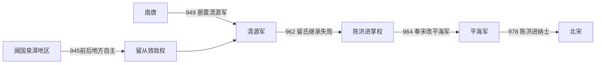

# 清源军

## 时间

949年-978年

## 别称

- 平海军
- 泉漳政权

## 概括

清源军是五代后期闽南泉州、漳州一带的地方割据政权。闽国内乱和南唐介入后，留从效据泉州自立，名义上先后奉南唐、后周、北宋正朔。978年陈洪进纳土归宋，清源军结束。

## 建立、权力更替与归宋

- **建立背景**：闽后期福州、建州内战使泉州、漳州军政逐渐自主。留从效依靠泉州军人和地方大族排除竞争者，在名义上接受南唐任命；949年南唐升泉州为清源军，授留从效节度使，清源军政权正式成形。
- **维系机制**：辖境只有泉、漳两州，却拥有港口、农业腹地和海上贸易资源。统治者不称帝、不自建年号，而是在南唐、后周、北宋之间寻求册封，以较低政治姿态换取地方军政和税收的实际自主。
- **相对鼎盛**：留从效长期掌权，修整城郭、维持商路，并让泉州在福建分裂后保持秩序。他在南唐名义统属下又尝试与后周联系；960年宋建立后，清源军逐步转奉宋朝。
- **继承危机**：962年留从效死，侄留绍镃仅任留后一个多月便被陈洪进废黜。陈洪进推张汉思为名义首领，自己控制军队；963年再废张汉思并直接掌权。清源军由留氏转为陈氏，不是平稳父子继承。
- **平海军阶段**：964年宋廷改清源军为平海军，陈洪进同时接受南唐、宋的名号以延续自治。975年南唐灭亡、吴越又趋向归宋后，泉漳失去可供平衡的邻国。
- **直接归宋**：977年陈洪进入汴京朝见，长期未获返镇；978年在部属劝说和宋廷压力下上表献出泉、漳二州。北宋撤销平海军并接收户籍、军队，清源军和平终结。

## 重要事件

| 时间 | 事件 | 过程与影响 |
|---|---|---|
| 945年前后 | 泉州脱离闽国中央 | 闽亡与南唐介入使留从效掌握地方军政。 |
| 949年 | 设清源军 | 南唐授留从效节度使，政权名号正式确立。 |
| 958—960年 | 转向中原王朝 | 留从效寻求后周、北宋承认，降低对南唐依赖。 |
| 962年 | 留从效去世 | 留绍镃短暂继任，旋被陈洪进废黜。 |
| 963年 | 陈洪进掌权 | 废张汉思，自掌泉漳军政。 |
| 964年 | 改称平海军 | 接受宋朝新军号，名义归属进一步转向北宋。 |
| 975—978年 | 南唐亡与泉漳纳土 | 外交平衡消失，陈洪进最终献地归宋。 |

## 统治者与实际权力序列

| 顺序 | 姓名 | 身份 / 军号 | 统治时间 | 与前任关系 | 关键事件 / 备注 |
|---:|---|---|---|---|---|
| 1 | **留从效** | 清源军节度使 | 949年-962年 | 开创者 | 闽亡前后掌泉州，受南唐正式册命；长期维持泉漳自治。 |
| 2 | 留绍镃 | 清源军留后 | 962年，约一个多月 | 留从效侄 | 继位未稳，被陈洪进废黜并送往南唐。 |
| 3 | 张汉思 | 清源军留后 | 962年-963年 | 陈洪进推立，无宗族继承关系 | 名义主政，实权在陈洪进；谋除陈失败后被废。 |
| 4 | **陈洪进** | 清源军节度使、平海军节度使 | 963年-978年 | 军中实力派，废张自立 | 964年后称平海军；978年献泉漳二州归宋。 |

## 演进流程

## 说明

- 清源军形成于闽国崩溃后的闽南地方割据。
- 留从效以泉州为核心，控制泉州、漳州一带。
- 清源军地处海上贸易活跃区域，较重视地方稳定与商业。
- 陈洪进时期归附北宋，闽南纳入宋朝统治。

## 统治结构

| 角色 | 人物 / 机构 | 说明 |
|---|---|---|
| 统治者 | 留从效、陈洪进等 | 闽南地方军政首领。 |
| 地域核心 | 泉州、漳州 | 清源军主要控制区。 |
| 外部关系 | 南唐、后周、北宋 | 先后奉强者正朔，最终归宋。 |

## 演变关系

- 前一节点：[闽](/%E4%BA%BA%E6%96%87%E7%A7%91%E5%AD%A6/%E5%8E%86%E5%8F%B2/%E4%B8%9C%E4%BA%9A/%E4%B8%AD%E5%9B%BD/%E4%BA%94%E4%BB%A3/%E5%8D%81%E5%9B%BD/%E9%97%BD.md)。闽亡后，闽南形成清源军割据。
- 后一节点：北宋。978年陈洪进纳土归宋。
- 并列关系：[吴越](/%E4%BA%BA%E6%96%87%E7%A7%91%E5%AD%A6/%E5%8E%86%E5%8F%B2/%E4%B8%9C%E4%BA%9A/%E4%B8%AD%E5%9B%BD/%E4%BA%94%E4%BB%A3/%E5%8D%81%E5%9B%BD/%E5%90%B4%E8%B6%8A.md)同样在北宋初年以和平方式归宋。
