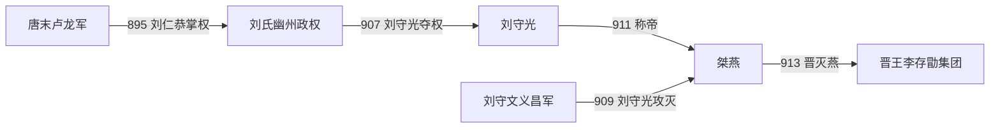

# 桀燕（刘燕）

## 时间

911年-913年

## 别称

- 桀燕
- 刘燕

## 概括

燕是刘守光据幽州称帝建立的短命政权。刘守光本为卢龙军节度使系统人物，911年称帝，国号燕。913年，李存勖率晋军攻破幽州，刘守光被俘，燕亡。

## 建立、扩张与覆亡

- **建立背景**：895年刘仁恭借河东李克用支持取得卢龙军，控制幽州及河北东北部。其后他摆脱河东约束，与周边军镇争夺沧州等地；907年刘守光囚禁父亲并夺取卢龙实权。
- **称帝过程**：刘守光以幽州兵马和北方边镇为基础，先后打击兄长刘守文的义昌军。911年他不顾臣下反对称帝，国号大燕、改元应天，后世因其结局与评价称“桀燕”。
- **统治结构**：燕仅以刘守光为皇帝，实际仍是卢龙牙军控制的军镇国家。它没有建立稳固的区域联盟，反而威胁义武、赵等邻镇，并与原本的支持者晋王李存勖决裂。
- **结构性衰落**：幽州地势虽险，但长期内战耗损兵力；称帝使周边势力获得联合讨伐的理由。刘守光以威吓维持军队，地方将领和城镇在晋军持续推进时缺乏共同抵抗意愿。
- **直接灭亡**：912年李存勖命周德威等围攻燕境，逐城切断幽州外援。913年幽州陷落，刘守光出逃后被俘，燕亡；914年刘氏父子被处死。晋由此控制幽州方向，为后来与后梁争夺河北增加战略纵深。

## 重要事件

| 时间 | 事件 | 过程与影响 |
|---|---|---|
| 895年 | 刘仁恭据卢龙 | 在李克用支持下取得幽州，建立刘氏军镇。 |
| 907年 | 刘守光夺权 | 囚父并掌握卢龙，为称帝做准备。 |
| 909年 | 消灭刘守文势力 | 控制义昌军部分地区，但也加深刘氏内战消耗。 |
| 911年 | 称帝建燕 | 改元应天，公开挑战周边政权。 |
| 912—913年 | 晋军攻燕 | 周德威等逐步夺取燕境并围幽州。 |
| 913年 | 幽州陷落 | 刘守光被俘，桀燕灭亡。 |

## 政权形成与君主

| 顺序 | 姓名 | 身份 / 称号 | 实际统治时间 | 与前任关系 | 关键事件 / 备注 |
|---:|---|---|---|---|---|
| 前身 | 刘仁恭 | 卢龙军节度使 | 895年-907年 | 刘氏军镇奠基者 | 由李克用扶植取得幽州，后被其子囚禁；不是燕帝。 |
| 1 | **刘守光** | 大燕皇帝；后称燕王、桀王 | 907年-913年（911年称帝） | 刘仁恭子，夺父权 | 燕唯一皇帝，年号应天；913年亡国被俘。 |

## 演进流程

## 说明

- 刘守光控制幽州、卢龙一带，地处华北东北部战略要地。
- 911年称帝后，燕政权很快遭到周边势力围攻。
- 913年，李存勖灭燕，扩大河东晋王集团在河北、幽州方向的影响。
- 燕的灭亡为后唐后来灭后梁、进入中原积累了北方优势。

## 统治结构

| 角色 | 人物 / 机构 | 说明 |
|---|---|---|
| 君主 | 刘守光 | 据幽州称帝。 |
| 地域核心 | 幽州、卢龙 | 燕政权主要控制区。 |
| 主要对手 | 晋王李存勖 | 913年灭燕。 |

## 演变关系

- 前一节点：唐末卢龙军割据。
- 后一节点：晋王集团 / 后唐。李存勖灭燕后控制幽州方向。
