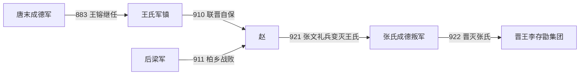

# 赵

## 时间

910年-921年（王氏据成德始于883年；张氏叛军至922年）

## 别称

- 成德赵
- 镇州王氏政权

## 概括

赵是王镕据成德军、镇州一带形成的河北割据政权。它夹在后梁和河东晋王集团之间，常借联盟维持自身地位。921年前后，赵内乱并被晋王李存勖势力接管。

## 建立、结盟与终结

- **建立背景**：王镕出自长期控制成德军的王氏，883年父亲王景崇死后幼年继任，实际割据远早于“赵”政权的通常起年。唐亡后他先接受后梁册封，在镇州维持成德军的世袭统治。
- **形成机制**：910年后梁企图以协防为名控制成德和义武，王镕转而与晋王李存勖、义武王处直结盟。此后他以赵王身份保持自治，赵因而更像一个受晋保护的河北军镇王国，而非称帝王朝。
- **战略作用**：成德地处太行山东麓和河北交通枢纽，赵的粮道、城池及骑步军对梁晋战争重要。911年柏乡之战中，赵、晋联军击败后梁，阻止梁军吞并河北中部。
- **维系与隐患**：王镕长期依靠镇州牙兵，晚年又扩大亲军并信任宦者、方士，旧军与君主之间矛盾加深。对外依晋保障安全，对内却没有消除唐末军镇“士兵逐帅”的制度性风险。
- **直接终结**：921年亲军将领张文礼发动兵变，杀王镕及其家族，自称留后，王氏赵政权灭亡。张文礼旋死，其子张处瑾等继续抵抗；李存勖以讨逆为名围攻镇州，922年消灭张氏并把成德纳入晋王集团。
- **前后关系**：因此921年是赵王室终结，922年才是成德叛军被完全接收。后唐建立后，镇州成为其河北军政体系的一部分。

## 重要事件

| 时间 | 事件 | 过程与影响 |
|---|---|---|
| 883年 | 王镕继成德 | 王氏世袭军镇形成长期割据。 |
| 907年 | 奉后梁正朔 | 接受梁的赵王等名号，暂与后梁结盟。 |
| 910年 | 转盟晋王 | 后梁试图控制成德，王镕联合晋与义武自保。 |
| 911年 | 柏乡之战 | 赵、晋联军击败后梁，稳定河北联盟。 |
| 921年 | 张文礼兵变 | 王镕被杀，王氏赵政权终结。 |
| 922年 | 晋取镇州 | 李存勖消灭张氏叛军，成德并入晋。 |

## 统治者与权力交接

| 顺序 | 姓名 | 身份 / 称号 | 统治时间 | 与前任关系 | 关键事件 / 备注 |
|---:|---|---|---|---|---|
| 1 | **王镕** | 成德军节度使、赵王 | 883年-921年（910年后作为晋盟友） | 王景崇子，幼年继任 | 赵唯一独立统治者；未称帝，沿用所奉中原王朝年号。 |
| 过渡 | 张文礼 | 成德军留后；又名王德明 | 921年 | 王镕养子、亲军将领，兵变篡权 | “王德明”是受王镕赐姓时所用姓名；杀王镕后不久病死，其子继续抵抗至922年。 |
| 过渡 | 张处瑾等 | 成德叛军首领 | 921年-922年 | 张文礼子 | 非赵王室；被晋军消灭，镇州被接收。 |

## 演进流程

## 说明

- 王镕为成德军节度使，唐末五代之际长期据镇州。
- 赵地处河北要冲，是梁、晋争夺的重要区域。
- 王镕曾与晋王李存勖结盟对抗后梁。
- 921年前后，赵内部兵变，王氏政权结束。

## 统治结构

| 角色 | 人物 / 机构 | 说明 |
|---|---|---|
| 统治者 | 王镕 | 成德军节度使，赵王。 |
| 地域核心 | 镇州、成德军辖区 | 河北重要藩镇区域。 |
| 外部关系 | 后梁、晋王集团 | 在梁晋之间周旋。 |

## 演变关系

- 前一节点：唐末成德军藩镇割据。
- 后一节点：晋王集团 / 后唐。赵地最终纳入李存勖势力范围。
- 并列关系：[燕](/%E4%BA%BA%E6%96%87%E7%A7%91%E5%AD%A6/%E5%8E%86%E5%8F%B2/%E4%B8%9C%E4%BA%9A/%E4%B8%AD%E5%9B%BD/%E4%BA%94%E4%BB%A3/%E5%90%8E%E6%B1%89%E5%8F%8A%E5%85%B6%E4%BB%96%E6%94%BF%E6%9D%83/%E7%87%95.md)同属河北、幽州方向的割据节点。
