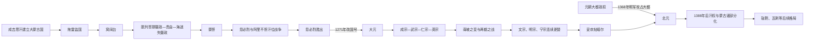

# 元皇帝与蒙古大汗世系

## 概括

元朝世系需要分清三个层次：1206年以后是大蒙古国大汗系统；1271年忽必烈改国号后进入大元皇帝系统；1368年大都失守后元廷退居漠北，进入北元及后续蒙古诸部阶段。称号在蒙古语大汗、中国皇帝庙谥和后世汗号之间并不完全等同，表中按实际阶段分列。

## 世系与政权演变

## 表格口径与实际权力

- 1227—1229年拖雷、1242—1246年脱列哥那、1248—1251年海迷失是摄政者，不列为大汗，却掌握召集忽里勒台、发布命令和分配资源的实际权力。
- 蒙哥死后，忽必烈与阿里不哥各获不同集团拥立。忽必烈获胜并不意味着术赤、察合台、窝阔台诸汗国从此都接受其日常统治；蒙古帝国已转为多个汗国共享成吉思汗家族秩序。
- 忽必烈从1260年起称大汗，1271年才使用“大元”国号；同一人在两表重复，是身份阶段转换，不是两位统治者。
- 元代皇位继承没有固定嫡长规则，母族、怯薛、宿卫、宗王和中书高官共同影响。1328年两都之战、文宗两次在位和明宗暴死尤其显示武装与宫廷联盟决定君位。
- 妥欢帖睦尔1368年离开大都后仍以元帝、大汗身份在漠北统治至1370年，故在“大元”和“北元”两表各列一次。
- “北元”终点有不同口径：本表把保持元国号、年号与较清楚传承的早期汗系列至1402年；此后汗位和部众政治继续存在，转入[蒙古诸部](/%E4%BA%BA%E6%96%87%E7%A7%91%E5%AD%A6/%E5%8E%86%E5%8F%B2/%E4%B8%9C%E4%BA%9A/%E4%B8%AD%E5%9B%BD/%E5%85%83/%E8%92%99%E5%8F%A4%E8%AF%B8%E9%83%A8.md)、[鞑靼](/%E4%BA%BA%E6%96%87%E7%A7%91%E5%AD%A6/%E5%8E%86%E5%8F%B2/%E4%B8%9C%E4%BA%9A/%E4%B8%AD%E5%9B%BD/%E5%85%83/%E9%9E%91%E9%9D%BC.md)和[瓦剌](/%E4%BA%BA%E6%96%87%E7%A7%91%E5%AD%A6/%E5%8E%86%E5%8F%B2/%E4%B8%9C%E4%BA%9A/%E4%B8%AD%E5%9B%BD/%E5%85%83/%E7%93%A6%E5%89%8C.md)专题，不能误写为蒙古政治于1402年终结。

## 崛起、统一与失去中原

### 崛起与统一

- 成吉思汗以千户制、怯薛和分封整合草原军政，继承者又利用跨区域骑兵、情报和工匠网络征服西夏、金及欧亚多地。
- 忽必烈依靠华北税粮、汉人官僚和蒙古宗王军队击败阿里不哥，以大都为中心建立行省、中书省和驿站体系。
- 1279年灭南宋后，元统治全国，并把海运、运河、纸钞和欧亚交通纳入帝国财政；统治并非只有族群等级，也依赖多语官僚和地方精英。
- 省制提高对辽阔区域的协调，却让地方丞相、平章和军队在中央继承危机时拥有重要影响。

### 衰落因素

- 频繁继承与政变使政策、官员和财政反复更换，武宗以后赏赐、军费和宫廷开支压力加重。
- 纸钞超发、盐课和劳役问题削弱货币信用；黄河水患、灾荒和赈济失灵扩大基层危机。
- 地方豪强、军户与寺院等掌握人口土地，国家户籍税收难以稳定；族群与身份差等又增加政治不满。
- 1351年治河征发成为红巾军起事的直接背景，各地反元集团迅速建立独立税兵体系。
- 元廷依靠察罕帖木儿、扩廓帖木儿等地方军阀平乱，却无法消除他们与中央、彼此之间的冲突。

### 直接退出中原

朱元璋先控制长江中下游，击败陈友谅、张士诚后于1368年建明并北伐。元廷内有皇太子、权臣和地方军阀矛盾，无法集中防御；徐达军逼近大都时，妥欢帖睦尔北撤。大都失守结束元在中原的全国性统治，但元廷、皇族和军队仍在漠北延续，随后与明长期战争。

## 大蒙古国

| 顺序 | 姓名 | 庙号 | 谥号 | 年号 | 在位时间 | 生卒时间 | 与前任关系 | 关键事件 / 备注 / 说明 |
|---:|---|---|---|---|---|---|---|---|
| - | 也速该 | 烈祖 | 神元皇帝 | 无 | 未即位 | 约1134年-1171年 | 成吉思汗父 | 元世祖追谥。 |
| 1 | **铁木真 / 成吉思汗** | 太祖 | 法天启运圣武皇帝 | 无 | 1206年-1227年 | 1162年-1227年 | 建国者 | 元世祖追谥。**1206年，成吉思汗统一漠北，于斡难河建立大蒙古国。** |
| - | 拖雷 | 睿宗 | 仁圣景襄皇帝 | 无 | 1227年-1229年摄政 | 1193年-1232年 | 成吉思汗四子 | 元世祖追谥。**1227年，蒙古灭西夏。** |
| 2 | **窝阔台** | 太宗 | 英文皇帝 | 无 | 1229年-1241年 | 1186年-1241年 | 成吉思汗三子 | 元世祖追谥。**1234年，蒙古灭金，完全领有华北。** |
| - | 脱列哥那 | 无 | 昭慈皇后 | 无 | 1242年-1246年摄政 | 不详-1246年 | 窝阔台皇后 | 元世祖追谥。 |
| 3 | 贵由 | 定宗 | 简平皇帝 | 无 | 1246年-1248年 | 1206年-1248年 | 窝阔台子 | 元世祖追谥。 |
| - | 海迷失 | 无 | 钦淑皇后 | 无 | 1248年-1251年摄政 | 不详-1252年 | 贵由皇后 | 元世祖追谥。 |
| 4 | **蒙哥** | 宪宗 | 桓肃皇帝 | 无 | 1251年-1259年 | 1209年-1259年 | 拖雷长子 | 元世祖追谥。**1259年，蒙哥在征宋战争中去世，忽必烈与阿里不哥爆发汗位战争。** |
| 5 | **忽必烈** | 世祖 | 圣德神功文武皇帝 | 中统、至元 | 1260年-1271年 | 1215年-1294年 | 蒙哥弟；拖雷子 | 1260年即位大汗，逐步建立中原王朝化统治。 |
| - | 阿里不哥 | 无 | 无 | 无 | 1260年-1264年 | 约1219年-1266年 | 忽必烈弟；汗位竞争者 | **1264年，忽必烈击败阿里不哥。** |

## 大元

| 顺序 | 姓名 | 庙号 | 谥号 | 年号 | 在位时间 | 生卒时间 | 与前任关系 | 关键事件 / 备注 / 说明 |
|---:|---|---|---|---|---|---|---|---|
| 1 | **忽必烈** | 世祖 | 圣德神功文武皇帝 | 至元 | 1271年-1294年 | 1215年-1294年 | 建元者 | **1271年，忽必烈改国号为大元，建立元朝，定都大都；1279年，元灭南宋，统一中国。** |
| 2 | 铁穆耳 | 成宗 | 钦明广孝皇帝 | 元贞、大德 | 1294年-1307年 | 1265年-1307年 | 世祖孙 | 维持元朝中前期稳定。 |
| 3 | 海山 | 武宗 | 仁惠宣孝皇帝 | 至大 | 1307年-1311年 | 1281年-1311年 | 成宗侄 | 即位后政治和财政开支扩大。 |
| 4 | 爱育黎拔力八达 | 仁宗 | 圣文钦孝皇帝 | 皇庆、延祐 | 1311年-1320年 | 1285年-1320年 | 武宗弟 | 推行延祐复科，恢复科举。 |
| 5 | 硕德八剌 | 英宗 | 睿圣文孝皇帝 | 至治 | 1320年-1323年 | 1303年-1323年 | 仁宗子 | 南坡之变中遇害。 |
| 6 | 也孙铁木儿 | 无 | 泰定皇帝 | 泰定、致和 | 1323年-1328年 | 1293年-1328年 | 成吉思汗后裔；晋王系 | 史称泰定帝。 |
| 7 | 阿速吉八 | 无 | 天顺皇帝 | 天顺 | 1328年 | 1320年-1328年 | 泰定帝子 | 两都之战中失败，在位极短。 |
| 8 | 图帖睦尔 | 文宗 | 圣明元孝皇帝 | 天历、至顺 | 1328年-1329年；1329年-1332年 | 1304年-1332年 | 武宗子 | 两次在位，卷入明宗和世㻋之死等继承争议。 |
| 9 | 和世㻋 | 明宗 | 翼献景孝皇帝 | 天历 | 1329年 | 1300年-1329年 | 武宗长子；文宗兄 | 即位后不久暴死。 |
| 10 | 懿璘质班 | 宁宗 | 冲圣嗣孝皇帝 | 至顺 | 1332年 | 1326年-1332年 | 明宗次子 | 幼年即位，在位很短。 |
| 11 | **妥欢帖睦尔** | 惠宗 | 顺皇帝 | 元统、至元、至正 | 1333年-1368年 | 1320年-1370年 | 明宗长子 | 1351年爆发红巾军起义。**1368年，朱元璋建立明朝，徐达北伐攻陷大都，元廷退居漠北，史称北元。** |

## 北元

| 顺序 | 姓名 | 庙号 | 谥号 / 汗号 | 年号 | 在位时间 | 生卒时间 | 与前任关系 | 关键事件 / 备注 / 说明 |
|---:|---|---|---|---|---|---|---|---|
| 1 | 妥欢帖睦尔 | 惠宗 | 顺皇帝；乌哈噶图汗 | 至正、宣光 | 1368年-1370年 | 1320年-1370年 | 元朝皇帝北退 | 退居漠北后继续维持元朝正统。 |
| 2 | 爱猷识理达腊 | 昭宗 | 必里克图汗 | 宣光 | 1370年-1378年 | 1338年-1378年 | 惠宗子 | 继续与明朝对抗。 |
| 3 | 脱古思帖木儿 | 无 | 乌萨哈尔汗 | 天元 | 1378年-1388年 | 1342年-1388年 | 昭宗弟 | 1388年捕鱼儿海之战后败亡，北元受到决定性打击。 |
| 4 | 也速迭儿 | 无 | 卓里克图汗 | 无 | 1388年-1391年或1393年 | 不详-1391年或1393年 | 阿里不哥后裔；篡位者 | 杀脱古思帖木儿后称汗，蒙古汗统争议加深。 |
| 5 | 额勒伯克 | 无 | 尼古埒苏克齐汗 | 无 | 1393年-1399年 | 1361年-1399年 | 蒙古汗 | 北元后期汗权衰弱。 |
| 6 | 坤帖木儿 | 无 | 无 | 无 | 1400年-1402年 | 不详-1402年 | 蒙古汗 | 1402年，鬼力赤篡位，传统北元叙事通常以此为重要终点。 |

## 演变关系

- 前一节点：[蒙古帝国](/%E4%BA%BA%E6%96%87%E7%A7%91%E5%AD%A6/%E5%8E%86%E5%8F%B2/%E4%B8%9C%E4%BA%9A/%E4%B8%AD%E5%9B%BD/%E5%85%83/%E8%92%99%E5%8F%A4%E5%B8%9D%E5%9B%BD.md)。
- 元朝后一节点：[明](/%E4%BA%BA%E6%96%87%E7%A7%91%E5%AD%A6/%E5%8E%86%E5%8F%B2/%E4%B8%9C%E4%BA%9A/%E4%B8%AD%E5%9B%BD/%E6%98%8E/README.md)。
- 北元后续节点：[蒙古诸部](/%E4%BA%BA%E6%96%87%E7%A7%91%E5%AD%A6/%E5%8E%86%E5%8F%B2/%E4%B8%9C%E4%BA%9A/%E4%B8%AD%E5%9B%BD/%E5%85%83/%E8%92%99%E5%8F%A4%E8%AF%B8%E9%83%A8.md)、[鞑靼](/%E4%BA%BA%E6%96%87%E7%A7%91%E5%AD%A6/%E5%8E%86%E5%8F%B2/%E4%B8%9C%E4%BA%9A/%E4%B8%AD%E5%9B%BD/%E5%85%83/%E9%9E%91%E9%9D%BC.md)、[瓦剌](/%E4%BA%BA%E6%96%87%E7%A7%91%E5%AD%A6/%E5%8E%86%E5%8F%B2/%E4%B8%9C%E4%BA%9A/%E4%B8%AD%E5%9B%BD/%E5%85%83/%E7%93%A6%E5%89%8C.md)。
