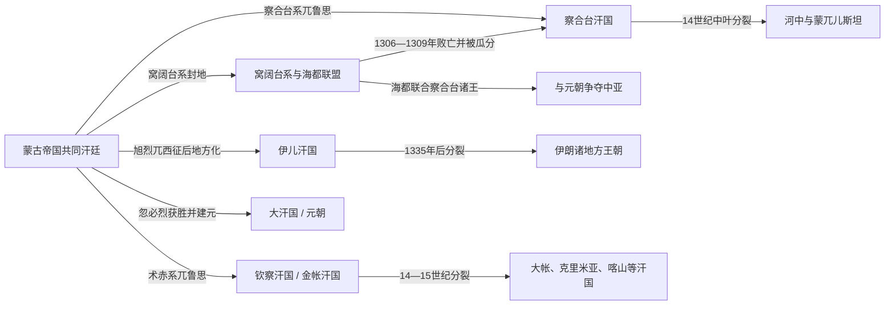

# 四大汗国

## 时间

13世纪中叶以后逐渐形成。各汗国的建立、独立和终结时间不同，不能视为同一年同时出现、边界固定的四个国家。

## 名称与计数口径

“四大汗国”是便于理解蒙古帝国分化的概括词，但存在两种常见口径：

1. **中文传统的西方四汗国口径**：钦察汗国、察合台汗国、窝阔台汗国、伊儿汗国，元朝另列为宗主汗廷。
2. **帝国政治四分口径**：忽必烈系大汗国即元朝、术赤系钦察汗国、察合台汗国、旭烈兀系伊儿汗国。现代蒙古史研究更常用这一结构描述1260年代以后实际独立的主要政权；窝阔台系海都联盟虽很重要，却与察合台领地交叠，且未形成同样长期稳定的单一汗国。

两种口径处理的是不同问题。本页保留中文笔记中熟悉的“四大汗国”名称，同时明确：这些政权源于成吉思汗家族兀鲁思分封，经扩张、内战和地方化才成为自主国家。

## 概括

成吉思汗把征服领地和人口分授诸子，但大汗仍有最高调度权。窝阔台、贵由、蒙哥时期，诸王的封地、军队与各地达鲁花赤仍处在共同帝国网络中。1259年蒙哥死后，忽必烈与阿里不哥争位；与此同时，旭烈兀在伊朗建立独立统治，术赤系与旭烈兀系因高加索和阿塞拜疆开战，海都又联合多位察合台诸王长期反对忽必烈。由此，大汗的宗主名义与跨汗国礼仪仍在，税收、军队和继承却分别掌握在各地汗廷手中。

汗国并非只靠游牧征服维持。钦察汗国控制伏尔加商路并向罗斯诸公国征收贡赋；察合台汗国统治河中城市、草原和绿洲；伊儿汗国采用波斯文官、土地税和城市财政；元朝则以中书省、行省和中国税粮支撑大汗权。宗教与语言也发生区域化：钦察、察合台和伊儿汗国先后不同程度突厥化、伊斯兰化，统治者仍以成吉思汗后裔身份维持合法性。

## 分化流程

## 主要政权比较

| 政权 | 家系与形成 | 核心区域 | 统治机制 | 主要转折与结局 |
|---|---|---|---|---|
| 钦察汗国 / 金帐汗国 | 术赤系；拔都在1236—1240年西征后奠定国家 | 伏尔加河、黑海—里海北部草原、罗斯宗主网络 | 萨莱汗廷、诸王封地、达鲁花赤与贡赋；依靠草原骑兵和跨欧亚贸易 | 别儿哥与旭烈兀系开战；月即别汗时期伊斯兰化加强；1359年后大乱，脱脱迷失短暂重整又败于帖木儿，15世纪分化为多个后继汗国。 |
| 察合台汗国 | 察合台兀鲁思，后在海都—都哇联盟中重组 | 河中、七河、天山南北及部分阿富汗 | 可汗与游牧贵族并存，城市税收由地方官僚和代理人经营 | 1260年代后自主化；都哇以后短暂承认元朝大汗；14世纪中叶分为西部河中与东部蒙兀儿斯坦，西部权力后来被帖木儿掌握。 |
| 窝阔台系 / 海都联盟 | 窝阔台后裔封地；海都约1269年后建立反忽必烈联盟 | 阿尔泰、额尔齐斯河与中亚东北部，势力跨入察合台领地 | 海都以黄金家族资历、军队和对察合台诸王的扶立维持联盟 | 海都长期与元朝争夺中亚，1301年死后联盟衰退；察八儿于1306年归降，1309年前后领地被元朝和察合台势力瓜分。 |
| 伊儿汗国 | 旭烈兀1256年西征后建立，受忽必烈承认为伊儿汗 | 伊朗、伊拉克、阿塞拜疆及安纳托利亚东部 | 蒙古军政贵族与波斯宰相、税收和文书体系结合 | 1258年攻陷巴格达；与金帐汗国、马穆鲁克长期战争；合赞汗1295年改宗伊斯兰并改革财政；不赛因1335年死后无强势成年继承人，国家分裂。 |
| 元朝 / 大汗国 | 拖雷—忽必烈系；1260年争位、1271年建元 | 蒙古高原、中国本部、青藏高原等 | 大汗兼皇帝，中书省、枢密院、行省、驿站和多语官僚 | 名义上居诸汗之上，实际不能日常控制西方汗国；1304年前后获得短暂名义承认，1368年失去大都后转入北元。 |

## 共通统治结构

| 机制 | 作用 | 地区差异 |
|---|---|---|
| 兀鲁思分封 | 成吉思汗家族成员获得人口、牧地、军队和税收份额。 | 早期是共同帝国内的份地，后来逐渐领土国家化。 |
| 黄金家族合法性 | 可汗原则上出自成吉思汗男系，忽里勒台和诸王拥立赋予程序正当性。 | 权臣可掌实际权力，却常需保留傀儡可汗；帖木儿等非黄金家族统治者尤其如此。 |
| 怯薛、千户与诸王军 | 连接宫廷、军事随从和地方部众。 | 定居地区又必须依靠波斯、中国、突厥和罗斯行政人员。 |
| 达鲁花赤、征税与贡赋 | 监督城市、属国和交通线，调取军需、人口与税收。 | 罗斯以间接宗主和贡赋为主；元与伊儿汗国拥有更庞大的定居官僚体系。 |
| 驿站与商路保护 | 保障使节、军令、商队和情报流通，是“蒙古和平”的物质基础。 | 汗国战争会切断路线，和平协议则能恢复跨境贸易。 |
| 宗教保护与改宗 | 早期普遍容纳多种宗教，以争取不同臣民和僧侣集团。 | 伊儿汗、金帐与察合台统治者后来陆续接受伊斯兰；元朝宫廷则突出藏传佛教等传统。 |

## 重要事件

1. **1236—1240年蒙古西征**：拔都等征服伏尔加、钦察草原和罗斯诸地，为术赤系国家奠定疆域与贡赋网络。
2. **1256年旭烈兀进入伊朗**：蒙哥授权的西征逐渐形成独立伊儿汗国；1258年巴格达陷落改变西亚政治格局。
3. **1259—1264年汗位战争**：忽必烈和阿里不哥各获不同诸王支持，大汗继承从共同帝国程序变为区域集团战争。
4. **1261年前后别儿哥—旭烈兀战争**：术赤系与伊儿汗系为高加索、阿塞拜疆和军队处置交战，证明西方汗国已经自主行动。
5. **海都长期抗元**：窝阔台后裔海都联合察合台诸王，在中亚牵制忽必烈及其继承者，阻止大汗恢复直接控制。
6. **约1304年的名义和解**：多个汗廷一度承认元成宗的最高名分，跨境贸易恢复；这不是行政统一，和解很快被新的地区竞争取代。
7. **伊儿汗国伊斯兰化与改革**：合赞汗改宗后整顿税制、军俸和行政，使蒙古统治更深地嵌入伊朗社会。
8. **14世纪的连续分裂**：伊儿汗国在1335年后崩解，察合台汗国东西分裂，金帐汗国在1359年后进入长期争位，区域王朝和军事权臣取代统一汗廷。

## 崛起、鼎盛与衰落机制

### 崛起条件

- 蒙古西征留下跨洲军队、户口、牧地和驿站，各支宗王可以把临时军区转为世袭兀鲁思。
- 成吉思汗家族共同合法性降低了早期建国成本，诸汗仍可调动亲族、婚姻和旧怯薛网络。
- 控制伏尔加、丝绸之路、河中绿洲、伊朗城市和中国税粮，让游牧军事与定居财政结合。
- 对地方宗教、官僚和商人的利用，使少数蒙古统治集团能够治理庞大人口。

### 结构性分裂

- 兀鲁思分封本身赋予诸支独立军队和收入；大汗缺乏跨越数千公里持续征税、任官和镇压的能力。
- 继承没有固定嫡长制，诸王、皇后、军队和忽里勒台可拥立不同候选人，导致反复内战。
- 各汗国的贸易方向、宗教和地方精英不同，政治利益越来越区域化。
- 汗国之间争夺高加索、花剌子模和中亚商路，消耗了恢复共同帝国所需的互信。

### 直接终结方式

“四大汗国”没有共同灭亡时刻：窝阔台系海都联盟被元与察合台瓜分；伊儿汗国因继承断裂和权臣割据而崩解；察合台汗国分为河中与蒙兀儿斯坦；金帐汗国经大乱、帖木儿打击和后继汗国分离而逐步解体；元朝则在1368年失去中原后以北元形式延续。讨论“蒙古帝国灭亡”时，应区分共同汗廷失效、各区域国家独立和各汗国自身终结三个层次。

## 相关笔记

- 总源头：[蒙古帝国](/%E4%BA%BA%E6%96%87%E7%A7%91%E5%AD%A6/%E5%8E%86%E5%8F%B2/%E4%B8%9C%E4%BA%9A/%E4%B8%AD%E5%9B%BD/%E5%85%83/%E8%92%99%E5%8F%A4%E5%B8%9D%E5%9B%BD.md)。
- 大汗国与中国主线：[元](/%E4%BA%BA%E6%96%87%E7%A7%91%E5%AD%A6/%E5%8E%86%E5%8F%B2/%E4%B8%9C%E4%BA%9A/%E4%B8%AD%E5%9B%BD/%E5%85%83/README.md)。
- 钦察汗国及后继国家：[金帐汗国、乌兹别克与哈萨克汗国](/%E4%BA%BA%E6%96%87%E7%A7%91%E5%AD%A6/%E5%8E%86%E5%8F%B2/%E4%B8%AD%E4%BA%9A/%E8%8D%89%E5%8E%9F%E6%B1%97%E5%9B%BD/%E9%87%91%E5%B8%90%E6%B1%97%E5%9B%BD%E3%80%81%E4%B9%8C%E5%85%B9%E5%88%AB%E5%85%8B%E4%B8%8E%E5%93%88%E8%90%A8%E5%85%8B%E6%B1%97%E5%9B%BD.md)。
- 察合台主线：[蒙古、察合台与帖木儿](/%E4%BA%BA%E6%96%87%E7%A7%91%E5%AD%A6/%E5%8E%86%E5%8F%B2/%E4%B8%AD%E4%BA%9A/_%E9%80%9A%E5%8F%B2/%E8%92%99%E5%8F%A4%E3%80%81%E5%AF%9F%E5%90%88%E5%8F%B0%E4%B8%8E%E5%B8%96%E6%9C%A8%E5%84%BF.md)及[察合台汗国与蒙兀儿斯坦统治者表](/%E4%BA%BA%E6%96%87%E7%A7%91%E5%AD%A6/%E5%8E%86%E5%8F%B2/%E4%B8%AD%E4%BA%9A/_%E9%80%9A%E5%8F%B2/%E5%AF%9F%E5%90%88%E5%8F%B0%E6%B1%97%E5%9B%BD%E4%B8%8E%E8%92%99%E5%85%80%E5%84%BF%E6%96%AF%E5%9D%A6%E7%BB%9F%E6%B2%BB%E8%80%85%E8%A1%A8.md)。
- 伊儿汗国：[蒙古与伊儿汗国时期](/%E4%BA%BA%E6%96%87%E7%A7%91%E5%AD%A6/%E5%8E%86%E5%8F%B2/%E8%A5%BF%E4%BA%9A/%E4%BC%8A%E6%9C%97/%E8%92%99%E5%8F%A4%E4%B8%8E%E4%BC%8A%E5%84%BF%E6%B1%97%E5%9B%BD%E6%97%B6%E6%9C%9F.md)及[伊儿汗国统治者表](/%E4%BA%BA%E6%96%87%E7%A7%91%E5%AD%A6/%E5%8E%86%E5%8F%B2/%E8%A5%BF%E4%BA%9A/%E4%BC%8A%E6%9C%97/%E4%BC%8A%E5%84%BF%E6%B1%97%E5%9B%BD%E7%BB%9F%E6%B2%BB%E8%80%85%E8%A1%A8.md)。
