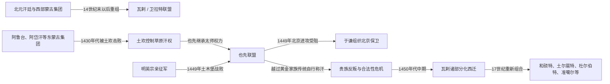

# 瓦剌

## 时间

约14世纪末以后形成明代文献中的西蒙古政治集团；15世纪中叶达到第一次高峰，后续诸支延伸至17—18世纪的和硕特、土尔扈特与准噶尔等政权。

## 名称边界

“瓦剌”是汉文史籍对卫拉特或西蒙古诸部的常见称呼，不是一个从北元到准噶尔始终不变的王朝。联盟所含部众、贵族家系和活动地域会随战争迁徙而变化；“四卫拉特”也主要是一种政治组合概念，不能把后世固定部名机械倒推到14世纪。这里先整理明代瓦剌联盟，再说明它如何转化为后来的西蒙古诸支。

## 概括

北元汗廷削弱后，活动在蒙古高原西部、阿尔泰与天山北部一带的卫拉特贵族，利用东蒙古内争和明朝分化政策扩大势力。马哈木等首领接受明朝封号却保持自身部众；其后土欢统一多个瓦剌集团，以太师身份控制黄金家族可汗。也先继承军政网络，通过草原征服、商路控制和朝贡贸易把联盟推至高峰，1449年在土木堡俘获明英宗。

瓦剌并未因土木堡胜利建立对明的持久统治。于谦组织北京防御，明朝另立景帝，也先手中的英宗不再是决定性筹码。也先后来杀害或排除黄金家族可汗并自行称汗，破坏了草原政治的合法性平衡；贵族冲突使其在1450年代中期被杀，统一联盟迅速瓦解。西蒙古部众仍然延续，并在更西地域重新组合，最终形成和硕特、土尔扈特、杜尔伯特、准噶尔等不同历史线索。

## 演进流程

## 政治阶段

| 阶段 | 时间 | 过程与权力特征 |
|---|---|---|
| 联盟形成 | 14世纪末—15世纪初 | 西蒙古首领在北元争位中支持、废立或对抗不同可汗；与明朝互通使节、接受封号并经营贸易。 |
| 土欢整合 | 15世纪前半叶 | 土欢击败阿鲁台等东蒙古权臣，统一多个瓦剌集团；他保留黄金家族可汗作为合法性中心，自己以太师掌握军政。 |
| 也先鼎盛 | 1439年前后—1449年 | 也先向东、向西扩张，控制草原交通和贡使网络；土木堡胜利使瓦剌声势达到顶点。 |
| 称汗与崩解 | 1450年代前半叶 | 北京进攻失败、英宗获释后，也先与名义可汗及贵族矛盾加剧；自行称汗引发反弹，随后被杀。 |
| 西蒙古重组 | 15世纪后半叶以后 | 统一汗权消失，但部众和贵族集团继续迁徙、会盟与分化，后来形成多个卫拉特政权，不能视为也先国家的简单直线延续。 |

## 统治结构与实际权力

| 角色 | 实际作用 | 内在矛盾 |
|---|---|---|
| 黄金家族可汗 | 提供成吉思汗后裔的最高合法性，能够召集更广泛蒙古部众。 | 瓦剌核心首领多非黄金家族，名义汗与太师可能互相利用或冲突。 |
| 太师 | 土欢、也先以此身份统军、任命亲信、分配战利品并主导外交，是鼎盛期实际最高权力。 | 权力依赖个人威望、亲族和部众联盟，缺少稳定继承规则。 |
| 部族贵族与首领会议 | 掌握牧地、兵户和迁徙路线，战争时组成联军。 | 各集团保留独立利益，战利品和贸易份额分配不均会迅速瓦解联盟。 |
| 贡使与商队网络 | 以马匹、牲畜等换取明朝粮布、金属和赏赐，支撑贵族随从。 | 贡使名额、物价和边关限制经常引发争执，贸易摩擦可能转化为军事压力。 |
| 被征服或结盟部众 | 扩大兵力与牧地，也帮助控制草原通道。 | 服从多基于胜负，核心集团受挫后容易倒戈。 |

## 重要事件

1. **北元后期西部集团兴起**：汗位争夺和明军北征削弱东蒙古中心，为瓦剌贵族向蒙古高原中部扩张创造空间。
2. **马哈木等受封**：明廷以王号和贸易接触瓦剌首领，意在牵制东蒙古；瓦剌则把朝贡转化为物资与政治承认，并非接受明朝日常统治。
3. **土欢击败东蒙古权臣**：1430年代，土欢消灭或驱逐阿鲁台、阿岱汗集团，利用黄金家族可汗建立“可汗居名、太师掌权”的结构。
4. **也先扩大联盟**：他继承父亲的部众和外交网络，向西影响中亚草原，向东控制蒙古诸部，并以贸易条件向明朝施压。
5. **1449年土木堡之变**：明英宗仓促亲征，补给与指挥失序，明军在撤退中被瓦剌击溃，皇帝被俘。
6. **北京保卫战**：于谦等拥立景帝并整顿京军，也先未能迫使明廷接受其条件；他绕过北京的行动也缺少长期攻城和补给基础。
7. **1450年英宗获释**：皇帝作为谈判筹码的价值下降，瓦剌与明恢复使节往来，但也先未能把军事胜利转化为稳定宗主权。
8. **也先称汗与被杀**：也先排除黄金家族可汗、自立为汗，触发贵族合法性与利益冲突；其统一政权在1450年代中期直接毁于内乱。
9. **后续西迁与重组**：瓦剌诸部逐渐在阿尔泰、准噶尔盆地、青海和伏尔加方向建立新网络，为17世纪多个西蒙古政权奠定人口与贵族基础。

## 崛起、鼎盛与崩解原因

### 崛起机制

- **东蒙古分裂**：北元中央衰弱、汗与太师争权，使瓦剌可以逐一击败对手并扶立可汗。
- **土欢的联盟制度**：保留黄金家族名义、由太师掌军，暂时兼顾传统合法性和实际控制。
- **跨区域资源**：牧地、马匹、贡赐、商路与战利品共同供养军队；与明朝的“朝贡”常兼具边贸性质。
- **也先的多向外交**：他在东蒙古、明朝和中亚之间灵活用兵，使各战场资源相互支撑。

### 鼎盛条件

土木堡胜利来自瓦剌机动骑兵和情报优势，也来自明军仓促亲征、指挥集中于宦官集团、补给线过长及撤退混乱。俘获皇帝是重大成果，却不等于瓦剌有能力占领和治理北京及华北。

### 衰落因素与直接崩解

- **结构因素**：联盟没有稳定官僚和继承机制，部族贵族的服从取决于持续胜利及公平分配。
- **合法性问题**：也先通过黄金家族可汗崛起，却最终自行称汗，破坏了原有权力交换。
- **外部限制**：北京防御成功、明朝另立皇帝，使人质外交失效；长期攻城也超出草原联军的补给能力。
- **直接触发**：也先与部下及贵族矛盾激化，在1450年代中期的反叛中被杀，统一联盟随即解体。
- **历史延续**：瓦剌作为政治整体的崩解不是西蒙古人口消失；后来的[准噶尔](/%E4%BA%BA%E6%96%87%E7%A7%91%E5%AD%A6/%E5%8E%86%E5%8F%B2/%E4%B8%9C%E4%BA%9A/%E4%B8%AD%E5%9B%BD/%E6%B8%85/%E5%87%86%E5%99%B6%E5%B0%94.md)只是诸支之一，不能与15世纪瓦剌完全等同。

## 演变关系

- 前一节点：[北元](/%E4%BA%BA%E6%96%87%E7%A7%91%E5%AD%A6/%E5%8E%86%E5%8F%B2/%E4%B8%9C%E4%BA%9A/%E4%B8%AD%E5%9B%BD/%E5%85%83/%E5%8C%97%E5%85%83.md)。
- 并列竞争：[鞑靼](/%E4%BA%BA%E6%96%87%E7%A7%91%E5%AD%A6/%E5%8E%86%E5%8F%B2/%E4%B8%9C%E4%BA%9A/%E4%B8%AD%E5%9B%BD/%E5%85%83/%E9%9E%91%E9%9D%BC.md)。
- 族群与部众延续：[蒙古诸部](/%E4%BA%BA%E6%96%87%E7%A7%91%E5%AD%A6/%E5%8E%86%E5%8F%B2/%E4%B8%9C%E4%BA%9A/%E4%B8%AD%E5%9B%BD/%E5%85%83/%E8%92%99%E5%8F%A4%E8%AF%B8%E9%83%A8.md)。
- 后续政权之一：[准噶尔](/%E4%BA%BA%E6%96%87%E7%A7%91%E5%AD%A6/%E5%8E%86%E5%8F%B2/%E4%B8%9C%E4%BA%9A/%E4%B8%AD%E5%9B%BD/%E6%B8%85/%E5%87%86%E5%99%B6%E5%B0%94.md)。
