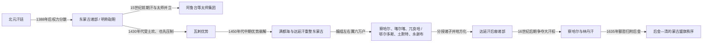

# 鞑靼

## 时间

约14世纪末至17世纪中叶；这里主要讨论明代文献所谓“鞑靼”，即北元分化后的东蒙古政治集团。

## 名称边界

“鞑靼”并不是这一时期某个国家固定使用的自称。这个词在不同时代可指更早的塔塔儿部，也可被欧亚多地文献泛用于蒙古人；明代官书则常把蒙古高原东部、由成吉思汗—忽必烈后裔及其部众构成的集团称为“鞑靼”，并与西蒙古“瓦剌”相对。因而本页整理的是一种外部分类下的政治主线，不能把所有人物编成一条单一王朝世系。

## 概括

1368年元廷退出大都后仍延续大汗与“大元”正统观念，但1388年捕鱼儿海战败、汗位争夺和贵族分裂削弱了中央权威。东蒙古汗权随后在孛儿只斤黄金家族、太师和各部首领之间反复重组；其力量取决于能否控制牧地、人口、商路和对明互市，而不只取决于名义汗号。

15世纪上半叶，阿鲁台等太师一度支配东蒙古政治，继而受瓦剌土欢、也先压制。15世纪后期，满都海与孛儿只斤巴图孟克即达延汗重建黄金家族权威，把东蒙古编为左右翼六万户。六万户后来分授诸子，既扩大达延汗后裔的统治网络，也造成新的地方化。16世纪土默特俺答汗等右翼领袖经营河套、推动边贸并与藏传佛教建立联系；察哈尔林丹汗试图重新集中大汗权力，却在后金扩张和蒙古诸部改宗主的压力下失败。

## 演进流程

## 政治阶段

| 阶段 | 时间 | 权力中心与具体过程 |
|---|---|---|
| 北元破碎与汗—太师竞争 | 1388年—1430年代 | 大汗仍须出自黄金家族，但拥兵太师可废立汗位；明朝以远征、封贡和分化政策同时介入。 |
| 瓦剌压制东蒙古 | 1430年代—1450年代中期 | 土欢、也先先后击败阿鲁台、阿岱汗等对手，并控制或利用东蒙古可汗；东蒙古没有就此消失，而是暂失草原主导权。 |
| 达延汗重整 | 15世纪后期—16世纪初 | 满都海扶立巴图孟克，逐步排除非黄金家族权臣；达延汗以左右翼六万户重组部众和封地。 |
| 诸部地方化与边贸政治 | 16世纪 | 达延汗后裔分掌察哈尔、喀尔喀、土默特、鄂尔多斯等部；大汗保留礼仪优势，实际兵力、牧地与贸易口岸掌握在各支领袖手中。 |
| 察哈尔失败与秩序转换 | 17世纪前期—1635年 | 林丹汗试图从察哈尔恢复汗权，征敛和战争却推动部分蒙古部转向后金；其死后额哲归附，明代“鞑靼”分类逐渐被清代盟旗体系取代。 |

## 统治结构与实际权力

| 层级 | 作用 | 权力限制 |
|---|---|---|
| 大汗 | 以成吉思汗黄金家族血统提供最高合法性，主持会盟、分封和对外名义。 | 若缺少直属部众、太师支持和贸易资源，汗号可能只具象征性。 |
| 太师与异姓贵族 | 统率军队、处理政务，弱汗时期能够废立可汗。 | 非黄金家族自行称汗会遭遇强烈合法性反弹，也难稳定分配诸部利益。 |
| 万户、鄂托克与诸王 | 管理牧地、户口和兵役，构成左右翼及地方部众。 | 分封会把统一成果转化为世袭支系，中央难持续调动全部兵力。 |
| 台吉、那颜与伴当 | 维系地方军事随从、贡赋和迁牧秩序。 | 追随关系会随婚姻、战败、灾荒和贸易条件改变。 |
| 明朝封贡与互市 | 以王号、赏赐、马市和边关贸易调节关系。 | 贸易受限时走私和袭扰增加；战争与互市常是同一谈判过程的两面。 |

## 重要事件

1. **1388年捕鱼儿海之战**：明军重创北元汗廷，随后汗位与诸部控制进一步分散；这不是蒙古政治的终结，而是东、西蒙古长期竞逐的开端。
2. **永乐时期北征与招抚**：明军多次深入草原，同时册封、互市并吸纳边缘部众，使东蒙古首领在抗明、入贡和内部联盟之间反复选择。
3. **阿鲁台—阿岱汗集团兴衰**：太师阿鲁台借黄金家族可汗维持权力，后来在瓦剌进攻中失败，显示汗号与实际军力相互依赖。
4. **瓦剌优势及其瓦解**：土欢、也先压倒东蒙古并在土木堡之变后达到高峰；也先越过黄金家族传统自行称汗，联盟随即在内讧中崩解。
5. **满都海与达延汗复兴**：他们联合和征服多个东蒙古集团，使忽必烈系汗权重新居于核心，并以六万户安排左右翼。
6. **1571年隆庆封贡**：明朝封俺答汗为顺义王并开放边市，长期战争转为制度化贸易；和平来自双方对马匹、粮布、名号和边境安全的共同需要。
7. **林丹汗与后金竞争**：林丹汗试图加强察哈尔和大汗权，其他蒙古部却陆续与努尔哈赤、皇太极结盟。
8. **1634—1635年政权转换**：林丹汗西迁途中去世，次年其子额哲归附后金；察哈尔被纳入新的宗主秩序，但东蒙古各部和黄金家族并未消失。

## 崛起、分化与转化原因

### 重整条件

- 黄金家族血统能为跨部联盟提供共同合法性，满都海与达延汗又把这种名义转化为军事胜利和分封秩序。
- 控制河套、草原通道和明朝边市，可以把牲畜交换为粮食、布匹和金属，从而供养更大的随从集团。
- 婚姻、收养、会盟与宗教资助能跨越单一部族，形成比短期掠夺更稳定的联盟。

### 持续分化因素

- 游牧部众和牧地分散，汗廷缺乏固定税收与常设官僚，必须不断在诸王、太师和部众之间重新分配利益。
- 达延汗把六万户分授子孙，解决了统一时的统治问题，却让后代诸支拥有独立兵力和外交空间。
- 明朝的边防、封贡和贸易开闭，瓦剌的军事压力，以及后金对蒙古贵族的婚姻和册封，共同改变诸部结盟方向。
- 林丹汗的失败不是“鞑靼王朝灭亡”，而是察哈尔大汗集权方案失败。其后东蒙古进入清朝盟旗、喀尔喀诸汗和内外蒙古等新框架。

## 演变关系

- 前一节点：[北元](/%E4%BA%BA%E6%96%87%E7%A7%91%E5%AD%A6/%E5%8E%86%E5%8F%B2/%E4%B8%9C%E4%BA%9A/%E4%B8%AD%E5%9B%BD/%E5%85%83/%E5%8C%97%E5%85%83.md)。
- 并列竞争：[瓦剌](/%E4%BA%BA%E6%96%87%E7%A7%91%E5%AD%A6/%E5%8E%86%E5%8F%B2/%E4%B8%9C%E4%BA%9A/%E4%B8%AD%E5%9B%BD/%E5%85%83/%E7%93%A6%E5%89%8C.md)。
- 组织延续：[蒙古诸部](/%E4%BA%BA%E6%96%87%E7%A7%91%E5%AD%A6/%E5%8E%86%E5%8F%B2/%E4%B8%9C%E4%BA%9A/%E4%B8%AD%E5%9B%BD/%E5%85%83/%E8%92%99%E5%8F%A4%E8%AF%B8%E9%83%A8.md)。
- 外部关系：[明](/%E4%BA%BA%E6%96%87%E7%A7%91%E5%AD%A6/%E5%8E%86%E5%8F%B2/%E4%B8%9C%E4%BA%9A/%E4%B8%AD%E5%9B%BD/%E6%98%8E/README.md)、[清](/%E4%BA%BA%E6%96%87%E7%A7%91%E5%AD%A6/%E5%8E%86%E5%8F%B2/%E4%B8%9C%E4%BA%9A/%E4%B8%AD%E5%9B%BD/%E6%B8%85/README.md)。
