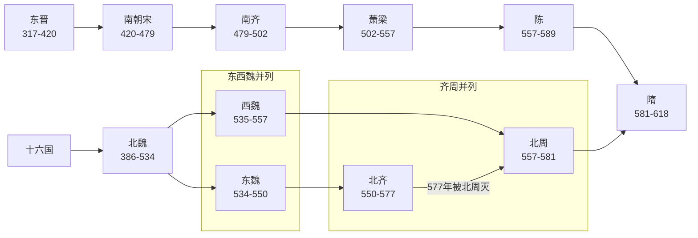

# 南北朝

> 导航：[南北朝](/%E4%BA%BA%E6%96%87%E7%A7%91%E5%AD%A6/%E5%8E%86%E5%8F%B2/%E4%B8%9C%E4%BA%9A/%E4%B8%AD%E5%9B%BD/%E5%8D%97%E5%8C%97%E6%9C%9D/README.md) / [南朝](/%E4%BA%BA%E6%96%87%E7%A7%91%E5%AD%A6/%E5%8E%86%E5%8F%B2/%E4%B8%9C%E4%BA%9A/%E4%B8%AD%E5%9B%BD/%E5%8D%97%E5%8C%97%E6%9C%9D/%E5%8D%97%E6%9C%9D/README.md) / [北朝](/%E4%BA%BA%E6%96%87%E7%A7%91%E5%AD%A6/%E5%8E%86%E5%8F%B2/%E4%B8%9C%E4%BA%9A/%E4%B8%AD%E5%9B%BD/%E5%8D%97%E5%8C%97%E6%9C%9D/%E5%8C%97%E6%9C%9D/README.md)

## 概括

南北朝（420年—589年）是中国历史上的南北对峙时期，上承[东晋](/%E4%BA%BA%E6%96%87%E7%A7%91%E5%AD%A6/%E5%8E%86%E5%8F%B2/%E4%B8%9C%E4%BA%9A/%E4%B8%AD%E5%9B%BD/%E6%99%8B/%E4%B8%9C%E6%99%8B.md)与[十六国](/%E4%BA%BA%E6%96%87%E7%A7%91%E5%AD%A6/%E5%8E%86%E5%8F%B2/%E4%B8%9C%E4%BA%9A/%E4%B8%AD%E5%9B%BD/%E6%99%8B/%E5%8D%81%E5%85%AD%E5%9B%BD/README.md)，下接隋朝。南方从刘裕代晋建立南朝宋开始，依次经历宋、齐、梁、陈；北方从北魏统一华北开始，后分裂为东魏、西魏，再分别演变为北齐、北周，最终北周由隋取代，隋灭陈后重新统一南北。

## 演进流程

## 阶段导览

| 顺序 | 阶段 | 时间 | 都城 | 简要概括 |
|---:|---|---|---|---|
| 1 | [南朝](/%E4%BA%BA%E6%96%87%E7%A7%91%E5%AD%A6/%E5%8E%86%E5%8F%B2/%E4%B8%9C%E4%BA%9A/%E4%B8%AD%E5%9B%BD/%E5%8D%97%E5%8C%97%E6%9C%9D/%E5%8D%97%E6%9C%9D/README.md) | 420年—589年 | 建康为主 | 宋、齐、梁、陈相继更替，南方政权以江南为根基，与北方长期对峙。 |
| 2 | [北朝](/%E4%BA%BA%E6%96%87%E7%A7%91%E5%AD%A6/%E5%8E%86%E5%8F%B2/%E4%B8%9C%E4%BA%9A/%E4%B8%AD%E5%9B%BD/%E5%8D%97%E5%8C%97%E6%9C%9D/%E5%8C%97%E6%9C%9D/README.md) | 439年—581年 | 平城、洛阳、邺、长安等 | 北魏统一华北后分裂为东魏、西魏，又演变为北齐、北周；北周灭北齐后统一北方。 |
| 3 | 隋灭陈 | 589年 | 大兴、建康 | 隋朝南下灭陈，结束南北朝分裂局面。 |

## 核心线索

- **南北对峙**：南方以建康为政治中心，北方以北魏及其后继政权为主轴。
- **门阀与皇权**：南朝承接东晋门阀政治，但寒门军功集团和皇权逐渐上升。
- **民族融合**：北朝以鲜卑政权为核心，北魏孝文帝改革推动汉化与制度整合。
- **分裂中的统一趋势**：北朝军政整合能力逐渐增强，最终由北周—隋系统完成统一。
- **灭亡原因**：门阀与皇权矛盾、地方军人势力兴起、皇室内斗、外部军事压力和财政民力消耗共同削弱南北政权。

## 建立、维系与衰亡 / 转型机制

南北朝是多政权并立与持续重组时期，不宜用一个王朝的“兴亡原因”概括。

| 区域主线 | 建立与维系 | 结构性变化 | 转型结果 |
|---|---|---|---|
| 南朝 | 刘裕凭北府军代晋建宋，宋、齐、梁、陈先后以建康和江南财赋为基础维系统治。 | 皇室骨肉相残、军人掌权和寒门武将上升造成频繁禅代；侯景之乱重创梁和江南旧秩序。 | 陈朝疆域和资源有限，589年被隋灭。 |
| 北朝 | 北魏整合北方诸政权，以部族军事组织、均田和地方治理恢复秩序；孝文帝改革推动政治文化重构。 | 六镇军镇与洛阳中央之间利益失衡，边镇起义和权臣竞争导致北魏分裂。 | 东魏—北齐、西魏—北周并立，北周最终灭北齐。 |
| 统一条件 | 北方长期整合形成较强军政与户籍财政基础；南北人口迁徙、制度交流和经济恢复缩小长期分裂的制度障碍。 | 北周内部经杨坚掌权完成权力转移，隋继承北周军政资源。 | 581年隋建立，589年灭陈，结束南北长期分裂。 |

## 相关笔记

- [南朝](/%E4%BA%BA%E6%96%87%E7%A7%91%E5%AD%A6/%E5%8E%86%E5%8F%B2/%E4%B8%9C%E4%BA%9A/%E4%B8%AD%E5%9B%BD/%E5%8D%97%E5%8C%97%E6%9C%9D/%E5%8D%97%E6%9C%9D/README.md)
- [北朝](/%E4%BA%BA%E6%96%87%E7%A7%91%E5%AD%A6/%E5%8E%86%E5%8F%B2/%E4%B8%9C%E4%BA%9A/%E4%B8%AD%E5%9B%BD/%E5%8D%97%E5%8C%97%E6%9C%9D/%E5%8C%97%E6%9C%9D/README.md)
- [晋](/%E4%BA%BA%E6%96%87%E7%A7%91%E5%AD%A6/%E5%8E%86%E5%8F%B2/%E4%B8%9C%E4%BA%9A/%E4%B8%AD%E5%9B%BD/%E6%99%8B/README.md)
- [十六国](/%E4%BA%BA%E6%96%87%E7%A7%91%E5%AD%A6/%E5%8E%86%E5%8F%B2/%E4%B8%9C%E4%BA%9A/%E4%B8%AD%E5%9B%BD/%E6%99%8B/%E5%8D%81%E5%85%AD%E5%9B%BD/README.md)

## 相关民族与东亚历史

- 北朝与鲜卑、柔然、突厥前史等北方族群关系密切，族群侧见[蒙古语族与东胡](/%E4%BA%BA%E6%96%87%E7%A7%91%E5%AD%A6/%E5%8E%86%E5%8F%B2/%E4%B8%9C%E4%BA%9A/%E4%B8%AD%E5%9B%BD/_%E6%B0%91%E6%97%8F/%E8%92%99%E5%8F%A4%E8%AF%AD%E6%97%8F%E4%B8%8E%E4%B8%9C%E8%83%A1/README.md)与[突厥语族与北方草原](/%E4%BA%BA%E6%96%87%E7%A7%91%E5%AD%A6/%E5%8E%86%E5%8F%B2/%E4%B8%9C%E4%BA%9A/%E4%B8%AD%E5%9B%BD/_%E6%B0%91%E6%97%8F/%E7%AA%81%E5%8E%A5%E8%AF%AD%E6%97%8F%E4%B8%8E%E5%8C%97%E6%96%B9%E8%8D%89%E5%8E%9F/README.md)。
- 同期日本处于[古坟时代](/%E4%BA%BA%E6%96%87%E7%A7%91%E5%AD%A6/%E5%8E%86%E5%8F%B2/%E4%B8%9C%E4%BA%9A/%E6%97%A5%E6%9C%AC/%E5%8F%A4%E5%9D%9F%E6%97%B6%E4%BB%A3.md)，朝鲜半岛处于高句丽、百济、新罗竞争阶段，见[高句丽王国](/%E4%BA%BA%E6%96%87%E7%A7%91%E5%AD%A6/%E5%8E%86%E5%8F%B2/%E4%B8%9C%E4%BA%9A/%E6%9C%9D%E9%B2%9C%E5%8D%8A%E5%B2%9B/%E9%AB%98%E5%8F%A5%E4%B8%BD%E7%8E%8B%E5%9B%BD.md)、[百济王国](/%E4%BA%BA%E6%96%87%E7%A7%91%E5%AD%A6/%E5%8E%86%E5%8F%B2/%E4%B8%9C%E4%BA%9A/%E6%9C%9D%E9%B2%9C%E5%8D%8A%E5%B2%9B/%E7%99%BE%E6%B5%8E%E7%8E%8B%E5%9B%BD.md)、[新罗王国](/%E4%BA%BA%E6%96%87%E7%A7%91%E5%AD%A6/%E5%8E%86%E5%8F%B2/%E4%B8%9C%E4%BA%9A/%E6%9C%9D%E9%B2%9C%E5%8D%8A%E5%B2%9B/%E6%96%B0%E7%BD%97%E7%8E%8B%E5%9B%BD.md)。

## 直接上级

- [中国](/%E4%BA%BA%E6%96%87%E7%A7%91%E5%AD%A6/%E5%8E%86%E5%8F%B2/%E4%B8%9C%E4%BA%9A/%E4%B8%AD%E5%9B%BD/README.md)
