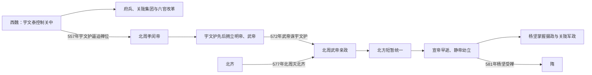

# 周（宇文）

> 导航：[南北朝](/%E4%BA%BA%E6%96%87%E7%A7%91%E5%AD%A6/%E5%8E%86%E5%8F%B2/%E4%B8%9C%E4%BA%9A/%E4%B8%AD%E5%9B%BD/%E5%8D%97%E5%8C%97%E6%9C%9D/README.md) / [北朝](/%E4%BA%BA%E6%96%87%E7%A7%91%E5%AD%A6/%E5%8E%86%E5%8F%B2/%E4%B8%9C%E4%BA%9A/%E4%B8%AD%E5%9B%BD/%E5%8D%97%E5%8C%97%E6%9C%9D/%E5%8C%97%E6%9C%9D/README.md) / [北魏、东魏、西魏](/%E4%BA%BA%E6%96%87%E7%A7%91%E5%AD%A6/%E5%8E%86%E5%8F%B2/%E4%B8%9C%E4%BA%9A/%E4%B8%AD%E5%9B%BD/%E5%8D%97%E5%8C%97%E6%9C%9D/%E5%8C%97%E6%9C%9D/%E9%AD%8F%EF%BC%88%E6%8B%93%E8%B7%8B%EF%BC%89.md) / [北齐](/%E4%BA%BA%E6%96%87%E7%A7%91%E5%AD%A6/%E5%8E%86%E5%8F%B2/%E4%B8%9C%E4%BA%9A/%E4%B8%AD%E5%9B%BD/%E5%8D%97%E5%8C%97%E6%9C%9D/%E5%8C%97%E6%9C%9D/%E9%BD%90%EF%BC%88%E9%AB%98%EF%BC%89.md) / [北周](/%E4%BA%BA%E6%96%87%E7%A7%91%E5%AD%A6/%E5%8E%86%E5%8F%B2/%E4%B8%9C%E4%BA%9A/%E4%B8%AD%E5%9B%BD/%E5%8D%97%E5%8C%97%E6%9C%9D/%E5%8C%97%E6%9C%9D/%E5%91%A8%EF%BC%88%E5%AE%87%E6%96%87%EF%BC%89.md)

## 时间

557年—581年。

## 别称

- 北周
- 宇文周

## 概括

北周由宇文觉代西魏建立，实际奠基者是宇文泰。前期宇文护专权，北周武帝宇文邕诛杀宇文护后强化皇权，并于577年灭北齐统一北方。581年杨坚代周建隋，北周灭亡。

## 兴亡主线

## 建立、发展与统治结构

| 阶段 | 具体过程 | 权力结构 |
|---|---|---|
| 西魏奠基 | 宇文泰据关中与高欢控制的东魏对峙，依靠关陇豪强、鲜卑军人和汉人士族重建军政。 | 西魏皇帝保留名义，宇文泰以大丞相等身份掌军政；八柱国、十二大将军体系组织精锐。 |
| 宇文护专政 | 宇文泰死后，侄宇文护辅佐宇文觉，并完成代魏；孝闵帝、明帝相继受制。 | 皇帝与宗室辅政者并立，禁军和核心将领效忠成为胜负关键。 |
| 武帝亲政 | 宇文邕隐忍多年，于572年诛宇文护，整顿财政军队，推行灭佛并把寺院人口、财产纳入国家。 | 皇帝直接控制府兵与官僚，关陇军事集团被整合而非消失。 |
| 灭齐统一 | 575年起连续进攻北齐，576年取平阳、晋阳，577年俘北齐后主。 | 北周接收人口富庶的山东、河北地区，但整合时间很短。 |
| 权力转移 | 武帝578年早逝，宣帝禅位幼子后亦于580年死，外戚杨坚成为辅政者。 | 幼主、外戚、宗室和地方总管争权，杨坚迅速控制中央和军队。 |

## 崛起、鼎盛与灭亡原因

- **崛起机制**：关中地形便于防守，宇文泰以府兵和关陇集团集中有限资源，又用仿《周礼》的六官体系建立区别于东魏—北齐的政治认同。
- **制度优势**：府兵把军事户籍、将领网络和中央动员结合；吸收汉人士族与鲜卑军人，使政权能长期承受东西对峙。
- **对手衰弱**：北齐后期皇室内斗、诛杀斛律光等将领，防线和统帅体系受损，为北周集中进攻创造机会。
- **鼎盛条件**：武帝亲政后皇权、财政与军队相对统一，灭齐使北周第一次控制整个北方。
- **结构隐患**：政权高度依赖皇帝个人和关陇军政精英，灭齐后尚未来得及把东部人口、官僚和军队稳定纳入。
- **直接转折**：武帝早逝、宣帝政治失序又英年去世，静帝年幼，使掌握禁军和外戚身份的杨坚取得摄政。
- **直接灭亡**：杨坚平定尉迟迥等反对力量，控制关陇与山东军队，581年迫静帝禅位；北周不是被外敌攻灭，而是统治集团内部完成王朝替换。

## 说明

- 宇文泰控制西魏，推行府兵制和关陇集团整合，为北周奠基。
- 557年，宇文护迫西魏恭帝禅位，拥立宇文觉建立北周。
- 前期宇文护专权，先后杀孝闵帝、明帝。
- 572年，北周武帝诛杀宇文护，重夺政权。
- 577年，北周灭北齐，统一北方。
- 581年，杨坚受禅代周称帝，建立隋，北朝结束。

## 世系表

| 顺序 | 姓名 | 庙号 | 谥号 / 称号 | 年号 | 在位时间 | 生卒时间 | 与前任关系 | 关键事件 / 备注 / 说明 |
|---:|---|---|---|---|---|---|---|---|
| 追尊 | 宇文肱 | 无 | 德皇帝 | 无 | 未正式在位 | 不详 | 宇文泰父 | 北周追尊。 |
| 追尊 | 宇文泰 | 太祖 | 文皇帝 | 无 | 未正式在位 | 507年—556年 | 北周奠基者 | 控制西魏，建立关陇政治军事基础。 |
| 1 | 宇文觉 | 无 | 孝闵皇帝 | 无 | 557年 | 542年—557年 | 宇文泰子 | 受西魏禅让称天王，建立北周；被宇文护杀。 |
| 2 | 宇文毓 | 世宗 | 明皇帝 | 武成 | 557年—560年 | 534年—560年 | 宇文泰庶长子 | 被宇文护毒杀。 |
| 3 | 宇文邕 | 高祖 | 武皇帝 | 保定、天和、建德、宣政 | 560年—578年 | 543年—578年 | 宇文泰子 | 572年诛宇文护；577年灭北齐统一北方。 |
| 4 | 宇文赟 | 无 | 宣皇帝 | 大成 | 578年—579年 | 559年—580年 | 宇文邕子 | 禅位幼子，自称天元皇帝，政局败坏。 |
| 5 | 宇文阐 / 宇文衍 | 无 | 静皇帝 | 大象、大定 | 579年—581年 | 573年—581年 | 宇文赟子 | 581年禅位杨坚，北周亡。 |

## 演变关系

- 前一节点：西魏。
- 并列对手：[齐（高）](/%E4%BA%BA%E6%96%87%E7%A7%91%E5%AD%A6/%E5%8E%86%E5%8F%B2/%E4%B8%9C%E4%BA%9A/%E4%B8%AD%E5%9B%BD/%E5%8D%97%E5%8C%97%E6%9C%9D/%E5%8C%97%E6%9C%9D/%E9%BD%90%EF%BC%88%E9%AB%98%EF%BC%89.md)。
- 后一节点：隋朝。

## 相关笔记

- [北朝](/%E4%BA%BA%E6%96%87%E7%A7%91%E5%AD%A6/%E5%8E%86%E5%8F%B2/%E4%B8%9C%E4%BA%9A/%E4%B8%AD%E5%9B%BD/%E5%8D%97%E5%8C%97%E6%9C%9D/%E5%8C%97%E6%9C%9D/README.md)
- [南北朝](/%E4%BA%BA%E6%96%87%E7%A7%91%E5%AD%A6/%E5%8E%86%E5%8F%B2/%E4%B8%9C%E4%BA%9A/%E4%B8%AD%E5%9B%BD/%E5%8D%97%E5%8C%97%E6%9C%9D/README.md)
- [魏（拓跋）](/%E4%BA%BA%E6%96%87%E7%A7%91%E5%AD%A6/%E5%8E%86%E5%8F%B2/%E4%B8%9C%E4%BA%9A/%E4%B8%AD%E5%9B%BD/%E5%8D%97%E5%8C%97%E6%9C%9D/%E5%8C%97%E6%9C%9D/%E9%AD%8F%EF%BC%88%E6%8B%93%E8%B7%8B%EF%BC%89.md)
- [齐（高）](/%E4%BA%BA%E6%96%87%E7%A7%91%E5%AD%A6/%E5%8E%86%E5%8F%B2/%E4%B8%9C%E4%BA%9A/%E4%B8%AD%E5%9B%BD/%E5%8D%97%E5%8C%97%E6%9C%9D/%E5%8C%97%E6%9C%9D/%E9%BD%90%EF%BC%88%E9%AB%98%EF%BC%89.md)
