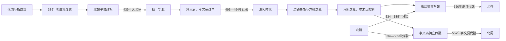

# 魏（拓跋）

> 导航：[南北朝](/%E4%BA%BA%E6%96%87%E7%A7%91%E5%AD%A6/%E5%8E%86%E5%8F%B2/%E4%B8%9C%E4%BA%9A/%E4%B8%AD%E5%9B%BD/%E5%8D%97%E5%8C%97%E6%9C%9D/README.md) / [北朝](/%E4%BA%BA%E6%96%87%E7%A7%91%E5%AD%A6/%E5%8E%86%E5%8F%B2/%E4%B8%9C%E4%BA%9A/%E4%B8%AD%E5%9B%BD/%E5%8D%97%E5%8C%97%E6%9C%9D/%E5%8C%97%E6%9C%9D/README.md) / [北魏、东魏、西魏](/%E4%BA%BA%E6%96%87%E7%A7%91%E5%AD%A6/%E5%8E%86%E5%8F%B2/%E4%B8%9C%E4%BA%9A/%E4%B8%AD%E5%9B%BD/%E5%8D%97%E5%8C%97%E6%9C%9D/%E5%8C%97%E6%9C%9D/%E9%AD%8F%EF%BC%88%E6%8B%93%E8%B7%8B%EF%BC%89.md) / [北齐](/%E4%BA%BA%E6%96%87%E7%A7%91%E5%AD%A6/%E5%8E%86%E5%8F%B2/%E4%B8%9C%E4%BA%9A/%E4%B8%AD%E5%9B%BD/%E5%8D%97%E5%8C%97%E6%9C%9D/%E5%8C%97%E6%9C%9D/%E9%BD%90%EF%BC%88%E9%AB%98%EF%BC%89.md) / [北周](/%E4%BA%BA%E6%96%87%E7%A7%91%E5%AD%A6/%E5%8E%86%E5%8F%B2/%E4%B8%9C%E4%BA%9A/%E4%B8%AD%E5%9B%BD/%E5%8D%97%E5%8C%97%E6%9C%9D/%E5%8C%97%E6%9C%9D/%E5%91%A8%EF%BC%88%E5%AE%87%E6%96%87%EF%BC%89.md)

## 时间

386年—534年；东魏534年—550年；西魏535年—557年。

## 别称

- 北魏
- 拓跋魏
- 元魏
- 东魏
- 西魏

## 概括

魏（拓跋）包括北魏及其分裂后的东魏、西魏。北魏由拓跋珪重建代国后改号为魏，439年统一华北，孝文帝改革后迁都洛阳。北魏末年因六镇之乱和权臣争夺分裂为东魏、西魏，分别成为北齐、北周的前身。

## 兴亡与分裂主线

## 发展阶段与统治结构

| 阶段 | 重要过程 | 统治机制 |
|---|---|---|
| 重建与平城立国 | 拓跋珪恢复代国，整合拓跋诸部，击败后燕并建都平城。 | 将部落人口迁入都城周边，以军事贵族、部落编组和俘户支撑王权。 |
| 统一华北 | 明元帝、太武帝连续扩张；太武帝先后击败夏、北燕、北凉，439年结束十六国主要割据。 | 皇帝统军，鲜卑军事集团与汉人官僚合作；对柔然和南朝长期两线用兵。 |
| 制度重整 | 文成帝恢复佛教；冯太后、孝文帝推行俸禄、均田、三长等改革，并迁都洛阳。 | 国家试图把编户、土地与地方基层纳入官僚控制，减少豪强隐匿人口。 |
| 洛阳转型 | 改姓元、改服制与礼制，鲜卑贵族与中原门阀通婚，南征频繁。 | 宫廷和洛阳贵族融合加深，但北方边镇军人地位、供给相对下降。 |
| 六镇战争 | 523年以后北镇起事扩散，河北、关陇军事集团兴起，中央财政与军队崩解。 | 胡太后、幼帝、尔朱荣等争夺最高权力，皇帝逐渐成为军阀拥立对象。 |
| 东西分裂 | 高欢把孝静帝迁邺建立东魏；元修西奔关中，宇文泰另立西魏文帝。 | 东魏、西魏皇帝皆多为名义君主，实际权力分别在高氏、宇文氏军政集团。 |

## 重要事件与转折

1. 386年拓跋珪复国，398年迁都平城并定国号魏，建立稳定北方王权。
2. 395年参合陂之战重创后燕，为进入河北和平城立国创造条件。
3. 439年太武帝灭北凉，统一华北；对柔然、刘宋战争同时扩大帝国负担。
4. 太武帝时期灭佛，文成帝继位后恢复佛教，云冈石窟显示王权、佛教与都城工程结合。
5. 冯太后和孝文帝改革俸禄、均田、三长，494年正式迁都洛阳。
6. 523年六镇之乱爆发，边镇军户、地方饥荒与身份下降引发连锁战争。
7. 528年尔朱荣发动河阴之变，大量宗室官员被杀，中央官僚与皇权遭重创。
8. 534年孝武帝与高欢决裂西奔，东魏、西魏先后成立，北魏统一政权结束。

## 崛起、鼎盛与分裂原因

### 崛起与鼎盛

- 拓跋骑兵与代北军事网络提供机动力，十六国长期战争又使对手分裂。
- 平城王朝持续吸收汉人文官、农业人口和制度技术，把部落联盟转为领土国家。
- 太武帝集中军力逐个击破北方政权，并以对柔然战争保护北边。
- 均田、三长和俸禄制尝试恢复户籍税役、约束地方豪强，洛阳成为人口、礼制和佛教中心。

### 结构矛盾

- 平城时代依赖的北镇军人曾是核心，迁都后其政治待遇与供给下降，形成中心—边镇裂缝。
- 贵族汉化并非简单民族同化，而是身份、婚姻和官职重新分配；部分军事集团在新秩序中失势。
- 大规模宫廷、佛寺和战争需要财政，地方豪强隐户、灾荒与运输又削弱国家供给。
- 太后临朝、幼帝继位与宗室猜忌反复出现，宫廷缺乏稳定处理辅政权的机制。

### 直接分裂

六镇之乱把边镇军人转化为各地武装，高欢、宇文泰从镇压和收编中建立军团。尔朱氏被推翻后，孝武帝试图摆脱高欢失败；高欢控制河北与邺，宇文泰控制关中与长安，地理和军事实力已无法由一位皇帝重新统一。东西两集团各立元氏皇帝，最终分别由高氏、宇文氏正式代魏。

## 说明

- 386年，拓跋珪即代王位，重建代国。
- 398年，拓跋珪定国号“魏”，建都平城；次年称帝。
- 439年，北魏太武帝拓跋焘统一华北，北朝时代开始。
- 493年，孝文帝迁都洛阳，推行改姓、服制、官制等汉化改革。
- 六镇之乱后，北魏中央衰败，尔朱荣、高欢、宇文泰等军政集团崛起。
- 534年，北魏分裂为东魏、西魏。

## 世系表

| 顺序 | 姓名 | 庙号 | 谥号 / 称号 | 年号 | 在位时间 | 生卒时间 | 与前任关系 | 关键事件 / 备注 / 说明 |
|---:|---|---|---|---|---|---|---|---|
| 追尊 | 拓跋寔 | 无 | 献明皇帝 | 无 | 未正式在位 | ？—371年 | 拓跋珪父 | 北魏太祖追尊。 |
| 1 | 拓跋珪 | 太祖 | 道武皇帝 | 登国、皇始、天兴、天赐 | 386年—409年 | 371年—409年 | 开国君主 | 重建代国，改号魏，建都平城。 |
| 2 | 拓跋嗣 | 太宗 | 明元皇帝 | 永兴、神瑞、泰常 | 409年—423年 | 392年—423年 | 拓跋珪子 | 巩固北魏政权。 |
| 3 | 拓跋焘 | 世祖 | 太武皇帝 | 始光、神䴥、延和、太延、太平真君、正平 | 424年—452年 | 408年—452年 | 拓跋嗣子 | 439年统一华北。 |
| 4 | 拓跋余 | 无 | 南安隐王 | 承平 | 452年 | ？—452年 | 拓跋焘子 | 短暂即位，被杀。 |
| 追尊 | 拓跋晃 | 恭宗 | 景穆皇帝 | 无 | 未正式在位 | 428年—451年 | 拓跋焘太子 | 北魏高宗追尊。 |
| 5 | 拓跋濬 | 高宗 | 文成皇帝 | 兴安、兴光、太安、和平 | 452年—465年 | 440年—465年 | 拓跋晃子 | 恢复佛教，稳定政局。 |
| 6 | 拓跋弘 | 显祖 | 献文皇帝 | 天安、皇兴 | 466年—471年 | 454年—476年 | 拓跋濬子 | 让位于孝文帝后为太上皇。 |
| 7 | 拓跋宏 / 元宏 | 高祖 | 孝文皇帝 | 延兴、承明、太和 | 471年—499年 | 467年—499年 | 拓跋弘子 | 493年迁都洛阳，改拓跋为元。 |
| 8 | 元恪 | 世宗 | 宣武皇帝 | 景明、正始、永平、延昌 | 499年—515年 | 483年—515年 | 元宏子 | 北魏洛阳时期继续发展。 |
| 9 | 元诩 | 肃宗 | 孝明皇帝 | 熙平、神龟、正光、孝昌、武泰 | 516年—528年 | 510年—528年 | 元恪子 | 六镇之乱，北魏衰败。 |
| 10 | 元钊 | 无 | 幼主 | 武泰 | 528年 | 526年—528年 | 元诩族子 | 被尔朱荣沉河。 |
| 11 | 元子攸 | 敬宗 | 孝庄皇帝 | 建义、永安 | 528年—530年 | 507年—531年 | 北魏宗室 | 诛尔朱荣，后被尔朱氏杀。 |
| 12 | 元晔 | 无 | 长广王 | 建明 | 530年—531年 | ？—532年 | 北魏宗室 | 尔朱氏拥立。 |
| 13 | 元恭 | 无 | 节闵皇帝 | 普泰 | 531年—532年 | 498年—532年 | 北魏宗室 | 被高欢废杀。 |
| 14 | 元朗 | 无 | 安定王 | 中兴 | 531年—532年 | 513年—532年 | 北魏宗室 | 高欢拥立，与元恭并立。 |
| 15 | 元修 | 无 | 孝武皇帝 / 出皇帝 | 太昌、永兴、永熙 | 532年—534年 | 510年—535年 | 北魏宗室 | 西奔关中，后被宇文泰杀；北魏分裂。 |
| 东魏 | 元善见 | 无 | 孝静皇帝 | 天平、元象、兴和、武定 | 534年—550年 | 524年—552年 | 北魏宗室 | 高欢拥立于邺，后被高洋废。 |
| 西魏1 | 元宝炬 | 无 | 文皇帝 | 大统 | 535年—551年 | 507年—551年 | 元愉子 | 宇文泰拥立于长安。 |
| 西魏2 | 元钦 | 无 | 废帝 | 无 | 551年—554年 | 525年—554年 | 元宝炬子 | 被宇文泰废杀。 |
| 西魏3 | 元廓 | 无 | 恭皇帝 | 无 | 554年—557年 | 537年—557年 | 元宝炬子 | 被迫禅位宇文觉，西魏亡。 |

## 演变关系

- 前一节点：[十六国](/%E4%BA%BA%E6%96%87%E7%A7%91%E5%AD%A6/%E5%8E%86%E5%8F%B2/%E4%B8%9C%E4%BA%9A/%E4%B8%AD%E5%9B%BD/%E6%99%8B/%E5%8D%81%E5%85%AD%E5%9B%BD/README.md)。
- 分裂后：东魏被[齐（高）](/%E4%BA%BA%E6%96%87%E7%A7%91%E5%AD%A6/%E5%8E%86%E5%8F%B2/%E4%B8%9C%E4%BA%9A/%E4%B8%AD%E5%9B%BD/%E5%8D%97%E5%8C%97%E6%9C%9D/%E5%8C%97%E6%9C%9D/%E9%BD%90%EF%BC%88%E9%AB%98%EF%BC%89.md)取代，西魏被[周（宇文）](/%E4%BA%BA%E6%96%87%E7%A7%91%E5%AD%A6/%E5%8E%86%E5%8F%B2/%E4%B8%9C%E4%BA%9A/%E4%B8%AD%E5%9B%BD/%E5%8D%97%E5%8C%97%E6%9C%9D/%E5%8C%97%E6%9C%9D/%E5%91%A8%EF%BC%88%E5%AE%87%E6%96%87%EF%BC%89.md)取代。

## 相关笔记

- [北朝](/%E4%BA%BA%E6%96%87%E7%A7%91%E5%AD%A6/%E5%8E%86%E5%8F%B2/%E4%B8%9C%E4%BA%9A/%E4%B8%AD%E5%9B%BD/%E5%8D%97%E5%8C%97%E6%9C%9D/%E5%8C%97%E6%9C%9D/README.md)
- [南北朝](/%E4%BA%BA%E6%96%87%E7%A7%91%E5%AD%A6/%E5%8E%86%E5%8F%B2/%E4%B8%9C%E4%BA%9A/%E4%B8%AD%E5%9B%BD/%E5%8D%97%E5%8C%97%E6%9C%9D/README.md)
- [齐（高）](/%E4%BA%BA%E6%96%87%E7%A7%91%E5%AD%A6/%E5%8E%86%E5%8F%B2/%E4%B8%9C%E4%BA%9A/%E4%B8%AD%E5%9B%BD/%E5%8D%97%E5%8C%97%E6%9C%9D/%E5%8C%97%E6%9C%9D/%E9%BD%90%EF%BC%88%E9%AB%98%EF%BC%89.md)
- [周（宇文）](/%E4%BA%BA%E6%96%87%E7%A7%91%E5%AD%A6/%E5%8E%86%E5%8F%B2/%E4%B8%9C%E4%BA%9A/%E4%B8%AD%E5%9B%BD/%E5%8D%97%E5%8C%97%E6%9C%9D/%E5%8C%97%E6%9C%9D/%E5%91%A8%EF%BC%88%E5%AE%87%E6%96%87%EF%BC%89.md)
