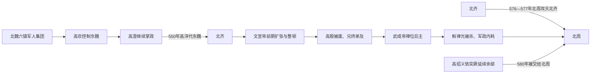

# 齐（高）

> 导航：[南北朝](/%E4%BA%BA%E6%96%87%E7%A7%91%E5%AD%A6/%E5%8E%86%E5%8F%B2/%E4%B8%9C%E4%BA%9A/%E4%B8%AD%E5%9B%BD/%E5%8D%97%E5%8C%97%E6%9C%9D/README.md) / [北朝](/%E4%BA%BA%E6%96%87%E7%A7%91%E5%AD%A6/%E5%8E%86%E5%8F%B2/%E4%B8%9C%E4%BA%9A/%E4%B8%AD%E5%9B%BD/%E5%8D%97%E5%8C%97%E6%9C%9D/%E5%8C%97%E6%9C%9D/README.md) / [北魏、东魏、西魏](/%E4%BA%BA%E6%96%87%E7%A7%91%E5%AD%A6/%E5%8E%86%E5%8F%B2/%E4%B8%9C%E4%BA%9A/%E4%B8%AD%E5%9B%BD/%E5%8D%97%E5%8C%97%E6%9C%9D/%E5%8C%97%E6%9C%9D/%E9%AD%8F%EF%BC%88%E6%8B%93%E8%B7%8B%EF%BC%89.md) / [北齐](/%E4%BA%BA%E6%96%87%E7%A7%91%E5%AD%A6/%E5%8E%86%E5%8F%B2/%E4%B8%9C%E4%BA%9A/%E4%B8%AD%E5%9B%BD/%E5%8D%97%E5%8C%97%E6%9C%9D/%E5%8C%97%E6%9C%9D/%E9%BD%90%EF%BC%88%E9%AB%98%EF%BC%89.md) / [北周](/%E4%BA%BA%E6%96%87%E7%A7%91%E5%AD%A6/%E5%8E%86%E5%8F%B2/%E4%B8%9C%E4%BA%9A/%E4%B8%AD%E5%9B%BD/%E5%8D%97%E5%8C%97%E6%9C%9D/%E5%8C%97%E6%9C%9D/%E5%91%A8%EF%BC%88%E5%AE%87%E6%96%87%EF%BC%89.md)

## 时间

550年—577年。

## 别称

- 北齐
- 高齐

## 概括

北齐由高洋代东魏建立，承接高欢、高澄控制东魏的政治军事基础。北齐控制河北、山东、河南东部等人口和财赋富庶地区，前期军力强盛；但皇位在高氏兄弟、侄子间反复转移，宫廷清洗和后主时期统帅体系崩解，577年被北周灭。

## 兴亡主线

## 建立基础与统治结构

| 层面 | 具体机制 |
|---|---|
| 奠基集团 | 高欢从六镇军人中崛起，控制孝静帝和东魏，联合鲜卑军人、河北大族与汉人官僚。 |
| 最高权力 | 皇帝来自高氏，但高欢诸子势力都很强；高殷被叔父高演废黜，显示父子继承并未稳定。 |
| 军事 | 晋阳是军事中心，邺为政治都城；鲜卑军户、边镇将领和河北兵源构成主力。 |
| 财政人口 | 山东、河北和河南东部人口密集、农业手工业发达，国家资源总体优于西部北周。 |
| 官僚文化 | 沿用北魏—东魏官制，汉人士族参与文官系统；皇帝近幸、宗室和军事贵族又能绕过常规官僚。 |
| 外交战线 | 西与北周争夺河东、洛阳，北防突厥、契丹，南与梁、陈在淮河—长江间攻守。 |

## 重要事件与阶段

1. 547年高欢死、高澄继掌东魏，549年高澄遇刺，高洋迅速接管集团。
2. 550年高洋迫孝静帝禅位建立北齐，完成高氏从实际执政到皇帝的转换。
3. 文宣帝前期整顿法令、北击柔然和契丹、南压梁境，北齐进入军事强势期；后期滥刑与宫廷暴力增加。
4. 559年高殷继位，560年被叔父高演废黜，随后高演、高湛兄弟相继为帝，继承规则被宗室实力取代。
5. 564年北周大举攻洛阳，北齐名将段韶、斛律光等击退周军，显示其军事体系仍有韧性。
6. 高湛禅位高纬后仍以太上皇掌权，名义皇帝与实际权力再次分离。
7. 571—572年前后，高纬集团诛杀斛律光，兰陵王高长恭亦被赐死，能统军的宗室、将领遭系统性削弱。
8. 576年北周武帝攻取平阳，次年突破晋阳、邺城；高纬禅位幼子高恒后出逃，均被俘。
9. 高延宗在晋阳短暂称帝，高绍义依突厥延续抵抗，均未能恢复政权。

## 鼎盛、衰落与灭亡原因

### 鼎盛条件

- 承接东魏的富庶地区、人口和官僚体系，能够维持庞大军队。
- 高欢建立的晋阳军事集团将六镇武人、鲜卑贵族与河北地方资源结合。
- 北周前期受宇文护专政和内部权力斗争限制，北齐得以保持东部优势。
- 段韶、斛律光、高长恭等将领能够在洛阳、河东等战线抵御北周。

### 衰落因素

- 皇位反复在高欢诸子及孙辈间转移，废立和杀戮破坏宗室合作。
- 宫廷近幸、乳母集团与皇帝私人宠信干预军政，常规官僚难以纠错。
- 高洋后期及高纬时期奢费、滥刑和工程加重财政、政治压力；“昏君”叙事虽有后世加工，统治集团失序仍有充分史实基础。
- 诛杀斛律光、逼死高长恭等行动直接损害统帅层，也打击军队忠诚。
- 多线防务消耗资源，而北周武帝亲政后完成财政和军队整合，力量对比逆转。

### 直接灭亡

576年平阳失守后，北齐未能集中指挥反攻；晋阳、邺相继陷落，后主逃亡并仓促传位，中央命令彻底失效。577年高氏皇族被俘，北周接管东部。余部依赖突厥，缺乏核心领土和财赋，无法形成第二政权。

## 说明

- 高欢控制东魏政权，奠定高氏代魏基础。
- 550年，高洋废东魏孝静帝，建立北齐。
- 北齐与北周长期争夺华北和关陇。
- 后主高纬时期政治腐败，军事衰退。
- 577年，北周攻灭北齐，北方由北周统一。

## 世系表

| 顺序 | 姓名 | 庙号 | 谥号 / 称号 | 年号 | 在位时间 | 生卒时间 | 与前任关系 | 关键事件 / 备注 / 说明 |
|---:|---|---|---|---|---|---|---|---|
| 追尊 | 高树生 | 无 | 文穆皇帝 | 无 | 未正式在位 | 不详 | 高欢父 | 北齐追尊。 |
| 追尊 | 高欢 | 高祖 / 太祖 | 神武皇帝 / 献武皇帝 | 无 | 未正式在位 | 496年—547年 | 高氏奠基者 | 控制东魏，奠定北齐基础。 |
| 追尊 | 高澄 | 世宗 | 文襄皇帝 | 无 | 未正式在位 | 521年—549年 | 高欢子 | 继掌东魏政权，遇刺。 |
| 1 | 高洋 | 显祖 | 文宣皇帝 | 天保 | 550年—559年 | 526年—559年 | 高欢子 | 代东魏建立北齐。 |
| 2 | 高殷 | 无 | 废帝 / 闵悼王 | 乾明 | 559年—560年 | 545年—561年 | 高洋子 | 被高演废。 |
| 3 | 高演 | 肃宗 | 孝昭皇帝 | 皇建 | 560年—561年 | 535年—561年 | 高欢子 | 短暂在位。 |
| 4 | 高湛 | 世祖 | 武成皇帝 | 太宁、河清 | 561年—565年 | 537年—569年 | 高欢子 | 后禅位于高纬。 |
| 5 | 高纬 | 无 | 后主 | 天统、武平、隆化 | 565年—577年 | 556年—577年 | 高湛子 | 政治腐败，北齐被北周攻灭。 |
| 追尊 | 高俨 | 无 | 楚恭哀帝 | 无 | 未正式在位 | 557年—571年 | 高湛子 | 北齐追谥。 |
| 短暂 | 高延宗 | 无 | 安德王 | 德昌 | 576年 | 544年—577年 | 高欢孙 | 晋阳陷落后短暂称帝。 |
| 6 | 高恒 | 无 | 幼主 | 承光 | 577年 | 570年—577年 | 高纬子 | 北齐末帝，被北周俘杀。 |
| 余部 | 高湝 | 无 | 任城王 | 无 | 577年 | ？—577年 | 高欢子 | 未正式即位，抗周失败。 |
| 余部 | 高绍义 | 无 | 范阳王 | 武平 | 578年 | ？—580年 | 高澄子 | 依突厥称帝，后被北周俘。 |

## 演变关系

- 前一节点：东魏。
- 后一节点：[周（宇文）](/%E4%BA%BA%E6%96%87%E7%A7%91%E5%AD%A6/%E5%8E%86%E5%8F%B2/%E4%B8%9C%E4%BA%9A/%E4%B8%AD%E5%9B%BD/%E5%8D%97%E5%8C%97%E6%9C%9D/%E5%8C%97%E6%9C%9D/%E5%91%A8%EF%BC%88%E5%AE%87%E6%96%87%EF%BC%89.md)灭北齐，统一北方。

## 相关笔记

- [北朝](/%E4%BA%BA%E6%96%87%E7%A7%91%E5%AD%A6/%E5%8E%86%E5%8F%B2/%E4%B8%9C%E4%BA%9A/%E4%B8%AD%E5%9B%BD/%E5%8D%97%E5%8C%97%E6%9C%9D/%E5%8C%97%E6%9C%9D/README.md)
- [南北朝](/%E4%BA%BA%E6%96%87%E7%A7%91%E5%AD%A6/%E5%8E%86%E5%8F%B2/%E4%B8%9C%E4%BA%9A/%E4%B8%AD%E5%9B%BD/%E5%8D%97%E5%8C%97%E6%9C%9D/README.md)
- [魏（拓跋）](/%E4%BA%BA%E6%96%87%E7%A7%91%E5%AD%A6/%E5%8E%86%E5%8F%B2/%E4%B8%9C%E4%BA%9A/%E4%B8%AD%E5%9B%BD/%E5%8D%97%E5%8C%97%E6%9C%9D/%E5%8C%97%E6%9C%9D/%E9%AD%8F%EF%BC%88%E6%8B%93%E8%B7%8B%EF%BC%89.md)
- [周（宇文）](/%E4%BA%BA%E6%96%87%E7%A7%91%E5%AD%A6/%E5%8E%86%E5%8F%B2/%E4%B8%9C%E4%BA%9A/%E4%B8%AD%E5%9B%BD/%E5%8D%97%E5%8C%97%E6%9C%9D/%E5%8C%97%E6%9C%9D/%E5%91%A8%EF%BC%88%E5%AE%87%E6%96%87%EF%BC%89.md)
