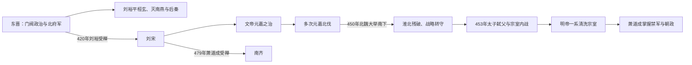

# 宋（刘）

> 导航：[南北朝](/%E4%BA%BA%E6%96%87%E7%A7%91%E5%AD%A6/%E5%8E%86%E5%8F%B2/%E4%B8%9C%E4%BA%9A/%E4%B8%AD%E5%9B%BD/%E5%8D%97%E5%8C%97%E6%9C%9D/README.md) / [南朝](/%E4%BA%BA%E6%96%87%E7%A7%91%E5%AD%A6/%E5%8E%86%E5%8F%B2/%E4%B8%9C%E4%BA%9A/%E4%B8%AD%E5%9B%BD/%E5%8D%97%E5%8C%97%E6%9C%9D/%E5%8D%97%E6%9C%9D/README.md) / [刘宋](/%E4%BA%BA%E6%96%87%E7%A7%91%E5%AD%A6/%E5%8E%86%E5%8F%B2/%E4%B8%9C%E4%BA%9A/%E4%B8%AD%E5%9B%BD/%E5%8D%97%E5%8C%97%E6%9C%9D/%E5%8D%97%E6%9C%9D/%E5%AE%8B%EF%BC%88%E5%88%98%EF%BC%89.md) / [南齐](/%E4%BA%BA%E6%96%87%E7%A7%91%E5%AD%A6/%E5%8E%86%E5%8F%B2/%E4%B8%9C%E4%BA%9A/%E4%B8%AD%E5%9B%BD/%E5%8D%97%E5%8C%97%E6%9C%9D/%E5%8D%97%E6%9C%9D/%E9%BD%90%EF%BC%88%E8%90%A7%EF%BC%89.md) / [萧梁](/%E4%BA%BA%E6%96%87%E7%A7%91%E5%AD%A6/%E5%8E%86%E5%8F%B2/%E4%B8%9C%E4%BA%9A/%E4%B8%AD%E5%9B%BD/%E5%8D%97%E5%8C%97%E6%9C%9D/%E5%8D%97%E6%9C%9D/%E6%A2%81%EF%BC%88%E8%90%A7%EF%BC%89.md) / [陈](/%E4%BA%BA%E6%96%87%E7%A7%91%E5%AD%A6/%E5%8E%86%E5%8F%B2/%E4%B8%9C%E4%BA%9A/%E4%B8%AD%E5%9B%BD/%E5%8D%97%E5%8C%97%E6%9C%9D/%E5%8D%97%E6%9C%9D/%E9%99%88%EF%BC%88%E9%99%88%EF%BC%89.md)

## 时间

420年—479年。

## 别称

- 刘宋
- 南朝宋

## 概括

刘宋由刘裕代东晋建立，是南朝第一朝，也是南朝疆域较大、军事实力较强的一朝。刘宋前期延续刘裕北伐声势，宋文帝时出现“元嘉之治”，但元嘉北伐失败后国势转弱，后期宗室相杀，最终被萧道成建立的南齐取代。

## 兴亡主线

## 建立背景、发展阶段与统治结构

| 阶段 | 具体过程 | 权力结构 |
|---|---|---|
| 刘裕奠基 | 刘裕以北府军将领身份平定桓玄、卢循，灭南燕、后秦，收复洛阳、长安后声望达到高点。 | 寒门军功集团进入中枢，门阀士族仍掌文化与行政，皇帝以军权压制世家。 |
| 永初建国 | 420年刘裕迫东晋恭帝禅位，改朝不改建康官僚框架；刘裕旋即去世。 | 幼主由徐羡之、傅亮、谢晦等辅政，辅臣可废杀皇帝，继承机制尚不稳。 |
| 元嘉之治 | 文帝诛辅臣亲政，整顿吏治、休养民力，江南经济文化发展。 | 皇帝重用文官，同时让宗王出镇控制军队，以避免权臣独大。 |
| 北伐与转折 | 430、450、452等北伐试图收复河南，补给与骑兵不足；450年北魏太武帝反击深入长江北岸。 | 中央频繁遥控前线，宗王和将领承担军权，失败加重君臣猜疑。 |
| 宗室战争 | 453年太子刘劭弑父，刘骏起兵夺位；刘子业被杀后刘彧继位，又与各地宗王战争。 | 为防宗室挑战，皇帝清洗亲王并依赖寒门近臣、禁军将领，反而使权臣更易控制宫廷。 |
| 萧氏取代 | 后废帝被杀，萧道成控制禁军并拥立顺帝，先平沈攸之等反对者。 | 幼主无实权，军政和禅让程序均由萧道成掌握。 |

## 重要事件

1. 410—417年刘裕先后击败卢循、灭南燕和后秦，建立超越东晋门阀的军功权威。
2. 420年刘裕受禅建宋，东晋结束，南朝开始。
3. 424年辅政大臣废杀少帝并拥立刘义隆；文帝随后清除辅臣，恢复皇帝亲政。
4. 元嘉时期恢复生产、编纂典籍，建康政局相对稳定，形成南朝长期文化基础。
5. 430年北伐短暂占领河南后撤；450年再伐失败，北魏反攻至瓜步，淮河流域遭重创。
6. 453年刘劭弑杀文帝，刘骏从江州起兵平乱，皇位第一次以大规模宗室内战重建。
7. 465—466年明帝刘彧夺位，各地拥立刘子勋，内战后北魏趁机夺取山东、淮北大片地区。
8. 477年萧道成集团杀后废帝，479年顺帝禅位，刘宋灭亡。

## 崛起、鼎盛与衰亡原因

### 崛起与鼎盛

- 刘裕掌握北府军并连续取得内外战争胜利，拥有东晋宗室和门阀无法匹敌的军事声望。
- 江南农业、户籍和建康政务在东晋后期已有积累，改朝后能迅速恢复。
- 文帝前期减少大规模战争、整顿官吏，寒门官僚与门阀分工维持相对平衡。
- 北魏统一北方前，刘裕北伐利用对手分裂，一度控制黄河流域要地。

### 衰落因素

- 南朝步兵、水军善守江淮，但远征河南、河北需要骑兵与漫长补给，元嘉北伐战略目标超过持续动员能力。
- 宗王出镇本为制衡权臣，却让皇子、兄弟各有军队；皇帝猜忌又导致反复清洗和起兵。
- 刘劭弑父、刘子勋与明帝内战摧毁皇室共同合法性，北魏乘机南下。
- 皇帝越来越依赖寒门近臣和禁军以压制宗室，这些掌兵者最终可像萧道成一样控制废立。

### 直接灭亡

萧道成在明帝、后废帝时期掌握禁军和中枢，杀后废帝后拥立幼主刘准，再击败荆州刺史沈攸之等军事反对者。刘宋已无独立宗王或中央军能阻止，479年禅让只是实际权力转移后的法定程序。

## 说明

- 420年，刘裕受禅代晋，建立宋，南朝开始。
- 宋文帝时期政治相对稳定，史称“元嘉之治”。
- 元嘉北伐失败后，刘宋对北魏的战略主动权下降。
- 后期皇室内斗和权臣坐大，萧道成逐步掌握军政大权。
- 479年，刘准禅位于萧道成，刘宋灭亡。

## 世系表

| 顺序 | 姓名 | 庙号 | 谥号 / 称号 | 年号 | 在位时间 | 生卒时间 | 与前任关系 | 关键事件 / 备注 / 说明 |
|---:|---|---|---|---|---|---|---|---|
| 追尊 | 刘翘 | 无 | 孝穆皇帝 | 无 | 未正式在位 | 不详 | 刘裕父 | 宋武帝刘裕追尊。 |
| 1 | 刘裕 | 高祖 | 武皇帝 | 永初 | 420年—422年 | 363年—422年 | 开国君主 | 代东晋称帝，建立南朝宋。 |
| 2 | 刘义符 | 无 | 少帝 | 景平 | 422年—424年 | 406年—424年 | 刘裕长子 | 被辅政大臣废杀。 |
| 3 | 刘义隆 | 太祖 | 文皇帝 | 元嘉 | 424年—453年 | 407年—453年 | 刘裕第三子 | 元嘉之治；发动元嘉北伐；被太子刘劭弑杀。 |
| 4 | 刘劭 | 无 | 元凶 | 太初 | 453年 | 426年—453年 | 刘义隆太子 | 弑父即位，被刘骏讨灭。 |
| 5 | 刘骏 | 世祖 | 孝武皇帝 | 孝建、大明 | 453年—464年 | 430年—464年 | 刘义隆第三子 | 平刘劭后即位，强化皇权。 |
| 6 | 刘子业 | 无 | 前废帝 | 永光、景和 | 464年—465年 | 449年—465年 | 刘骏子 | 暴虐失政，被杀。 |
| 7 | 刘彧 | 太宗 | 明皇帝 | 泰始、泰豫 | 465年—472年 | 439年—472年 | 刘义隆第十一子 | 平定宗室反对，晚年猜忌宗室。 |
| 8 | 刘昱 | 无 | 后废帝 / 苍梧王 | 元徽 | 472年—477年 | 463年—477年 | 刘彧子 | 被萧道成集团所杀。 |
| 9 | 刘准 | 无 | 顺皇帝 | 升明 | 477年—479年 | 467年—479年 | 刘彧子 | 479年禅位萧道成，刘宋亡。 |

## 演变关系

- 前一节点：[东晋](/%E4%BA%BA%E6%96%87%E7%A7%91%E5%AD%A6/%E5%8E%86%E5%8F%B2/%E4%B8%9C%E4%BA%9A/%E4%B8%AD%E5%9B%BD/%E6%99%8B/%E4%B8%9C%E6%99%8B.md)。
- 后一节点：[齐（萧）](/%E4%BA%BA%E6%96%87%E7%A7%91%E5%AD%A6/%E5%8E%86%E5%8F%B2/%E4%B8%9C%E4%BA%9A/%E4%B8%AD%E5%9B%BD/%E5%8D%97%E5%8C%97%E6%9C%9D/%E5%8D%97%E6%9C%9D/%E9%BD%90%EF%BC%88%E8%90%A7%EF%BC%89.md)。

## 相关笔记

- [南朝](/%E4%BA%BA%E6%96%87%E7%A7%91%E5%AD%A6/%E5%8E%86%E5%8F%B2/%E4%B8%9C%E4%BA%9A/%E4%B8%AD%E5%9B%BD/%E5%8D%97%E5%8C%97%E6%9C%9D/%E5%8D%97%E6%9C%9D/README.md)
- [南北朝](/%E4%BA%BA%E6%96%87%E7%A7%91%E5%AD%A6/%E5%8E%86%E5%8F%B2/%E4%B8%9C%E4%BA%9A/%E4%B8%AD%E5%9B%BD/%E5%8D%97%E5%8C%97%E6%9C%9D/README.md)
- [齐（萧）](/%E4%BA%BA%E6%96%87%E7%A7%91%E5%AD%A6/%E5%8E%86%E5%8F%B2/%E4%B8%9C%E4%BA%9A/%E4%B8%AD%E5%9B%BD/%E5%8D%97%E5%8C%97%E6%9C%9D/%E5%8D%97%E6%9C%9D/%E9%BD%90%EF%BC%88%E8%90%A7%EF%BC%89.md)
