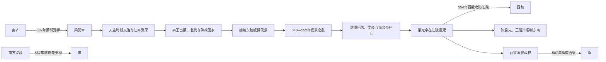

# 梁（萧）

> 导航：[南北朝](/%E4%BA%BA%E6%96%87%E7%A7%91%E5%AD%A6/%E5%8E%86%E5%8F%B2/%E4%B8%9C%E4%BA%9A/%E4%B8%AD%E5%9B%BD/%E5%8D%97%E5%8C%97%E6%9C%9D/README.md) / [南朝](/%E4%BA%BA%E6%96%87%E7%A7%91%E5%AD%A6/%E5%8E%86%E5%8F%B2/%E4%B8%9C%E4%BA%9A/%E4%B8%AD%E5%9B%BD/%E5%8D%97%E5%8C%97%E6%9C%9D/%E5%8D%97%E6%9C%9D/README.md) / [刘宋](/%E4%BA%BA%E6%96%87%E7%A7%91%E5%AD%A6/%E5%8E%86%E5%8F%B2/%E4%B8%9C%E4%BA%9A/%E4%B8%AD%E5%9B%BD/%E5%8D%97%E5%8C%97%E6%9C%9D/%E5%8D%97%E6%9C%9D/%E5%AE%8B%EF%BC%88%E5%88%98%EF%BC%89.md) / [南齐](/%E4%BA%BA%E6%96%87%E7%A7%91%E5%AD%A6/%E5%8E%86%E5%8F%B2/%E4%B8%9C%E4%BA%9A/%E4%B8%AD%E5%9B%BD/%E5%8D%97%E5%8C%97%E6%9C%9D/%E5%8D%97%E6%9C%9D/%E9%BD%90%EF%BC%88%E8%90%A7%EF%BC%89.md) / [萧梁](/%E4%BA%BA%E6%96%87%E7%A7%91%E5%AD%A6/%E5%8E%86%E5%8F%B2/%E4%B8%9C%E4%BA%9A/%E4%B8%AD%E5%9B%BD/%E5%8D%97%E5%8C%97%E6%9C%9D/%E5%8D%97%E6%9C%9D/%E6%A2%81%EF%BC%88%E8%90%A7%EF%BC%89.md) / [陈](/%E4%BA%BA%E6%96%87%E7%A7%91%E5%AD%A6/%E5%8E%86%E5%8F%B2/%E4%B8%9C%E4%BA%9A/%E4%B8%AD%E5%9B%BD/%E5%8D%97%E5%8C%97%E6%9C%9D/%E5%8D%97%E6%9C%9D/%E9%99%88%EF%BC%88%E9%99%88%EF%BC%89.md)

## 时间

502年—557年；西梁 / 后梁555年—587年。

## 别称

- 萧梁
- 南梁
- 西梁
- 后梁

## 概括

梁由萧衍代南齐建立。梁武帝在位近半个世纪，前期政治文化较盛，但后期因侯景之乱导致建康陷落、江南残破。梁元帝被西魏杀后，江南梁政权被陈霸先取代，江陵另有依附西魏、北周、隋的西梁 / 后梁。

## 兴亡与分支主线

## 建立、鼎盛与崩解阶段

| 阶段 | 具体过程 | 权力结构 |
|---|---|---|
| 天监建国 | 萧衍从襄阳起兵灭南齐，502年受禅；整顿官僚、学校和礼制。 | 皇帝长期亲政，萧氏宗王掌握各州军队，门阀与寒门官僚并用。 |
| 文治与文化繁荣 | 建康人口、商业、佛教寺院和文学学术兴盛；507年钟离之战击败北魏。 | 皇帝、宗王、士族与寺院共同占有大量资源，中央财政和地方社会关系复杂。 |
| 北方分裂机会 | 北魏末乱后梁多次北伐，并接纳北方降人；部分行动扩大淮南控制，也带来军费和安置压力。 | 边将、降将与宗王各掌部队，中央缺乏统一常备军应对内部叛变。 |
| 侯景之乱 | 东魏叛将侯景降梁，和议危机后于548年反叛，次年攻陷台城。 | 建康禁军薄弱，各地宗王首先保存实力、互相猜忌，救援不能统一。 |
| 诸王争位 | 侯景控制简文帝、立萧栋并自立；湘东王萧绎、武陵王萧纪等各自称帝或争权。 | 对侯景战争与皇位战争并行，地方军队不再听从同一中央。 |
| 江陵覆亡与陈代梁 | 王僧辩、陈霸先消灭侯景，萧绎在江陵即位；西魏攻江陵杀元帝。东南由王、陈控制，最终陈霸先称帝。 | 梁皇帝仅有名义，实权掌握在军阀；西魏、北齐通过扶立候选人干预。 |
| 西梁延续 | 西魏扶萧詧在江陵建立附属西梁，领土有限。 | 对西魏、北周、隋称臣，保留梁宗室和局部官制，587年被隋直接撤销。 |

## 重要事件

1. 502年萧衍受禅建梁，开启近半世纪的梁武帝统治。
2. 507年钟离之战，梁军击败北魏大军，巩固淮南防线。
3. 梁武帝多次舍身同泰寺并由群臣赎回，佛教与王权、财政关系达到高峰。
4. 北魏六镇之乱和东西分裂后，梁接纳降人并发动北伐；疆界虽有变化，未能统一中原。
5. 547年侯景背叛东魏投梁，梁廷在对东魏和议与保护降将之间摇摆。
6. 548年侯景起兵，549年攻陷建康台城，梁武帝在围困中去世。
7. 551年侯景废杀简文帝、立萧栋后自称汉帝；552年王僧辩、陈霸先等攻灭侯景。
8. 553年萧绎在与弟萧纪争位中借西魏力量攻蜀，进一步引入北朝干预。
9. 554年西魏攻陷江陵、杀梁元帝，把大片江汉地区纳入势力范围。
10. 555年北齐扶萧渊明，陈霸先随后废之立萧方智；557年陈霸先受禅，南方梁亡。
11. 西梁在江陵延续至587年，终被隋文帝撤销。

## 鼎盛条件与统治特色

- 江南农业、手工业和长江贸易经过宋齐积累，为建康文化与寺院经济提供资源。
- 梁武帝统治时间长，避免南齐式连续废立；重视经学、礼制和官僚教育。
- 宗王出镇能够在边疆组织军队，北魏内乱又减轻北方压力。
- 佛教成为王朝教化和国际交流的重要语言，建康与东亚、东南亚海路联系活跃。
- 但寺院、士族与宗王掌握人口土地，也使国家直接税役和军事动员受到限制。

## 衰落与灭亡原因

### 结构因素

- 皇帝长期以宗王控制强州，却未建立清晰的军权协调和继承秩序；危机中各王优先争夺皇位。
- 建康繁荣但禁军战力不足，外来降将侯景能以少量精兵突破长江防线并吸收失意者。
- 梁的北方政策依赖降人和临时联盟，东魏、西魏、北齐可利用梁内战扶立傀儡、夺取土地。
- 武帝晚年皇子、官僚和寺院利益复杂，政治决策更加迟缓；单以“崇佛亡国”解释则过于简单。

### 直接触发与崩解

对侯景的接纳及随后准备与东魏和议，使侯景担心被交换，548年反叛。台城长期围困中，各路宗王救援迟缓且相互猜忌，中央覆亡。侯景虽被消灭，萧氏诸王已经内战；萧绎借西魏灭萧纪后又拒绝受其控制，西魏遂攻江陵。江南再无有实力的梁宗室，陈霸先以军权完成代梁。

## 说明

- 502年，萧衍迫齐和帝禅位，建立梁。
- 梁武帝前期文治、佛教与文学发展兴盛。
- 侯景之乱严重摧毁建康和江南社会，梁朝从此衰落。
- 554年，西魏攻陷江陵，杀梁元帝，并扶立萧詧为梁王。
- 557年，陈霸先代梁建陈，南方梁政权结束。
- 西梁 / 后梁依附西魏、北周、隋，587年被隋废除。

## 世系表

| 顺序 | 姓名 | 庙号 | 谥号 / 称号 | 年号 | 在位时间 | 生卒时间 | 与前任关系 | 关键事件 / 备注 / 说明 |
|---:|---|---|---|---|---|---|---|---|
| 追尊 | 萧顺之 | 太祖 | 文皇帝 | 无 | 未正式在位 | ？—490年 | 萧衍父 | 梁武帝追尊。 |
| 1 | 萧衍 | 高祖 | 武皇帝 | 天监、普通、大通、中大通、大同、中大同、太清 | 502年—549年 | 464年—549年 | 开国君主 | 代南齐建梁；侯景之乱中饿死台城。 |
| 僭立 | 萧正德 | 无 | 无 | 正平 | 549年 | ？—549年 | 萧衍侄 | 侯景拥立，后被杀；通常不列为正统。 |
| 2 | 萧纲 | 太宗 | 简文皇帝 | 大宝 | 549年—551年 | 503年—551年 | 萧衍子 | 受侯景控制，后被杀。 |
| 追尊 | 萧统 | 高宗 | 昭明皇帝 | 无 | 未正式在位 | 501年—531年 | 萧衍长子 | 萧栋追尊，即昭明太子。 |
| 3 | 萧栋 | 无 | 豫章王 | 天正 | 551年 | ？—552年 | 萧统孙 | 侯景废简文帝后拥立，后被废。 |
| 4 | 萧绎 | 世祖 | 元皇帝 | 承圣 | 552年—554年 | 508年—554年 | 萧衍子 | 平侯景后即位于江陵；554年西魏陷江陵，被杀。 |
| 割据 | 萧纪 | 无 | 武陵王 | 天正 | 552年—553年 | 508年—553年 | 萧衍子 | 据蜀称帝，与萧绎争位，后败亡。 |
| 5 | 萧渊明 | 无 | 闵皇帝 | 天成 | 555年 | ？—556年 | 萧衍侄 | 北齐扶立，后被陈霸先废。 |
| 6 | 萧方智 | 无 | 敬皇帝 | 绍泰、太平 | 555年—557年 | 543年—558年 | 萧绎子 | 禅位陈霸先，梁亡。 |
| 流亡 | 萧庄 | 无 | 无 | 天启 | 558年—560年 | 548年—577年 | 萧方等子 | 王琳拥立，后败奔北齐。 |
| 西梁1 | 萧詧 | 中宗 | 宣皇帝 | 大定 | 555年—562年 | 519年—562年 | 萧统子 | 依附西魏，在江陵建立西梁 / 后梁。 |
| 西梁2 | 萧岿 | 世宗 | 孝明皇帝 | 天保 | 562年—585年 | 542年—585年 | 萧詧子 | 依附北周、隋。 |
| 西梁3 | 萧琮 | 无 | 孝靖皇帝 | 广运 | 585年—587年 | 558年—607年 | 萧岿子 | 587年隋废西梁。 |

## 演变关系

- 前一节点：[齐（萧）](/%E4%BA%BA%E6%96%87%E7%A7%91%E5%AD%A6/%E5%8E%86%E5%8F%B2/%E4%B8%9C%E4%BA%9A/%E4%B8%AD%E5%9B%BD/%E5%8D%97%E5%8C%97%E6%9C%9D/%E5%8D%97%E6%9C%9D/%E9%BD%90%EF%BC%88%E8%90%A7%EF%BC%89.md)。
- 后一节点：[陈（陈）](/%E4%BA%BA%E6%96%87%E7%A7%91%E5%AD%A6/%E5%8E%86%E5%8F%B2/%E4%B8%9C%E4%BA%9A/%E4%B8%AD%E5%9B%BD/%E5%8D%97%E5%8C%97%E6%9C%9D/%E5%8D%97%E6%9C%9D/%E9%99%88%EF%BC%88%E9%99%88%EF%BC%89.md)。
- 分支关系：西梁 / 后梁依附西魏、北周、隋，至587年被隋废。

## 相关笔记

- [南朝](/%E4%BA%BA%E6%96%87%E7%A7%91%E5%AD%A6/%E5%8E%86%E5%8F%B2/%E4%B8%9C%E4%BA%9A/%E4%B8%AD%E5%9B%BD/%E5%8D%97%E5%8C%97%E6%9C%9D/%E5%8D%97%E6%9C%9D/README.md)
- [南北朝](/%E4%BA%BA%E6%96%87%E7%A7%91%E5%AD%A6/%E5%8E%86%E5%8F%B2/%E4%B8%9C%E4%BA%9A/%E4%B8%AD%E5%9B%BD/%E5%8D%97%E5%8C%97%E6%9C%9D/README.md)
- [陈（陈）](/%E4%BA%BA%E6%96%87%E7%A7%91%E5%AD%A6/%E5%8E%86%E5%8F%B2/%E4%B8%9C%E4%BA%9A/%E4%B8%AD%E5%9B%BD/%E5%8D%97%E5%8C%97%E6%9C%9D/%E5%8D%97%E6%9C%9D/%E9%99%88%EF%BC%88%E9%99%88%EF%BC%89.md)
