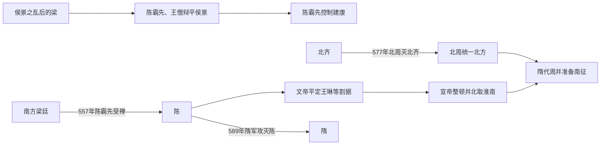

# 陈（陈）

> 导航：[南北朝](/%E4%BA%BA%E6%96%87%E7%A7%91%E5%AD%A6/%E5%8E%86%E5%8F%B2/%E4%B8%9C%E4%BA%9A/%E4%B8%AD%E5%9B%BD/%E5%8D%97%E5%8C%97%E6%9C%9D/README.md) / [南朝](/%E4%BA%BA%E6%96%87%E7%A7%91%E5%AD%A6/%E5%8E%86%E5%8F%B2/%E4%B8%9C%E4%BA%9A/%E4%B8%AD%E5%9B%BD/%E5%8D%97%E5%8C%97%E6%9C%9D/%E5%8D%97%E6%9C%9D/README.md) / [刘宋](/%E4%BA%BA%E6%96%87%E7%A7%91%E5%AD%A6/%E5%8E%86%E5%8F%B2/%E4%B8%9C%E4%BA%9A/%E4%B8%AD%E5%9B%BD/%E5%8D%97%E5%8C%97%E6%9C%9D/%E5%8D%97%E6%9C%9D/%E5%AE%8B%EF%BC%88%E5%88%98%EF%BC%89.md) / [南齐](/%E4%BA%BA%E6%96%87%E7%A7%91%E5%AD%A6/%E5%8E%86%E5%8F%B2/%E4%B8%9C%E4%BA%9A/%E4%B8%AD%E5%9B%BD/%E5%8D%97%E5%8C%97%E6%9C%9D/%E5%8D%97%E6%9C%9D/%E9%BD%90%EF%BC%88%E8%90%A7%EF%BC%89.md) / [萧梁](/%E4%BA%BA%E6%96%87%E7%A7%91%E5%AD%A6/%E5%8E%86%E5%8F%B2/%E4%B8%9C%E4%BA%9A/%E4%B8%AD%E5%9B%BD/%E5%8D%97%E5%8C%97%E6%9C%9D/%E5%8D%97%E6%9C%9D/%E6%A2%81%EF%BC%88%E8%90%A7%EF%BC%89.md) / [陈](/%E4%BA%BA%E6%96%87%E7%A7%91%E5%AD%A6/%E5%8E%86%E5%8F%B2/%E4%B8%9C%E4%BA%9A/%E4%B8%AD%E5%9B%BD/%E5%8D%97%E5%8C%97%E6%9C%9D/%E5%8D%97%E6%9C%9D/%E9%99%88%EF%BC%88%E9%99%88%EF%BC%89.md)

## 时间

557年—589年。

## 别称

- 南陈
- 陈朝

## 概括

陈由陈霸先代梁建立，是南朝最后一个政权。陈承侯景之乱后的江南残局，版图、人口和上游屏障均弱于宋、齐、梁；武帝、文帝、宣帝逐步平定地方并一度北取淮南，但北周灭北齐、隋统一北方后力量对比彻底失衡，589年隋灭陈，南北朝结束。

## 兴亡主线

## 建立、恢复与统治结构

| 阶段 | 具体过程 | 权力结构 |
|---|---|---|
| 军事奠基 | 陈霸先参加平侯景，后与王僧辩共同掌握梁军；因反对北齐扶立萧渊明而杀王僧辩，控制建康。 | 皇帝名义仍属梁敬帝，陈霸先依靠岭南、江南将领和禁军掌握实际权力。 |
| 武帝建国 | 557年陈霸先受禅，随即面对王琳、北齐及各地割据，559年去世。 | 新王朝领土有限，中央必须与地方军头、豪族和北朝力量竞逐。 |
| 文帝恢复 | 陈蒨越过武帝之子继位，平定王琳势力和内部叛乱，恢复州郡税役。 | 皇位选择以成年、有军功宗室为先，显示危机下实用继承高于父子顺序。 |
| 废帝与宣帝 | 陈伯宗幼年继位，叔父陈顼辅政后废帝自立。 | 辅政宗室掌军，幼帝难以保位；宣帝在位较长，中央相对稳定。 |
| 太建北伐 | 北齐衰弱时陈军北进，573年收复淮南；577年北周灭齐后反攻，陈所获地区多失。 | 吴明彻等将领掌前线，国家仍缺乏与统一北方帝国长期竞争的兵力。 |
| 后主与隋征服 | 陈叔宝时期建康文化繁荣，边防和军政协调不足；隋完成北方整合后多路南征。 | 长江天险依赖水军与沿岸守将，一旦上游、淮南和内部指挥同时失效，中央无纵深。 |

## 重要事件

1. 552年陈霸先与王僧辩等击败侯景，成为梁末最重要将领之一。
2. 554年西魏灭江陵梁廷后，王僧辩接受北齐扶立萧渊明；555年陈霸先袭杀王僧辩，另立萧方智。
3. 557年陈霸先受禅建陈，但王琳等不承认新朝，江南仍处于分裂。
4. 559年陈文帝继位，经过数年战争稳定建康、荆湘以东及岭南关系；王琳败后北逃。
5. 566年废帝即位，陈顼辅政并于568年称帝，完成另一次宗室权力转换。
6. 573年吴明彻北伐击败北齐，收复淮南和部分淮北，陈疆域短暂扩大。
7. 577年北周灭北齐，吴明彻继续北进反被周军击败，寿阳等地丢失。
8. 581年杨坚建立隋并逐步整合北方，587年废除西梁，陈的长江上游侧翼完全暴露。
9. 588年隋文帝下诏南征，以贺若弼、韩擒虎等多路渡江；589年建康陷落，陈叔宝被俘。

## 恢复条件、局限与灭亡原因

### 能够恢复的条件

- 陈霸先和陈蒨拥有平侯景、整顿地方的军事网络，能在梁末废墟上重新建立中央。
- 长江下游与岭南仍有农业、盐业、商业和人口基础，建康的官僚文化未被完全摧毁。
- 北齐、北周长期对峙，北方未能立即集中力量南征，给陈三十余年恢复窗口。
- 文帝、宣帝时期皇帝有军政经验，能够压制部分地方割据。

### 结构局限

- 侯景之乱和西魏攻江陵使江汉上游、四川等传统战略腹地脱离南朝，陈的疆域纵深狭窄。
- 国家人口、马匹和财政远少于统一后的北方，防线却横跨长江、淮南与岭南。
- 宗室辅政仍可能直接废帝，继承制度没有根本稳定。
- 北伐所得地区缺乏长期防御条件，北齐一亡，陈即面对掌握整个北方资源的北周—隋。

### 直接灭亡过程

隋统一北方、废西梁后可从上游、中游、下游同时进攻。陈廷误判开战时间，长江防军分散，将领之间缺乏统一协同；隋军利用江面防备空隙渡江，韩擒虎、贺若弼迅速逼近建康。后主被俘后，各地抵抗缺少共同君主和补给中心，589年内大体结束。

## 历史影响

- 陈亡使自西晋末年以来近三百年的南北分裂告终，隋取得全国统一。
- 隋并未废弃江南官僚与经济体系，而是吸收陈旧臣、户籍和文化资源，为运河与唐代整合奠基。
- 陈代文学、佛教和宫廷文化延续南朝传统；“后主荒淫亡国”的后世叙事有道德化成分，不能取代南北资源差距和战略纵深分析。
- 陈霸先从岭南相关军政网络崛起，也反映南朝后期传统高门之外的地方军事力量上升。

## 说明

- 557年，陈霸先受梁敬帝禅让，建立陈。
- 陈朝主要控制长江下游和岭南部分地区，国力较南朝前期明显削弱。
- 陈宣帝时一度北伐并收复淮南部分地区，但难以长期抗衡统一北方的隋。
- 589年，隋军渡江攻入建康，陈后主陈叔宝被俘，南朝陈灭亡。

## 世系表

| 顺序 | 姓名 | 庙号 | 谥号 / 称号 | 年号 | 在位时间 | 生卒时间 | 与前任关系 | 关键事件 / 备注 / 说明 |
|---:|---|---|---|---|---|---|---|---|
| 追尊 | 陈文赞 | 太祖 | 景皇帝 | 无 | 未正式在位 | 不详 | 陈霸先父 | 陈武帝追尊。 |
| 追尊 | 陈道谭 | 无 | 始兴昭烈王 | 无 | 未正式在位 | ？—548年 | 陈霸先兄 | 陈武帝追尊。 |
| 1 | 陈霸先 | 高祖 | 武皇帝 | 永定 | 557年—559年 | 503年—559年 | 开国君主 | 受梁敬帝禅让，建立陈。 |
| 2 | 陈蒨 | 世祖 | 文皇帝 | 天嘉、天康 | 559年—566年 | 522年—566年 | 陈霸先侄 | 稳定陈初政局。 |
| 3 | 陈伯宗 | 无 | 废帝 / 临海王 | 光大 | 566年—568年 | 554年—570年 | 陈蒨子 | 被陈顼废。 |
| 4 | 陈顼 | 高宗 | 宣皇帝 | 太建 | 568年—582年 | 530年—582年 | 陈蒨弟 | 一度北伐，收复淮南部分地区。 |
| 5 | 陈叔宝 | 无 | 后主 / 长城炀公 | 至德、祯明 | 582年—589年 | 553年—604年 | 陈顼子 | 589年隋灭陈，南北朝结束。 |

## 演变关系

- 前一节点：[梁（萧）](/%E4%BA%BA%E6%96%87%E7%A7%91%E5%AD%A6/%E5%8E%86%E5%8F%B2/%E4%B8%9C%E4%BA%9A/%E4%B8%AD%E5%9B%BD/%E5%8D%97%E5%8C%97%E6%9C%9D/%E5%8D%97%E6%9C%9D/%E6%A2%81%EF%BC%88%E8%90%A7%EF%BC%89.md)。
- 后一节点：隋灭陈，南北统一。

## 相关笔记

- [南朝](/%E4%BA%BA%E6%96%87%E7%A7%91%E5%AD%A6/%E5%8E%86%E5%8F%B2/%E4%B8%9C%E4%BA%9A/%E4%B8%AD%E5%9B%BD/%E5%8D%97%E5%8C%97%E6%9C%9D/%E5%8D%97%E6%9C%9D/README.md)
- [南北朝](/%E4%BA%BA%E6%96%87%E7%A7%91%E5%AD%A6/%E5%8E%86%E5%8F%B2/%E4%B8%9C%E4%BA%9A/%E4%B8%AD%E5%9B%BD/%E5%8D%97%E5%8C%97%E6%9C%9D/README.md)
