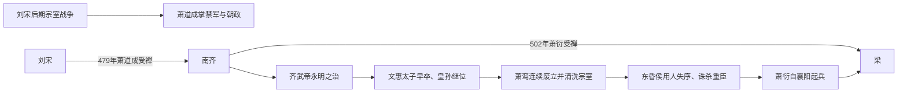

# 齐（萧）

> 导航：[南北朝](/%E4%BA%BA%E6%96%87%E7%A7%91%E5%AD%A6/%E5%8E%86%E5%8F%B2/%E4%B8%9C%E4%BA%9A/%E4%B8%AD%E5%9B%BD/%E5%8D%97%E5%8C%97%E6%9C%9D/README.md) / [南朝](/%E4%BA%BA%E6%96%87%E7%A7%91%E5%AD%A6/%E5%8E%86%E5%8F%B2/%E4%B8%9C%E4%BA%9A/%E4%B8%AD%E5%9B%BD/%E5%8D%97%E5%8C%97%E6%9C%9D/%E5%8D%97%E6%9C%9D/README.md) / [刘宋](/%E4%BA%BA%E6%96%87%E7%A7%91%E5%AD%A6/%E5%8E%86%E5%8F%B2/%E4%B8%9C%E4%BA%9A/%E4%B8%AD%E5%9B%BD/%E5%8D%97%E5%8C%97%E6%9C%9D/%E5%8D%97%E6%9C%9D/%E5%AE%8B%EF%BC%88%E5%88%98%EF%BC%89.md) / [南齐](/%E4%BA%BA%E6%96%87%E7%A7%91%E5%AD%A6/%E5%8E%86%E5%8F%B2/%E4%B8%9C%E4%BA%9A/%E4%B8%AD%E5%9B%BD/%E5%8D%97%E5%8C%97%E6%9C%9D/%E5%8D%97%E6%9C%9D/%E9%BD%90%EF%BC%88%E8%90%A7%EF%BC%89.md) / [萧梁](/%E4%BA%BA%E6%96%87%E7%A7%91%E5%AD%A6/%E5%8E%86%E5%8F%B2/%E4%B8%9C%E4%BA%9A/%E4%B8%AD%E5%9B%BD/%E5%8D%97%E5%8C%97%E6%9C%9D/%E5%8D%97%E6%9C%9D/%E6%A2%81%EF%BC%88%E8%90%A7%EF%BC%89.md) / [陈](/%E4%BA%BA%E6%96%87%E7%A7%91%E5%AD%A6/%E5%8E%86%E5%8F%B2/%E4%B8%9C%E4%BA%9A/%E4%B8%AD%E5%9B%BD/%E5%8D%97%E5%8C%97%E6%9C%9D/%E5%8D%97%E6%9C%9D/%E9%99%88%EF%BC%88%E9%99%88%EF%BC%89.md)

## 时间

479年—502年。

## 别称

- 南齐
- 萧齐

## 概括

南齐由萧道成代刘宋建立，国祚较短。齐武帝萧赜时期政治较稳，史称“永明之治”；其后宗室屠戮和皇位更替频繁，中央禁军、宗王与地方刺史相互争夺，最终被萧衍建立的梁取代。

## 兴亡主线

## 发展阶段与统治结构

| 阶段 | 具体过程 | 权力结构 |
|---|---|---|
| 高帝建国 | 萧道成以禁军和军功控制刘宋，479年受禅；继续使用建康官僚与州郡体系。 | 皇帝依靠萧氏宗族、寒门武将和门阀文官，试图限制宗王拥兵。 |
| 永明稳定 | 齐武帝减少大规模战争，整顿户籍、赋役和学校文化，与北魏维持攻守。 | 皇帝亲政，竟陵王萧子良等宗王形成文学、幕僚中心，但尚未公开争位。 |
| 继承危机 | 文惠太子萧长懋在武帝前去世，皇孙萧昭业继位；叔祖萧鸾控制禁军并连续废杀两帝。 | 储位断层使辅政宗室成为实际最高权力，法定继承难约束武装。 |
| 明帝清洗 | 萧鸾称帝后杀戮高帝、武帝多支子孙，确保本支继承。 | 短期消除对手，却同时摧毁皇族可用的地方统帅和互信。 |
| 东昏侯与萧衍起兵 | 萧宝卷诛杀大臣、频繁更换将帅；雍州刺史萧衍以替兄复仇和拥立和帝为名东下。 | 建康禁军离心，地方强镇襄阳的军力反而超过中央。 |

## 重要事件

1. 479年萧道成迫刘宋顺帝禅位，建立南齐。
2. 482年齐武帝即位，永明年间政局、文化相对稳定，王俭等主持礼制与官僚事务。
3. 南齐与北魏在淮河、汉水一线反复攻守，边境压力持续消耗州郡军费。
4. 493年文惠太子与齐武帝先后去世，萧昭业以皇孙继位，权力落入萧鸾。
5. 494年萧鸾先后废杀萧昭业、萧昭文并称帝，开始大规模清洗高、武帝诸子。
6. 498年萧宝卷即位，杀萧懿等重臣，引发其弟萧衍从襄阳起兵。
7. 501年建康守军倒戈、萧宝卷被杀，萧衍控制朝廷；502年和帝禅位，南齐灭亡。

## 短暂稳定与迅速灭亡的原因

### 稳定条件

- 南齐接收刘宋完整的建康、州郡和江南财赋体系，改朝初期没有大范围社会革命。
- 齐武帝在位较长，减少宫廷废立，重用文官并保持边防，形成“永明之治”。
- 江南经济、佛教、文学和士族文化继续发展，国家有较稳定税源。

### 结构隐患

- 南朝皇帝担心权臣，常以宗王出镇；又担心宗王，转而依赖寒门将领和禁军，形成循环性不信任。
- 建康控制长江下游，但荆州、雍州等上游强镇有独立兵源，中央内乱时可沿江东下。
- 皇位缺乏稳定嫡长继承，幼帝或皇孙继位即需要宗室辅政，辅政者很容易转为篡位者。
- 萧鸾的宗室屠戮解决了眼前竞争，却使萧宝卷遇危机时没有可信任的皇族将领。

### 直接灭亡

萧宝卷诛杀萧懿成为直接触发。萧衍掌握襄阳和雍州军队，拥立萧宝融取得宗室名义；东下过程中吸收地方将领，建康内部又发生倒戈。501年萧宝卷被杀后，和帝只是过渡君主，502年禅位完成梁代齐。

## 说明

- 479年，萧道成迫宋顺帝刘准禅让，建立南齐。
- 齐武帝萧赜时期相对稳定，文化和政治较有起色，史称“永明之治”。
- 萧鸾掌权后大杀高帝、武帝子孙，宗室政治急剧恶化。
- 萧宝卷暴虐失政，引发萧衍起兵。
- 502年，齐和帝萧宝融禅位萧衍，南齐灭亡。

## 世系表

| 顺序 | 姓名 | 庙号 | 谥号 / 称号 | 年号 | 在位时间 | 生卒时间 | 与前任关系 | 关键事件 / 备注 / 说明 |
|---:|---|---|---|---|---|---|---|---|
| 追尊 | 萧承之 | 无 | 宣皇帝 | 无 | 未正式在位 | 384年—447年 | 萧道成父 | 齐太祖追尊。 |
| 1 | 萧道成 | 太祖 | 高皇帝 | 建元 | 479年—482年 | 427年—482年 | 开国君主 | 代刘宋建立南齐。 |
| 2 | 萧赜 | 世祖 | 武皇帝 | 永明 | 482年—493年 | 440年—493年 | 萧道成子 | 永明之治。 |
| 追尊 | 萧长懋 | 世宗 | 文皇帝 | 无 | 未正式在位 | 458年—493年 | 萧赜子 | 萧昭业追尊。 |
| 3 | 萧昭业 | 无 | 郁林王 | 隆昌 | 493年—494年 | 473年—494年 | 萧长懋子 | 被萧鸾废杀。 |
| 4 | 萧昭文 | 无 | 海陵恭王 | 延兴 | 494年 | 480年—494年 | 萧昭业弟 | 被萧鸾废杀。 |
| 追尊 | 萧道生 | 无 | 景皇帝 | 无 | 未正式在位 | ？—478年 | 萧鸾父 | 齐明帝萧鸾追尊。 |
| 5 | 萧鸾 | 高宗 | 明皇帝 | 建武、永泰 | 494年—498年 | 452年—498年 | 萧道成侄 | 诛杀高、武帝诸子，强化本支权力。 |
| 6 | 萧宝卷 | 无 | 东昏侯 | 永元 | 498年—501年 | 483年—501年 | 萧鸾子 | 暴虐失政，被杀。 |
| 7 | 萧宝融 | 无 | 和皇帝 | 中兴 | 501年—502年 | 488年—502年 | 萧鸾子 | 禅位萧衍，南齐亡。 |

## 演变关系

- 前一节点：[宋（刘）](/%E4%BA%BA%E6%96%87%E7%A7%91%E5%AD%A6/%E5%8E%86%E5%8F%B2/%E4%B8%9C%E4%BA%9A/%E4%B8%AD%E5%9B%BD/%E5%8D%97%E5%8C%97%E6%9C%9D/%E5%8D%97%E6%9C%9D/%E5%AE%8B%EF%BC%88%E5%88%98%EF%BC%89.md)。
- 后一节点：[梁（萧）](/%E4%BA%BA%E6%96%87%E7%A7%91%E5%AD%A6/%E5%8E%86%E5%8F%B2/%E4%B8%9C%E4%BA%9A/%E4%B8%AD%E5%9B%BD/%E5%8D%97%E5%8C%97%E6%9C%9D/%E5%8D%97%E6%9C%9D/%E6%A2%81%EF%BC%88%E8%90%A7%EF%BC%89.md)。

## 相关笔记

- [南朝](/%E4%BA%BA%E6%96%87%E7%A7%91%E5%AD%A6/%E5%8E%86%E5%8F%B2/%E4%B8%9C%E4%BA%9A/%E4%B8%AD%E5%9B%BD/%E5%8D%97%E5%8C%97%E6%9C%9D/%E5%8D%97%E6%9C%9D/README.md)
- [南北朝](/%E4%BA%BA%E6%96%87%E7%A7%91%E5%AD%A6/%E5%8E%86%E5%8F%B2/%E4%B8%9C%E4%BA%9A/%E4%B8%AD%E5%9B%BD/%E5%8D%97%E5%8C%97%E6%9C%9D/README.md)
- [梁（萧）](/%E4%BA%BA%E6%96%87%E7%A7%91%E5%AD%A6/%E5%8E%86%E5%8F%B2/%E4%B8%9C%E4%BA%9A/%E4%B8%AD%E5%9B%BD/%E5%8D%97%E5%8C%97%E6%9C%9D/%E5%8D%97%E6%9C%9D/%E6%A2%81%EF%BC%88%E8%90%A7%EF%BC%89.md)
