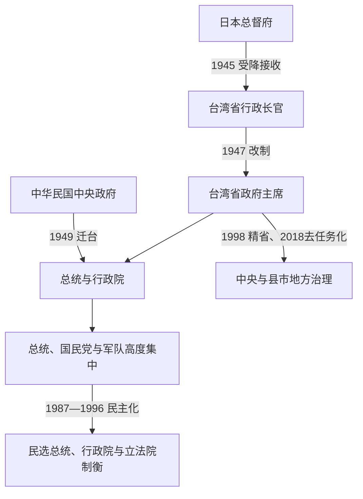

# 1945年以来台湾政权与行政首长表

## 时间与口径

1945年至今；现任信息核验至2026-07-14。

本表把国家元首、政府首脑、台湾地方行政首长和党政军实际权力分开。1949年前中央政府主要在中国大陆运作，台湾由行政长官公署或省政府治理；1949年12月中央政府迁台后，国家层级与台湾省层级重叠于同一地理空间，但两者并非同一机关。1949—1950年李宗仁名义代总统、蒋中正掌握国民党与军事核心，是必须明确标出的权力断裂。

## 权力层级演进

## 国家元首完整序列

| 顺序 | 国家元首或代行安排 | 任期 | 名义与实际权力说明 |
|---:|---|---|---|
| 1 | 蒋中正（国民政府主席） | 1945—1948-05-20 | 台湾接收时的中华民国国家元首；岛内日常行政由陈仪主持。 |
| 2 | **蒋中正（总统）** | 1948-05-20—1949-01-21 | 行宪后首任总统；内战失利后宣布引退。 |
| — | **李宗仁（代总统）** | 1949-01-21—1950-03-01 | 依副总统身份代行；1949-11-20离开中华民国实际管辖区后，难以指挥迁台政府。蒋中正仍控制国民党与主要军事资源。 |
| 2复任 | **蒋中正（复行视事）** | 1950-03-01—1975-04-05 | 在台北恢复总统职权，兼国民党总裁和军事最高权威。 |
| 3 | 严家淦 | 1975-04-05—1978-05-20 | 由副总统继任；蒋经国任行政院长、国民党主席并掌安全军政核心，实际权力并不完全随总统职位转移。 |
| 4 | **蒋经国** | 1978-05-20—1988-01-13 | 总统兼执政党核心；后期解除戒严、扩大政治开放。 |
| 5 | **李登辉** | 1988-01-13—2000-05-20 | 由副总统继任，1990年当选、1996年成为首位直接民选总统；逐步完成党政军权力接续和民主化。 |
| 6 | 陈水扁 | 2000-05-20—2008-05-20 | 首次政党轮替后的总统。 |
| 7 | 马英九 | 2008-05-20—2016-05-20 | 第二次政党轮替后的总统。 |
| 8 | 蔡英文 | 2016-05-20—2024-05-20 | 首位女性总统，任内完成两届任期。 |
| 9 | **赖清德** | 2024-05-20—至今 | 第16任总统；截至2026-07-14在任，副总统为萧美琴。 |

## 行政院院长完整序列

下表从1945年起连续列出；同一人物复任、重新组阁或不同届次分行。

| 顺序 | 行政院院长 | 任期 | 说明 |
|---:|---|---|---|
| 1 | 宋子文 | 1945-06-04—1947-03-01 | 抗战胜利后接收与内战初期。 |
| 2 | 蒋中正（兼代） | 1947-03-01—1947-04-23 | 宋子文去职后的短期过渡。 |
| 3 | 张群 | 1947-04-23—1948-05-24 | 行宪前最后阶段。 |
| 4 | 翁文灏 | 1948-05-25—1948-11-26 | 行宪后首任行政院长。 |
| 5 | 孙科 | 1948-11-26—1949-03-12 | 内战急剧恶化时期。 |
| 6 | 何应钦 | 1949-03-12—1949-06-13 | 李宗仁代总统时期。 |
| 7 | 阎锡山 | 1949-06-13—1950-03-10 | 政府迁台前后继续任职。 |
| 8 | 陈诚（第一次） | 1950-03-10—1954-06-01 | 土地改革、美援与政权重建。 |
| 9 | 俞鸿钧 | 1954-06-01—1958-07-15 | 财政、工业与冷战安全体制发展。 |
| 10 | 陈诚（第二次） | 1958-07-15—1963-12-16 | 复任；兼副总统。 |
| 11 | 严家淦 | 1963-12-16—1972-06-01 | 出口工业化加速。 |
| 12 | 蒋经国 | 1972-06-01—1978-05-20 | 十大建设、外交挫折与权力接班。 |
| 13 | 孙运璿 | 1978-06-01—1984-06-01 | 产业升级、科技政策和基础设施。 |
| 14 | 俞国华 | 1984-06-01—1989-06-01 | 跨越解严前后。 |
| 15 | 李焕 | 1989-06-01—1990-06-01 | 民主化和国民党内部重组。 |
| 16 | 郝柏村 | 1990-06-01—1993-02-27 | 军人转任阁揆，面对国会全面改选。 |
| 17 | 连战（第一次组阁） | 1993-02-27—1996-02-24 | 宪政改革与地方选举时期。 |
| 17续 | 连战（第二次组阁） | 1996-02-24—1997-09-01 | 总统直选后留任并重组内阁。 |
| 18 | 萧万长（第一次组阁） | 1997-09-01—1999-01-22 | 亚洲金融危机背景。 |
| 18续 | 萧万长（第二次组阁） | 1999-01-22—2000-05-20 | 政党轮替前夕。 |
| 19 | 唐飞 | 2000-05-20—2000-10-06 | 首次轮替后的跨党派组阁。 |
| 20 | 张俊雄（第一次） | 2000-10-06—2002-02-01 | 少数政府与核四争议时期。 |
| 21 | 游锡堃（第一次组阁） | 2002-02-01—2004-05-20 | 行政改革、SARS与建设政策。 |
| 21续 | 游锡堃（第二次组阁） | 2004-05-20—2005-02-01 | 陈水扁第二任初期。 |
| 22 | 谢长廷 | 2005-02-01—2006-01-25 | 朝野协商与社会政策。 |
| 23 | 苏贞昌（第一次） | 2006-01-25—2007-05-21 | 行政与选举政治并行。 |
| 24 | 张俊雄（第二次） | 2007-05-21—2008-05-20 | 看守至第二次政党轮替。 |
| 25 | 刘兆玄 | 2008-05-20—2009-09-10 | 金融危机与莫拉克风灾。 |
| 26 | 吴敦义 | 2009-09-10—2012-02-06 | 两岸经贸和灾后重建。 |
| 27 | 陈冲 | 2012-02-06—2013-02-18 | 欧债危机与经济调整。 |
| 28 | 江宜桦 | 2013-02-18—2014-12-08 | 太阳花运动和地方选举挫败。 |
| 29 | 毛治国 | 2014-12-08—2016-02-01 | 马英九任期末段。 |
| 30 | 张善政 | 2016-02-01—2016-05-20 | 看守至第三次政党轮替。 |
| 31 | 林全 | 2016-05-20—2017-09-08 | 蔡英文首任初期。 |
| 32 | 赖清德 | 2017-09-08—2019-01-14 | 年金、能源与地方选举时期。 |
| 33 | 苏贞昌（第二次） | 2019-01-14—2023-01-31 | 新冠疫情、振兴与对外压力时期。 |
| 34 | 陈建仁 | 2023-01-31—2024-05-20 | 疫后治理与政权交接。 |
| 35 | **卓荣泰** | 2024-05-20—至今 | 赖清德任命；截至2026-07-14在任。 |

## 台湾地方最高行政首长

### 行政长官公署

| 首长 | 任期 | 说明 |
|---|---|---|
| **陈仪** | 1945-10-25—1947-05-16 | 台湾省行政长官，集中广泛行政权；二二八事件后公署撤销。 |

### 台湾省政府主席与省长

| 顺序 | 首长 | 任期 | 说明 |
|---:|---|---|---|
| 1 | 魏道明 | 1947-05-16—1949-01-05 | 首任省主席，接替行政长官公署。 |
| 2 | 陈诚 | 1949-01-05—1949-12-21 | 推动币制与土地政策，后任行政院长。 |
| 3 | 吴国桢 | 1949-12-21—1953-04-16 | 中央政府迁台初期省主席，后与蒋经国系统冲突。 |
| 4 | 俞鸿钧 | 1953-04-16—1954-06-07 | 后转任行政院长。 |
| 5 | 严家淦 | 1954-06-07—1957-08-16 | 省政府疏迁中部的规划阶段。 |
| 6 | 周至柔 | 1957-08-16—1962-12-01 | 省政府迁入中兴新村后运作。 |
| 7 | 黄杰 | 1962-12-01—1969-07-05 | 任内推进交通、水利与教育建设，后任国防部长。 |
| 8 | 陈大庆 | 1969-07-05—1972-06-06 | 军人省主席。 |
| 9 | 谢东闵 | 1972-06-06—1978-05-20 | 首位台湾本省籍省主席，后任副总统。 |
| 代理 | 瞿韶华 | 1978-05-20—1978-06-11 | 省政府秘书长代理。 |
| 10 | 林洋港 | 1978-06-12—1981-12-05 | 后任内政部长、司法院长。 |
| 11 | 李登辉 | 1981-12-05—1984-05-20 | 后任副总统、总统。 |
| 代理 | 刘兆田 | 1984-05-20—1984-06-08 | 省政府秘书长代理。 |
| 12 | 邱创焕 | 1984-06-09—1990-06-16 | 跨越解严前后。 |
| 13 | 连战 | 1990-06-16—1993-02-25 | 后转任行政院长。 |
| 代理 | 涂德锜 | 1993-02-27—1993-03-19 | 省政府秘书长代理。 |
| 14 | 宋楚瑜（任命制主席） | 1993-03-20—1994-12-20 | 末任精省前官派省主席。 |
| — | 宋楚瑜（民选省长） | 1994-12-20—1998-12-21 | 唯一一任民选台湾省长；职位名称与官派主席不同。 |
| 15 | 赵守博 | 1998-12-21—2000-05-02 | 精省后恢复主席制，职权大幅缩减。 |
| 代理 | 江清馦 | 2000-05-02—2000-05-19 | 省政府副主席代理。 |
| 16 | 张博雅 | 2000-05-20—2002-02-01 | 内政部长兼任，首位女性省主席。 |
| 17 | 范光群 | 2002-02-01—2004-10-13 | 精省后主席。 |
| 18 | 林光华 | 2004-10-13—2006-01-25 | 首位民主进步党籍省主席。 |
| 代行 | 郑培富 | 2006-01-25—2007-12-07 | 主席悬缺，行政院授权省政府秘书长代行职权。 |
| 19 | 林锡耀 | 2007-12-07—2008-05-20 | 行政院政务委员兼任，此后兼任成为常态。 |
| 20 | 蔡勋雄 | 2008-05-20—2009-09-10 | 行政院政务委员兼任。 |
| 21 | 张进福 | 2009-09-10—2010-02-26 | 行政院政务委员兼任。 |
| 22 | 林政则 | 2010-02-26—2016-05-20 | 行政院政务委员兼任，为精省后任期最长者。 |
| 23 | 施俊吉 | 2016-05-20—2016-06-29 | 行政院政务委员兼任，后转任台湾证券交易所董事长。 |
| 24 | 许璋瑶 | 2016-06-29—2017-11-06 | 行政院政务委员兼任。 |
| 25 | 吴泽成 | 2017-11-07—2018-06-30 | 行政院政务委员兼任，末任省政府主席。 |
| — | 停止派任、机关去任务化 | 2018-07-01起 | 预算、人员和剩余业务移交中央机关；省级机关停止实质运作。 |

## 党政军实际最高权力阶段

| 时期 | 主要权力核心 | 名义职位与实际权力辨析 |
|---|---|---|
| 1945—1949年 | 蒋中正与国民党军事中枢；岛内陈仪/省政府 | 中央国家元首不直接处理全部台湾地方行政。 |
| 1949—1950年 | 李宗仁名义代总统；蒋中正掌党军核心 | 李宗仁离境后出现明显名实分离，1950年蒋复行视事。 |
| 1950—1975年 | 蒋中正 | 总统、国民党总裁和军事安全体系集中于一人。 |
| 1975—1978年 | 严家淦任总统；蒋经国掌实际核心 | 蒋经国兼行政院长、国民党主席并控制主要党政军资源。 |
| 1978—1988年 | 蒋经国 | 总统与党政军核心重新重合，后期开启政治开放。 |
| 1988—1996年 | 李登辉逐步完成接班 | 初期受国民党资深派和军方制约，后以党主席、总统直选和宪改巩固权威。 |
| 1996年至今 | 民选总统、行政院、立法院和司法体系 | 总统居国安外交核心，但权力受选举、国会、司法、地方政府和社会力量制约。 |

## 现任核验

截至2026-07-14：

- 总统：赖清德，2024-05-20就任。
- 副总统：萧美琴，2024-05-20就任。
- 行政院长：卓荣泰，2024-05-20就任。
- 立法院长：韩国瑜，第11届立法院院长。
- 实际管辖由中华民国中央与地方机关行使；中华人民共和国对台湾提出主权主张，但不在台湾实施行政统治。

## 关联笔记

- [战后接收、威权统治与冷战](/%E4%BA%BA%E6%96%87%E7%A7%91%E5%AD%A6/%E5%8E%86%E5%8F%B2/%E4%B8%9C%E4%BA%9A/%E4%B8%AD%E5%9B%BD/%E5%8F%B0%E6%B9%BE/%E6%88%98%E5%90%8E%E6%8E%A5%E6%94%B6%E3%80%81%E5%A8%81%E6%9D%83%E7%BB%9F%E6%B2%BB%E4%B8%8E%E5%86%B7%E6%88%98.md)
- [民主化与当代台湾](/%E4%BA%BA%E6%96%87%E7%A7%91%E5%AD%A6/%E5%8E%86%E5%8F%B2/%E4%B8%9C%E4%BA%9A/%E4%B8%AD%E5%9B%BD/%E5%8F%B0%E6%B9%BE/%E6%B0%91%E4%B8%BB%E5%8C%96%E4%B8%8E%E5%BD%93%E4%BB%A3%E5%8F%B0%E6%B9%BE.md)
