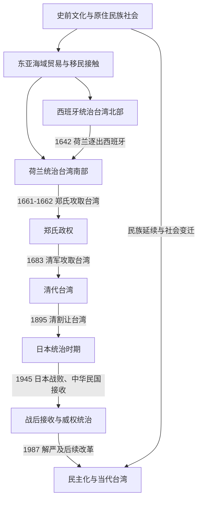

# 台湾历史

## 概括

台湾历史由南岛语族原住民族社会、东亚海域网络、欧洲殖民、郑氏政权、清代治理、日本殖民统治、1945年后的中华民国治理以及民主化等多条线索构成。澎湖、台湾本岛及周边岛屿在不同历史阶段的行政隶属和社会联系并不完全相同。

本目录按用户选择放在“中国”目录内，目的是服务笔记导航和跨时期互链；这一目录位置本身不代替对不同政权治理范围、主权主张、身份认同和法理争议的辨析。

## 历史主线

## 阶段导航

| 顺序 | 阶段 | 时间 | 概括 |
|---:|---|---|---|
| 1 | [史前与原住民族社会](/%E4%BA%BA%E6%96%87%E7%A7%91%E5%AD%A6/%E5%8E%86%E5%8F%B2/%E4%B8%9C%E4%BA%9A/%E4%B8%AD%E5%9B%BD/%E5%8F%B0%E6%B9%BE/%E5%8F%B2%E5%89%8D%E4%B8%8E%E5%8E%9F%E4%BD%8F%E6%B0%91%E6%97%8F%E7%A4%BE%E4%BC%9A.md) | 史前至17世纪 | 多期考古文化、南岛语族社会和区域海域网络。 |
| 2 | [荷西殖民与郑氏政权](/%E4%BA%BA%E6%96%87%E7%A7%91%E5%AD%A6/%E5%8E%86%E5%8F%B2/%E4%B8%9C%E4%BA%9A/%E4%B8%AD%E5%9B%BD/%E5%8F%B0%E6%B9%BE/%E8%8D%B7%E8%A5%BF%E6%AE%96%E6%B0%91%E4%B8%8E%E9%83%91%E6%B0%8F%E6%94%BF%E6%9D%83.md) | 1624-1683年 | 欧洲殖民竞争、跨海贸易、汉人移民扩大和郑氏政权。 |
| 3 | [清代台湾](/%E4%BA%BA%E6%96%87%E7%A7%91%E5%AD%A6/%E5%8E%86%E5%8F%B2/%E4%B8%9C%E4%BA%9A/%E4%B8%AD%E5%9B%BD/%E5%8F%B0%E6%B9%BE/%E6%B8%85%E4%BB%A3%E5%8F%B0%E6%B9%BE.md) | 1683-1895年 | 清代行政建制、移民开发、族群互动、地方动乱和建省。 |
| 4 | [日本统治时期](/%E4%BA%BA%E6%96%87%E7%A7%91%E5%AD%A6/%E5%8E%86%E5%8F%B2/%E4%B8%9C%E4%BA%9A/%E4%B8%AD%E5%9B%BD/%E5%8F%B0%E6%B9%BE/%E6%97%A5%E6%9C%AC%E7%BB%9F%E6%B2%BB%E6%97%B6%E6%9C%9F.md) | 1895-1945年 | 总督府殖民统治、基础设施和产业改造、社会运动及战争动员。 |
| 5 | [战后接收、威权统治与冷战](/%E4%BA%BA%E6%96%87%E7%A7%91%E5%AD%A6/%E5%8E%86%E5%8F%B2/%E4%B8%9C%E4%BA%9A/%E4%B8%AD%E5%9B%BD/%E5%8F%B0%E6%B9%BE/%E6%88%98%E5%90%8E%E6%8E%A5%E6%94%B6%E3%80%81%E5%A8%81%E6%9D%83%E7%BB%9F%E6%B2%BB%E4%B8%8E%E5%86%B7%E6%88%98.md) | 1945-1987年 | 战后接收、二二八事件、迁台、戒严、白色恐怖和出口工业化。 |
| 6 | [民主化与当代台湾](/%E4%BA%BA%E6%96%87%E7%A7%91%E5%AD%A6/%E5%8E%86%E5%8F%B2/%E4%B8%9C%E4%BA%9A/%E4%B8%AD%E5%9B%BD/%E5%8F%B0%E6%B9%BE/%E6%B0%91%E4%B8%BB%E5%8C%96%E4%B8%8E%E5%BD%93%E4%BB%A3%E5%8F%B0%E6%B9%BE.md) | 1987年至今 | 解严、宪政改革、直接选举、政党轮替和当代社会转型。 |

## 关键辨析

- 原住民族不是台湾史的“史前背景”，而是延续至今、内部多样的社会与政治主体。
- 荷兰、西班牙和郑氏在岛内的控制范围不同，不能把地图上的主张视为全岛有效统治。
- 清代移民拓殖既带来市场和行政扩展，也造成土地冲突、分类治理和原住民族生存空间变化。
- 日本统治时期的现代基础设施、教育和产业建设与殖民压迫、差别待遇、镇压和战争动员同时存在。
- 1945年后的中华民国在台湾治理、1949年两岸分治、国际承认变化和民主化是相互关联但不同层次的问题。
- “本省人”“外省人”“原住民族”和新住民等称谓具有特定历史背景，不能被当成固定不变的族群边界。

## 相关入口

- [中华人民共和国](/%E4%BA%BA%E6%96%87%E7%A7%91%E5%AD%A6/%E5%8E%86%E5%8F%B2/%E4%B8%9C%E4%BA%9A/%E4%B8%AD%E5%9B%BD/%E4%B8%AD%E5%8D%8E%E4%BA%BA%E6%B0%91%E5%85%B1%E5%92%8C%E5%9B%BD/README.md)
- [清](/%E4%BA%BA%E6%96%87%E7%A7%91%E5%AD%A6/%E5%8E%86%E5%8F%B2/%E4%B8%9C%E4%BA%9A/%E4%B8%AD%E5%9B%BD/%E6%B8%85/README.md)
- [民国](/%E4%BA%BA%E6%96%87%E7%A7%91%E5%AD%A6/%E5%8E%86%E5%8F%B2/%E4%B8%9C%E4%BA%9A/%E4%B8%AD%E5%9B%BD/%E6%B0%91%E5%9B%BD/README.md)
- [日本](/%E4%BA%BA%E6%96%87%E7%A7%91%E5%AD%A6/%E5%8E%86%E5%8F%B2/%E4%B8%9C%E4%BA%9A/%E6%97%A5%E6%9C%AC/README.md)
