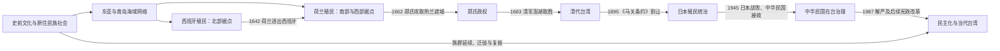

# 台湾历史

## 范围与口径

本目录梳理台湾本岛、澎湖及其周边岛屿从史前到当代的历史。台湾长期处在南岛语族世界、中国东南沿海、日本列岛、菲律宾群岛与西太平洋海域网络的交汇处；各时期政权的主张范围、实际控制范围和当地社会的延续范围并不相同。

本目录置于“中国”目录仅为现有笔记导航安排，不预设当代主权争议的结论。涉及1945年后历史时，分别说明中华民国政府的实际管辖、中华人民共和国的主权主张、国际承认变化与台湾内部政治认同，避免把四者混写。

## 历史主线

## 历史主线

- 史前与早期历史以考古、语言、口述传统和外来文献互证，不能把考古文化直接等同于今日某一民族。
- 17世纪荷兰、西班牙和郑氏的统治集中于港口、平原与交通节点，岛内仍并存许多自主村社。
- 清代行政和移民社会逐步扩张，但国家控制、移民开垦与原住民族空间之间长期存在边界。
- 日本统治以总督府、警察和殖民经济重塑全岛，同时伴随差别统治、武力镇压、同化与战争动员。
- 1945年后经历接收、二二八事件、中央政府迁台、戒严与冷战结盟；1987年后逐步完成民主化。
- 当代台湾的制度运行、两岸关系、国际空间、人口与产业转型彼此关联，但不应被压缩成单一身份或主权叙事。

## 阶段导航

| 顺序 | 阶段 | 时间 | 内容重点 |
|---:|---|---|---|
| 1 | [史前与原住民族社会](/%E4%BA%BA%E6%96%87%E7%A7%91%E5%AD%A6/%E5%8E%86%E5%8F%B2/%E4%B8%9C%E4%BA%9A/%E4%B8%AD%E5%9B%BD/%E5%8F%B0%E6%B9%BE/%E5%8F%B2%E5%89%8D%E4%B8%8E%E5%8E%9F%E4%BD%8F%E6%B0%91%E6%97%8F%E7%A4%BE%E4%BC%9A.md) | 史前至17世纪；社会延续至今 | 考古文化、南岛语族、村社政治与海域网络。 |
| 2 | [荷西殖民与郑氏政权](/%E4%BA%BA%E6%96%87%E7%A7%91%E5%AD%A6/%E5%8E%86%E5%8F%B2/%E4%B8%9C%E4%BA%9A/%E4%B8%AD%E5%9B%BD/%E5%8F%B0%E6%B9%BE/%E8%8D%B7%E8%A5%BF%E6%AE%96%E6%B0%91%E4%B8%8E%E9%83%91%E6%B0%8F%E6%94%BF%E6%9D%83.md) | 1624—1683年 | 欧洲殖民竞争、原住民村社、移民贸易与郑氏反清政权。 |
| 3 | [清代台湾](/%E4%BA%BA%E6%96%87%E7%A7%91%E5%AD%A6/%E5%8E%86%E5%8F%B2/%E4%B8%9C%E4%BA%9A/%E4%B8%AD%E5%9B%BD/%E5%8F%B0%E6%B9%BE/%E6%B8%85%E4%BB%A3%E5%8F%B0%E6%B9%BE.md) | 1683—1895年 | 建制扩张、移民开发、族群冲突、海防与建省。 |
| 4 | [日本统治时期](/%E4%BA%BA%E6%96%87%E7%A7%91%E5%AD%A6/%E5%8E%86%E5%8F%B2/%E4%B8%9C%E4%BA%9A/%E4%B8%AD%E5%9B%BD/%E5%8F%B0%E6%B9%BE/%E6%97%A5%E6%9C%AC%E7%BB%9F%E6%B2%BB%E6%97%B6%E6%9C%9F.md) | 1895—1945年 | 总督府殖民统治、产业与基础设施、社会运动和战争动员。 |
| 5 | [战后接收、威权统治与冷战](/%E4%BA%BA%E6%96%87%E7%A7%91%E5%AD%A6/%E5%8E%86%E5%8F%B2/%E4%B8%9C%E4%BA%9A/%E4%B8%AD%E5%9B%BD/%E5%8F%B0%E6%B9%BE/%E6%88%98%E5%90%8E%E6%8E%A5%E6%94%B6%E3%80%81%E5%A8%81%E6%9D%83%E7%BB%9F%E6%B2%BB%E4%B8%8E%E5%86%B7%E6%88%98.md) | 1945—1987年 | 接收、二二八、迁台、戒严、白色恐怖、冷战与工业化。 |
| 6 | [民主化与当代台湾](/%E4%BA%BA%E6%96%87%E7%A7%91%E5%AD%A6/%E5%8E%86%E5%8F%B2/%E4%B8%9C%E4%BA%9A/%E4%B8%AD%E5%9B%BD/%E5%8F%B0%E6%B9%BE/%E6%B0%91%E4%B8%BB%E5%8C%96%E4%B8%8E%E5%BD%93%E4%BB%A3%E5%8F%B0%E6%B9%BE.md) | 1987年至今 | 宪政改革、直接选举、政党轮替、社会转型与两岸关系。 |

## 统治者与行政首长专表

| 专表 | 覆盖范围 |
|---|---|
| [荷西殖民与郑氏政权统治者表](/%E4%BA%BA%E6%96%87%E7%A7%91%E5%AD%A6/%E5%8E%86%E5%8F%B2/%E4%B8%9C%E4%BA%9A/%E4%B8%AD%E5%9B%BD/%E5%8F%B0%E6%B9%BE/%E8%8D%B7%E8%A5%BF%E6%AE%96%E6%B0%91%E4%B8%8E%E9%83%91%E6%B0%8F%E6%94%BF%E6%9D%83%E7%BB%9F%E6%B2%BB%E8%80%85%E8%A1%A8.md) | 12任荷兰台湾长官、北台湾西班牙行政首长及郑氏继承争议。 |
| [日本统治时期台湾总督表](/%E4%BA%BA%E6%96%87%E7%A7%91%E5%AD%A6/%E5%8E%86%E5%8F%B2/%E4%B8%9C%E4%BA%9A/%E4%B8%AD%E5%9B%BD/%E5%8F%B0%E6%B9%BE/%E6%97%A5%E6%9C%AC%E7%BB%9F%E6%B2%BB%E6%97%B6%E6%9C%9F%E5%8F%B0%E6%B9%BE%E6%80%BB%E7%9D%A3%E8%A1%A8.md) | 1895—1945年全部19任台湾总督。 |
| [1945年以来台湾政权与行政首长表](/%E4%BA%BA%E6%96%87%E7%A7%91%E5%AD%A6/%E5%8E%86%E5%8F%B2/%E4%B8%9C%E4%BA%9A/%E4%B8%AD%E5%9B%BD/%E5%8F%B0%E6%B9%BE/1945%E5%B9%B4%E4%BB%A5%E6%9D%A5%E5%8F%B0%E6%B9%BE%E6%94%BF%E6%9D%83%E4%B8%8E%E8%A1%8C%E6%94%BF%E9%A6%96%E9%95%BF%E8%A1%A8.md) | 国家元首、行政院长、地方行政首长、代理与实际权力断裂，核验至2026-07-14。 |

## 名义主权、行政机构与实际控制

| 时段 | 名义或法理安排 | 岛内主要行政机构 | 实际控制要点 |
|---|---|---|---|
| 1624—1683年 | 荷兰、西班牙与郑氏分别提出殖民或王朝权利 | VOC台湾长官与大员评议会、西班牙驻军、郑氏承天府 | 控制范围随港口、村社联盟和战争变化，从未同时覆盖所有山地与东部社会。 |
| 1683—1895年 | 清朝将台湾纳入福建、后建福建台湾省 | 台湾府、道、厅县及巡抚体系 | 西部平原控制逐步加深；山地和东部长期存在不同程度自主。 |
| 1895—1945年 | 《马关条约》后日本取得台湾、澎湖 | 台湾总督府 | 日本以军警、法院、学校、土地和户籍制度逐步形成全岛殖民行政。 |
| 1945—1949年 | 日本战败；中华民国奉盟军命令受降并开始治理 | 台湾省行政长官公署、台湾省政府 | 中华民国实际控制台湾；战后和约对台湾处分的解释后来成为法理争论之一。 |
| 1949年至今 | 两岸分治；中华民国与中华人民共和国各有宪制主张 | 中华民国中央与地方机构实际在台运行 | 中华民国实际管辖台湾、澎湖、金门、马祖等地；中华人民共和国主张台湾为其领土，但1949年以来未在台湾实施统治。 |

## 重要转折

| 时间 | 转折 | 长期影响 |
|---|---|---|
| 1624—1626年 | 荷兰、西班牙先后设据点 | 台湾更深卷入欧洲殖民竞争和跨洋贸易。 |
| 1661—1662年 | 郑成功围攻热兰遮城 | 荷兰殖民统治结束，郑氏建立以台湾为基地的政权。 |
| 1683—1684年 | 清军取澎湖、设台湾府 | 台湾进入清代行政与大规模移民开发阶段。 |
| 1895年 | 割让、台湾民主国与乙未战争 | 清代统治终结，日本殖民统治建立。 |
| 1945—1949年 | 战后接收、二二八、两岸分治 | 台湾治理结构、人口组成和安全环境彻底改变。 |
| 1987—1996年 | 解严、国会改选、总统直选 | 威权党国体制转为竞争性民主。 |
| 2000年以来 | 多次政党轮替与公民社会扩展 | 行政、立法和社会力量之间形成更公开的竞争与制衡。 |

## 相关入口

- [民国](/%E4%BA%BA%E6%96%87%E7%A7%91%E5%AD%A6/%E5%8E%86%E5%8F%B2/%E4%B8%9C%E4%BA%9A/%E4%B8%AD%E5%9B%BD/%E6%B0%91%E5%9B%BD/README.md)
- [中华人民共和国](/%E4%BA%BA%E6%96%87%E7%A7%91%E5%AD%A6/%E5%8E%86%E5%8F%B2/%E4%B8%9C%E4%BA%9A/%E4%B8%AD%E5%9B%BD/%E4%B8%AD%E5%8D%8E%E4%BA%BA%E6%B0%91%E5%85%B1%E5%92%8C%E5%9B%BD/README.md)
- [清](/%E4%BA%BA%E6%96%87%E7%A7%91%E5%AD%A6/%E5%8E%86%E5%8F%B2/%E4%B8%9C%E4%BA%9A/%E4%B8%AD%E5%9B%BD/%E6%B8%85/README.md)
- [日本](/%E4%BA%BA%E6%96%87%E7%A7%91%E5%AD%A6/%E5%8E%86%E5%8F%B2/%E4%B8%9C%E4%BA%9A/%E6%97%A5%E6%9C%AC/README.md)
- 直接上级：[中国](/%E4%BA%BA%E6%96%87%E7%A7%91%E5%AD%A6/%E5%8E%86%E5%8F%B2/%E4%B8%9C%E4%BA%9A/%E4%B8%AD%E5%9B%BD/README.md)
