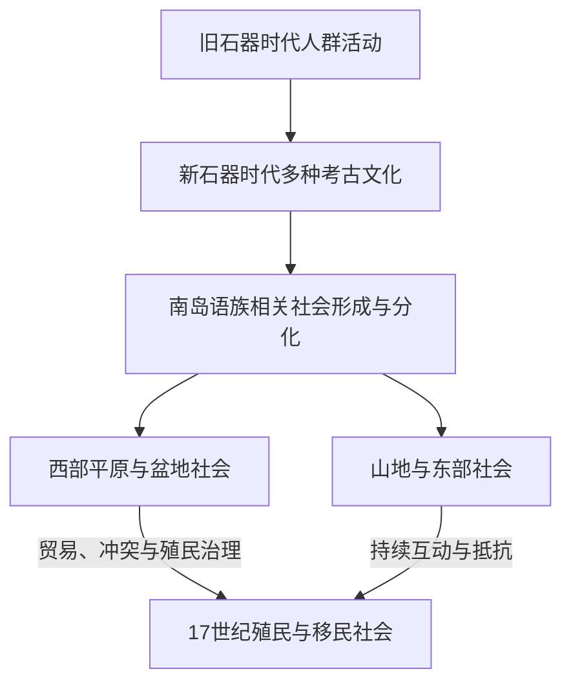

# 史前与原住民族社会

## 时间

史前时期至17世纪；原住民族社会延续至今

## 概括

台湾至少在旧石器时代晚期已有人类活动。新石器时代以来，多种考古文化反映岛内不同区域的人群迁徙、交流与适应。多数台湾原住民族语言属于南岛语系，台湾在南岛语族早期扩散研究中具有重要位置，但语言亲缘不等于所有族群拥有单一、线性的共同政治历史。

## 社会与区域网络

| 线索 | 说明 |
|---|---|
| 考古文化 | 长滨、大坌坑、圆山、卑南、十三行等文化反映不同时期和区域，不能直接与今天某一民族一一对应。 |
| 生计 | 农耕、渔猎、采集和海上活动因地理环境而异。 |
| 政治组织 | 部落、村社、联盟和头目制度多样，没有覆盖全岛的单一原住民国家。 |
| 海域联系 | 台湾与吕宋、琉球、中国东南沿海及更广的西太平洋存在长期航海和物质文化交流。 |
| 文字记录 | 17世纪以前主要依靠考古和口述传统；外来文献带有观察者分类和殖民视角。 |

## 演变关系

- 后续接触见[荷西殖民与郑氏政权](/%E4%BA%BA%E6%96%87%E7%A7%91%E5%AD%A6/%E5%8E%86%E5%8F%B2/%E4%B8%9C%E4%BA%9A/%E4%B8%AD%E5%9B%BD/%E5%8F%B0%E6%B9%BE/%E8%8D%B7%E8%A5%BF%E6%AE%96%E6%B0%91%E4%B8%8E%E9%83%91%E6%B0%8F%E6%94%BF%E6%9D%83.md)。
