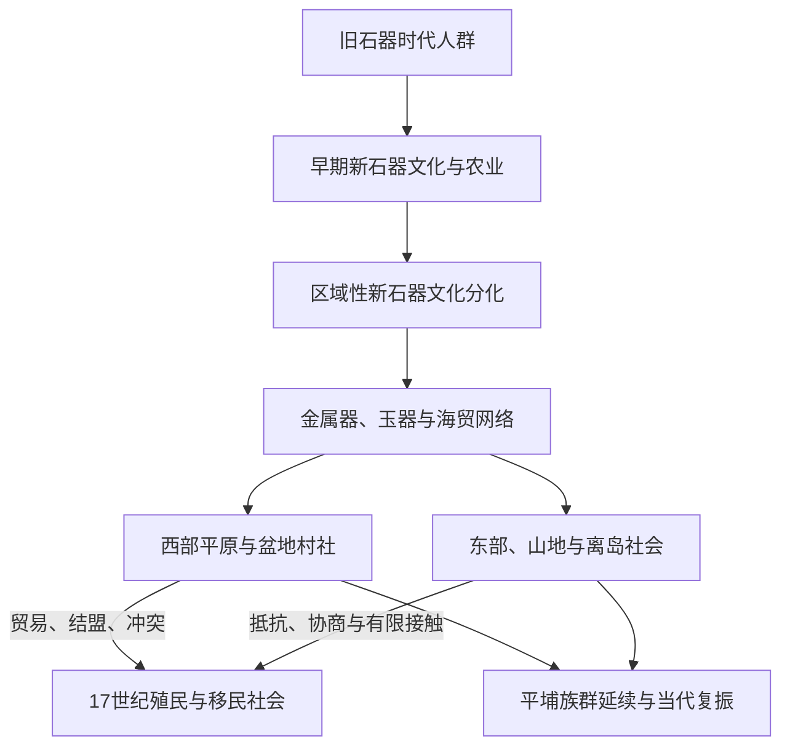

# 史前与原住民族社会

## 时间

旧石器时代晚期至17世纪；原住民族社会延续至今。

## 概括

台湾至少在旧石器时代晚期已有稳定的人类活动。新石器时代以后，多种区域性考古文化反映农业、渔猎、航海、金属技术和聚落组织的变化。多数台湾原住民族语言属于南岛语系，台湾保留南岛语系内部高度分化的语言支系，因此在南岛语族早期扩散研究中占有关键位置；但语言亲缘、考古文化和今日民族认同不能简单一一对应。

“原住民族”不是单一族群。平原、山地、东部与离岛社会在亲属、年龄阶级、首长或祭司权威、猎场与土地制度、战争和贸易方式上差异很大，也没有形成覆盖全岛的统一国家。

## 认识这一时期的方法

| 资料 | 能说明什么 | 主要限制 |
|---|---|---|
| 考古遗址与器物 | 生计、技术、聚落、交换和埋葬习俗 | 考古文化名称不等于今日民族名称。 |
| 历史语言学 | 语言亲缘、分化与迁徙可能方向 | 不能单独确定具体政治事件或精确年代。 |
| 口述传统 | 族群起源、迁徙、地景和社会记忆 | 不宜强行套入单一线性年代。 |
| 中国、日本与欧洲文献 | 海上贸易、外来观察和17世纪接触 | 常带有外来分类、殖民或国家视角。 |

## 分阶段发展

| 阶段 | 约略时间 | 主要变化 |
|---|---|---|
| 旧石器时代晚期 | 约3万年前以后，具体年代仍有讨论 | 长滨等遗址显示采集、渔猎和石器技术；当时海岸线与今日不同。 |
| 新石器时代早期 | 约前4000年以后 | 大坌坑文化及相关遗存显示陶器、农业和海岸聚落扩展，常被纳入南岛语族早期研究。 |
| 新石器时代中晚期 | 约前2500年至前后之交 | 圆山、卑南、营埔等区域文化发展，石器、玉器交换和大型聚落显示社会分化。 |
| 金属器时代 | 约公元前后至17世纪 | 十三行等遗址出现铁器、玻璃珠和更广海贸联系，各区域形成不同政治与交换网络。 |
| 有文字接触前夕 | 约13—17世纪 | 与中国东南沿海、琉球、日本及菲律宾群岛的贸易、渔业和航行接触增多。 |

## 社会机制与地区差异

- 生计因环境而异：沿海和河口重渔捞、航海与交换，平原适合农业，山地社会结合狩猎、移动耕作和多层次生态利用。
- 政治权威可来自头目、长老、祭司、猎首或战争声望、年龄阶级和亲属网络；不同民族内部也会变化。
- 村社之间既有婚姻、贸易和联盟，也有猎场、土地和荣誉冲突。17世纪殖民者常借既有敌对关系建立盟约。
- 玉器、陶器、铁器、鹿皮、硫磺等物品的流动说明台湾并非孤立岛屿，而是西太平洋交换网络的一部分。
- 平埔族群在殖民、移民、通婚和国家分类下经历语言与身份变化；“消失”叙事会遮蔽其后代及当代复振。

## 重要变化与事件

1. 旧石器时代人群在海岸洞穴和台地活动，形成台湾已知最早的人类生活证据。
2. 约前4000年后，陶器、农业与海上技术扩展，台湾和南岛语族早期扩散的关系逐渐形成。
3. 新石器时代中晚期的玉器生产与跨岛交换加强，显示专业化和远距离社会网络。
4. 金属器时代铁器、玻璃珠和外来商品进入，聚落与区域政治结构进一步变化。
5. 13—16世纪，中国东南沿海渔民、商人和海上武装与台湾接触增加，澎湖的军事与行政活动也影响海峡网络。
6. 17世纪初，荷兰、西班牙进入台湾，原住民族村社开始被卷入条约、传教、税收、征战和殖民分类。
7. 17世纪汉人移民数量增长，土地、劳力和市场关系改变部分西部平原社会，但山地与东部社会仍维持多样自主性。

## 演变关系

## 前后关系

- 本阶段不是在17世纪终止；原住民族社会持续影响此后各政权。
- 欧洲殖民和郑氏阶段见[荷西殖民与郑氏政权](/%E4%BA%BA%E6%96%87%E7%A7%91%E5%AD%A6/%E5%8E%86%E5%8F%B2/%E4%B8%9C%E4%BA%9A/%E4%B8%AD%E5%9B%BD/%E5%8F%B0%E6%B9%BE/%E8%8D%B7%E8%A5%BF%E6%AE%96%E6%B0%91%E4%B8%8E%E9%83%91%E6%B0%8F%E6%94%BF%E6%9D%83.md)。
- 总览见[台湾历史](/%E4%BA%BA%E6%96%87%E7%A7%91%E5%AD%A6/%E5%8E%86%E5%8F%B2/%E4%B8%9C%E4%BA%9A/%E4%B8%AD%E5%9B%BD/%E5%8F%B0%E6%B9%BE/README.md)。
