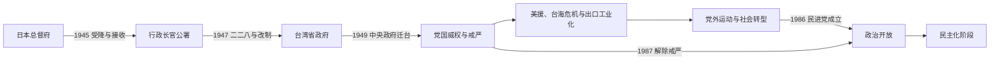

# 战后接收、威权统治与冷战

## 时间

1945—1987年。

## 建立背景与法理层次

1945年日本投降后，盟军最高统帅发布命令，由蒋中正代表的中华民国方面在台湾接受日军投降；陈仪率行政长官公署接收总督府机构，中华民国自此开始对台湾、澎湖实施实际治理。1951年《旧金山和约》规定日本放弃台湾、澎湖而未在条文中指定受让方；1952年《中日和约》确认日本放弃。对这些文件与战后主权安排的解释长期存在争论，应与“1945年后由谁实际治理”这个事实分开。

1949年中华民国中央政府迁台，中华人民共和国在大陆成立。此后两岸政权均提出代表中国及台湾归属的主张，但实际管辖范围分离。

## 分阶段过程

### 接收危机与二二八事件（1945—1949年）

- 行政长官公署集中行政、立法和司法监督权，接收日产并经营专卖，原有经济网络骤变。
- 物价上涨、失业、腐败观感、语言文化隔阂和政治参与不足累积不满。
- 1947年查缉私烟冲突引发全台抗议，各地组织处理委员会并提出改革要求；中央增援部队抵台后镇压，造成大量死伤、失踪和后续清算。
- 二二八事件后撤销行政长官公署，改设台湾省政府，但政治信任和社会创伤长期存在。

### 中央政府迁台与党国威权（1949—1971年）

- 1949年5月台湾实施戒严，12月中华民国中央政府迁至台北；大量军民、官僚、企业和文化机构随之迁入。
- 《动员戡乱时期临时条款》、长期未全面改选的中央民意机关、国民党组织、军队与情治系统构成党国体制。
- 白色恐怖中，军事审判、政治案件和秘密情治压制共产党组织、异议者及被怀疑者，受害者背景多样。
- 土地改革改变租佃关系；美国援助、政府产业政策、教育扩张和中小企业网络推动从进口替代转向出口工业化。
- 朝鲜战争后美国介入台湾海峡，1954—1955年和1958年台海危机使金门、马祖与台湾安全紧密相连。

### 外交挫折、社会转型与有限开放（1971—1987年）

- 1971年联合国大会第2758号决议后，中华民国失去联合国“中国代表权”；日本和美国先后转而与中华人民共和国建交。
- 出口工业化、十大建设和城市化形成新中产、劳工与受教育群体，社会对政治参与的要求增强。
- 地方选举和增额中央民意代表选举为党外人士提供有限空间；1979年美丽岛事件及审判扩大反对运动影响。
- 蒋经国在严家淦任总统期间已通过行政院长、国民党主席和安全体系掌握主要权力，1978年就任总统后推动本土人才进入高层。
- 1986年民主进步党在禁令尚未正式解除时成立；1987年台湾地区解除戒严，威权体制进入制度性转型。

## 重要事件

| 时间 | 事件 | 影响 |
|---|---|---|
| 1945年10月25日 | 日军受降与中华民国接收 | 殖民制度向战后行政转换，实际统治者改变。 |
| 1947年 | 二二八事件 | 镇压造成重大伤亡和长期政治、族群与记忆创伤。 |
| 1949年 | 戒严、中央政府迁台与两岸分治 | 台湾成为中华民国中央政府主要统治基地。 |
| 1950—1953年 | 土地改革与美国援助体系形成 | 改变农业结构，为工业化、财政稳定和冷战安全提供条件。 |
| 1954—1955年、1958年 | 两次台海危机 | 金门、马祖遭受战火，美台安全关系强化。 |
| 1960年代 | 出口导向工业化 | 加工出口区、教育和中小企业推动高速增长。 |
| 1971年 | 联合国代表权变化 | 中华民国外交承认与国际组织空间快速缩小。 |
| 1975—1978年 | 蒋中正去世、严家淦继任与蒋经国权力上升 | 名义国家元首和党政军实际权力出现明显分离。 |
| 1979年 | 美台断交、美丽岛事件 | 对外安全架构和岛内反对运动均发生转折。 |
| 1986—1987年 | 民进党成立与解除戒严 | 竞争性政党政治和宪政改革开始制度化。 |

## 制度与实际权力结构

| 层级 | 名义职权 | 实际运行 |
|---|---|---|
| 总统 | 国家元首、统帅及重要任命权 | 蒋中正长期兼国民党总裁并控制军事安全系统；严家淦时期实际核心转向蒋经国。 |
| 行政院长 | 政府首脑，领导行政 | 负责经济和日常政策；重大安全与政治方向受总统、国民党中枢和情治军方影响。 |
| 国民党中枢 | 执政党组织与干部体系 | 通过党部、军队政工、国营事业和社会组织形成党国网络。 |
| 台湾省政府与地方机关 | 地方行政、建设和县市治理 | 1949年前是岛内最高行政层级；中央政府迁台后成为中央之下的省级机构。 |
| 警备与情治系统 | 戒严、国安与反间谍 | 军事审判和监控构成政治压制核心。 |
| 地方选举与党外 | 县市长、议会和增额民代 | 在威权边界内形成反对力量、地方派系和社会动员空间。 |

国家元首、行政院长与地方行政首长完整序列见[1945年以来台湾政权与行政首长表](/%E4%BA%BA%E6%96%87%E7%A7%91%E5%AD%A6/%E5%8E%86%E5%8F%B2/%E4%B8%9C%E4%BA%9A/%E4%B8%AD%E5%9B%BD/%E5%8F%B0%E6%B9%BE/1945%E5%B9%B4%E4%BB%A5%E6%9D%A5%E5%8F%B0%E6%B9%BE%E6%94%BF%E6%9D%83%E4%B8%8E%E8%A1%8C%E6%94%BF%E9%A6%96%E9%95%BF%E8%A1%A8.md)。

## 威权维系与转型原因

| 类型 | 因素 |
|---|---|
| 结构因素 | 内战延续叙事、戒严法制、党国组织、军队与情治、中央民代长期不改选。 |
| 经济社会基础 | 土地改革、美国援助和工业化提高治理资源；教育、城市化与中产扩大又逐步催生政治参与。 |
| 外部压力 | 冷战安全支持巩固政权；1970年代外交承认流失迫使统治合法性更多转向台湾内部。 |
| 反对力量 | 党外选举、杂志、教会、人权律师、受难者家属和社会运动持续扩大公共空间。 |
| 直接转折 | 1986年民进党成立、1987年解除戒严；但国会改选、总统直选和司法转型仍待后续完成。 |

## 演变关系

## 前后关系

- 前一阶段：[日本统治时期](/%E4%BA%BA%E6%96%87%E7%A7%91%E5%AD%A6/%E5%8E%86%E5%8F%B2/%E4%B8%9C%E4%BA%9A/%E4%B8%AD%E5%9B%BD/%E5%8F%B0%E6%B9%BE/%E6%97%A5%E6%9C%AC%E7%BB%9F%E6%B2%BB%E6%97%B6%E6%9C%9F.md)。
- 后一阶段：[民主化与当代台湾](/%E4%BA%BA%E6%96%87%E7%A7%91%E5%AD%A6/%E5%8E%86%E5%8F%B2/%E4%B8%9C%E4%BA%9A/%E4%B8%AD%E5%9B%BD/%E5%8F%B0%E6%B9%BE/%E6%B0%91%E4%B8%BB%E5%8C%96%E4%B8%8E%E5%BD%93%E4%BB%A3%E5%8F%B0%E6%B9%BE.md)。
