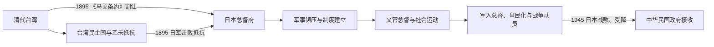

# 日本统治时期

## 时间

1895—1945年。

## 建立背景与占领过程

甲午战争后，清政府在《马关条约》中将台湾、澎湖割让日本。台湾官绅建立短暂的台湾民主国，各地义军、民团和清军残部继续抵抗。日军自澳底登陆，先取台北，再向中南部推进；1895年10月台南失守后，台湾民主国结束，但地方武装抵抗延续多年。

日本建立台湾总督府。总督由中央任命，早期兼掌广泛行政、立法、司法和军事权力；警察、保甲、户籍、土地调查与专卖制度逐步深入基层。

## 分阶段发展

### 军事镇压与殖民制度建立（1895—1919年）

- 总督府以军队、宪兵和警察镇压乙未战争及后续抗日行动，实施特别法令和差别司法。
- 土地调查、户口调查与货币、度量衡改革提高财政和行政穿透力，也重组既有土地权利。
- 后藤新平任民政长官时期扩展警察、保甲、公共卫生、铁路和专卖制度。
- 糖业资本、灌溉和铁路港口建设把台湾纳入日本帝国分工；资源与利润分配具有殖民不平等。
- 总督府以隘勇线和军事行动推进山地，1910年代的“理蕃”战争造成迁居、伤亡与土地控制。

### 文官总督与社会政治运动（1919—1936年）

- 1919年后出现文官总督，制度趋向“内地延长主义”，但台湾居民仍缺乏与日本本土同等政治权利。
- 教育普及、城市公共设施和现代职业扩大，同时存在学校层级、语言与任用差别。
- 台湾文化协会、台湾议会设置请愿运动、台湾民众党和农民组合等推动文化启蒙、自治与劳农运动。
- 总督府以警察和法律限制组织活动；1930年雾社事件显示山地殖民压迫仍可引发武装反抗。

### 战时体制、皇民化与终结（1936—1945年）

- 军人总督复归后，皇民化、日语常用、改姓名、宗教动员和国家仪式加强。
- 台湾工业、港口和军用设施扩张，资源、粮食与劳动力服从战争需要。
- 志愿兵、征兵、军属和“慰安妇”等制度把台湾人卷入帝国战争；不同群体参与有自愿、谋生、压力与强制等复杂背景。
- 盟军轰炸造成城市、交通和工业设施损失。1945年日本投降，总督安藤利吉向中华民国代表陈仪办理受降。

## 统治结构

| 层级 | 机构或角色 | 实际作用 |
|---|---|---|
| 日本中央 | 天皇、内阁与拓殖/内务体系 | 任命总督，决定殖民地法律和战争政策。 |
| 最高殖民行政 | 台湾总督 | 早期兼具军事、行政与广泛制令权；后期权力结构虽调整，仍是殖民统治核心。 |
| 民政与专业官僚 | 民政长官、总务长官及各局部 | 土地、财政、警察、教育、交通、产业和卫生。 |
| 地方与基层 | 州厅、郡市街庄、警察与保甲 | 将户籍、税收、治安和社会控制落实到地方。 |
| 山地统治 | 警察、隘勇线、驻在所和“理蕃”机构 | 军事征服、枪械收缴、迁居和资源控制。 |

全部19任总督见[日本统治时期台湾总督表](/%E4%BA%BA%E6%96%87%E7%A7%91%E5%AD%A6/%E5%8E%86%E5%8F%B2/%E4%B8%9C%E4%BA%9A/%E4%B8%AD%E5%9B%BD/%E5%8F%B0%E6%B9%BE/%E6%97%A5%E6%9C%AC%E7%BB%9F%E6%B2%BB%E6%97%B6%E6%9C%9F%E5%8F%B0%E6%B9%BE%E6%80%BB%E7%9D%A3%E8%A1%A8.md)。

## 重要事件

| 时间 | 事件 | 过程与影响 |
|---|---|---|
| 1895年 | 接收、台湾民主国与乙未战争 | 日军击败各地抵抗，建立总督府统治。 |
| 1898—1905年 | 土地与户口调查 | 明确税基和人口管理，强化国家与资本对土地的掌握。 |
| 1906—1915年 | 山地征服与西来庵事件 | 总督府推进“理蕃”；1915年大规模武装抗日后，平地武装抵抗趋弱。 |
| 1919年 | 首任文官总督田健治郎到任 | 殖民治理从纯军事镇压转向同化、行政整合与有限社会参与。 |
| 1921—1934年 | 台湾议会设置请愿运动 | 连续向日本帝国议会要求设台湾议会，虽未成功，却培养政治组织。 |
| 1927年 | 台湾民众党成立 | 台湾出现近代合法政党，后被总督府取缔。 |
| 1930年 | 雾社事件 | 赛德克族等反抗殖民统治，遭大规模军事镇压。 |
| 1937年以后 | 皇民化与总体战动员 | 同化政策、资源征集和军事征募全面加强。 |
| 1944—1945年 | 盟军轰炸与战争崩溃 | 基础设施和城市受损，物资短缺加剧。 |
| 1945年10月25日 | 日军受降与行政移交 | 日本殖民统治终结，中华民国政府开始实际治理。 |

## 维系、转型与终结原因

- **结构基础**：日本拥有压倒性军事力量，并以警察、户籍、土地、学校、交通和专卖制度构成高密度殖民国家。
- **经济机制**：糖、米、樟脑、工业与港口铁路带来增长，但生产方向和利润分配服务日本帝国，台湾人参与权与待遇不平等。
- **社会张力**：差别教育、政治排斥、土地资源控制和山地征服不断产生抗争；运动形式由武装逐渐转向请愿、文化、劳农和自治组织。
- **外部压力**：中日战争与太平洋战争使治理从殖民开发转为总体战动员。
- **直接终结**：日本在第二次世界大战战败并接受投降；并非总督府内部渐进移交。

## 演变关系

## 前后关系

- 前一阶段：[清代台湾](/%E4%BA%BA%E6%96%87%E7%A7%91%E5%AD%A6/%E5%8E%86%E5%8F%B2/%E4%B8%9C%E4%BA%9A/%E4%B8%AD%E5%9B%BD/%E5%8F%B0%E6%B9%BE/%E6%B8%85%E4%BB%A3%E5%8F%B0%E6%B9%BE.md)。
- 后一阶段：[战后接收、威权统治与冷战](/%E4%BA%BA%E6%96%87%E7%A7%91%E5%AD%A6/%E5%8E%86%E5%8F%B2/%E4%B8%9C%E4%BA%9A/%E4%B8%AD%E5%9B%BD/%E5%8F%B0%E6%B9%BE/%E6%88%98%E5%90%8E%E6%8E%A5%E6%94%B6%E3%80%81%E5%A8%81%E6%9D%83%E7%BB%9F%E6%B2%BB%E4%B8%8E%E5%86%B7%E6%88%98.md)。
