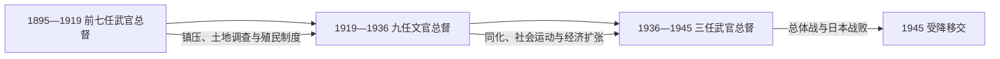

# 日本统治时期台湾总督表

## 时间与口径

1895年5月10日至1945年10月25日，共19任。任期交界以任命或到任时间整理，个别资料对交卸日可能相差一日；表中不把民政长官、总务长官或临时代理人混作总督。总督全部由日本中央任命，不是台湾居民选举产生。

## 总督序列图

## 历任台湾总督完整表

| 顺序 | 总督 | 任期 | 身份 | 关键事项 |
|---:|---|---|---|---|
| 1 | **桦山资纪** | 1895-05-10—1896-06-02 | 海军大将 | 首任；指挥接收和乙未战争，建立总督府。 |
| 2 | 桂太郎 | 1896-06-02—1896-10-14 | 陆军中将 | 短任；继续军事镇压与殖民行政整编。 |
| 3 | 乃木希典 | 1896-10-14—1898-02-26 | 陆军中将 | 财政和治安困难时期，仍以军事统治为主。 |
| 4 | **儿玉源太郎** | 1898-02-26—1906-04-11 | 陆军大将 | 后藤新平任民政长官；土地调查、警察保甲、铁路和专卖体系成形。 |
| 5 | 佐久间左马太 | 1906-04-11—1915-05-01 | 陆军大将 | 推进山地“理蕃”与隘勇线，实施大规模军事征讨。 |
| 6 | 安东贞美 | 1915-05-01—1918-06-06 | 陆军大将 | 西来庵事件后加强控制，殖民经济继续扩张。 |
| 7 | 明石元二郎 | 1918-06-06—1919-10-29 | 陆军中将 | 推动水利、产业和交通计划，任内去世。 |
| 8 | **田健治郎** | 1919-10-29—1923-09-06 | 文官 | 首任文官总督；“内地延长主义”和地方制度调整。 |
| 9 | 内田嘉吉 | 1923-09-06—1924-09-01 | 文官 | 延续同化和产业政策；任内发生治警事件。 |
| 10 | 伊泽多喜男 | 1924-09-01—1926-07-16 | 文官 | 面对议会设置请愿、文化与社会运动。 |
| 11 | 上山满之进 | 1926-07-16—1928-06-16 | 文官 | 台湾文化协会分裂、台湾民众党成立时期。 |
| 12 | 川村竹治 | 1928-06-16—1929-07-30 | 文官 | 殖民经济与警察治理持续。 |
| 13 | 石冢英藏 | 1929-07-30—1931-01-16 | 文官 | 任内发生1930年雾社事件，殖民山地政策遭到冲击。 |
| 14 | 太田政弘 | 1931-01-16—1932-03-02 | 文官 | 经济萧条和雾社事件善后时期。 |
| 15 | 南弘 | 1932-03-02—1932-05-27 | 文官 | 任期极短。 |
| 16 | 中川健藏 | 1932-05-27—1936-09-02 | 文官 | 工业化和战时准备增强，文官总督时期结束。 |
| 17 | **小林跻造** | 1936-09-02—1940-11-27 | 海军大将 | 推动皇民化、工业化和“南进基地化”。 |
| 18 | 长谷川清 | 1940-11-27—1944-12-30 | 海军大将 | 太平洋战争、志愿兵与征兵、资源和劳力总动员。 |
| 19 | **安藤利吉** | 1944-12-30—1945-10-25 | 陆军大将 | 末任；兼第十方面军司令，盟军轰炸和战败后向陈仪办理受降。 |

## 阶段辨析

- 1895—1919年并非只有军事事务；殖民行政、财政与产业制度正是在武官总督时期建立。
- 1919—1936年的“文官总督”不等于殖民统治民主化，台湾居民仍无平等的帝国政治权利。
- 1936年后武官重新担任总督，台湾被更直接纳入日本的南进和总体战体系。
- 总督是殖民行政首脑；日本首相、内阁和军部仍是更高决策层，岛内民政长官或总务长官负责大量日常行政。

## 关联笔记

- 主笔记：[日本统治时期](/%E4%BA%BA%E6%96%87%E7%A7%91%E5%AD%A6/%E5%8E%86%E5%8F%B2/%E4%B8%9C%E4%BA%9A/%E4%B8%AD%E5%9B%BD/%E5%8F%B0%E6%B9%BE/%E6%97%A5%E6%9C%AC%E7%BB%9F%E6%B2%BB%E6%97%B6%E6%9C%9F.md)
- 前一阶段：[清代台湾](/%E4%BA%BA%E6%96%87%E7%A7%91%E5%AD%A6/%E5%8E%86%E5%8F%B2/%E4%B8%9C%E4%BA%9A/%E4%B8%AD%E5%9B%BD/%E5%8F%B0%E6%B9%BE/%E6%B8%85%E4%BB%A3%E5%8F%B0%E6%B9%BE.md)
- 后一阶段：[战后接收、威权统治与冷战](/%E4%BA%BA%E6%96%87%E7%A7%91%E5%AD%A6/%E5%8E%86%E5%8F%B2/%E4%B8%9C%E4%BA%9A/%E4%B8%AD%E5%9B%BD/%E5%8F%B0%E6%B9%BE/%E6%88%98%E5%90%8E%E6%8E%A5%E6%94%B6%E3%80%81%E5%A8%81%E6%9D%83%E7%BB%9F%E6%B2%BB%E4%B8%8E%E5%86%B7%E6%88%98.md)
