# 民主化与当代台湾

## 时间

1987年至今；现任人物核验截止2026-07-14。

## 概括

台湾民主化不是单一日期的事件，而是解除戒严、开放党禁报禁、终止动员戡乱时期、资深中央民代退职、国会全面改选、总统直选、司法与地方制度改革、政党轮替和公民社会扩展的连续过程。民主制度稳定后，半导体与高科技产业、人口老龄化、能源转型、社会平权、转型正义、两岸关系和大国竞争共同塑造当代台湾。

## 分阶段发展

### 解严与宪政重组（1987—1996年）

- 1987年解除戒严并开放赴大陆探亲；党禁、报禁及结社限制逐步松动。
- 1988年蒋经国去世，副总统李登辉继任；党内权力竞争与社会运动并行。
- 1990年野百合学运要求国会改革，推动政治协商；1991年终止动员戡乱时期，资深国大代表退职。
- 1992年立法院全面改选，1994年省长和直辖市长民选，中央与地方政治授权逐步本地化。
- 1996年首次总统直接选举在台海导弹危机背景下举行，国家元首的政治授权方式改变。

### 政党轮替与制度磨合（2000—2016年）

- 2000年陈水扁当选，完成首次和平政党轮替；在“少数政府”格局下，行政与立法冲突上升。
- 2008年国民党重新执政，两岸直航、经贸制度化扩大；同时引发依赖、安全和程序正义争论。
- 2014年太阳花运动反对两岸服务贸易协议审议程序，推动青年政治参与和对行政—立法程序的检讨。
- 司法、人权、社会福利和地方治理持续改革，但政党极化、媒体环境与身份议题也更显著。

### 2016年以来：连续执政、社会改革与分立政府

- 2016年蔡英文就任，民进党首次同时控制总统与立法院多数；年金、转型正义、国防与能源政策推进。
- 2019年同性婚姻法律实施，台湾成为亚洲首个以法律承认同性婚姻的政治实体。
- 2020—2023年新冠疫情、防疫管制及后续开放影响医疗、经济和社会生活。
- 2024年赖清德、萧美琴就任正副总统；民进党连续第三次赢得总统选举，但立法院无单一政党过半，行政立法冲突加剧。
- 截至2026-07-14，总统为赖清德、副总统为萧美琴、行政院长为卓荣泰、立法院长为韩国瑜。

## 重要事件

| 时间 | 事件 | 影响 |
|---|---|---|
| 1987年 | 解除戒严 | 政治组织、媒体、探亲和社会运动空间扩大。 |
| 1990—1991年 | 野百合学运与终止动员戡乱时期 | 威权临时体制退场，宪政改革加速。 |
| 1992年 | 立法院全面改选 | 长期未改选中央民代退出，代表性重建。 |
| 1996年 | 首次总统直选与台海危机 | 民主授权加强，安全议题与选举政治紧密结合。 |
| 2000年 | 首次政党轮替 | 国民党长期中央执政结束，民主制度通过交接考验。 |
| 2008年 | 第二次政党轮替 | 国民党重返执政，两岸经贸交流扩大。 |
| 2014年 | 太阳花运动 | 公民社会介入两岸协议与立法程序，重塑政党竞争。 |
| 2016年 | 第三次政党轮替 | 蔡英文就任，民进党首次取得总统与立院多数。 |
| 2019年 | 同性婚姻法制化 | 性别平权和宪法解释落实的重要节点。 |
| 2024年 | 赖清德就任、国会无单一多数 | 连续执政与分立政府同时出现。 |

## 国家元首、政府首脑与实际权力

完整逐名表见[1945年以来台湾政权与行政首长表](/%E4%BA%BA%E6%96%87%E7%A7%91%E5%AD%A6/%E5%8E%86%E5%8F%B2/%E4%B8%9C%E4%BA%9A/%E4%B8%AD%E5%9B%BD/%E5%8F%B0%E6%B9%BE/1945%E5%B9%B4%E4%BB%A5%E6%9D%A5%E5%8F%B0%E6%B9%BE%E6%94%BF%E6%9D%83%E4%B8%8E%E8%A1%8C%E6%94%BF%E9%A6%96%E9%95%BF%E8%A1%A8.md)。

| 角色 | 制度位置 | 当代实际运行 |
|---|---|---|
| 总统 | 直接民选的国家元首，统率军队并任命行政院长 | 在外交、国防、两岸与重大政策上居核心地位，但须面对立法院、司法、选举和舆论制衡。 |
| 行政院长 | 政府首脑，领导行政院 | 由总统任命；负责日常行政、预算和法案推动，立院多数结构直接影响施政。 |
| 立法院 | 立法、预算与监督 | 2024年后无单一政党过半，协商、覆议、释宪和街头动员的重要性上升。 |
| 司法院与宪法法庭 | 司法审判与宪法解释 | 在权利保障和机关争议中发挥作用，其人事与程序亦受政治争论影响。 |
| 地方政府与公民社会 | 地方治理、选举与社会参与 | 县市首长可能与中央不同党，社运、工会、媒体和专业团体参与政策竞争。 |

## 实际管辖、主权主张与国际空间

- 中华民国政府实际管辖台湾、澎湖、金门、马祖及若干附属岛屿，中央机关在台北运作。
- 中华人民共和国主张台湾是中国领土的一部分，并以“一个中国原则”处理外交关系；1949年以来未在台湾实施行政统治。
- 中华民国的正式外交承认数量有限，但台湾通过经贸、科技、非官方代表机构和国际组织特殊名义维持广泛对外关系。
- 台湾内部对国家名称、身份认同、两岸关系和最终政治安排存在多种立场；选举结果也不能被解释为所有居民对主权问题持单一意见。
- 对“现状”的定义各方不同，历史笔记应分别陈述制度文本、实际控制、外交承认和政治主张。

## 当代转型的动力与压力

| 类型 | 内容 |
|---|---|
| 制度动力 | 竞争性选举、权力和平交接、司法审查、地方自治与公民社会监督。 |
| 经济基础 | 半导体、电子制造、传统产业与全球供应链带来实力，也造成外需、能源和地缘风险。 |
| 社会压力 | 低生育、老龄化、住房负担、工资与世代差距、移工和新住民权益。 |
| 外部压力 | 台海军事风险、中美竞争、外交空间受限、信息战与供应链安全。 |
| 直接政治张力 | 总统与立法院多数不一致、政党极化、程序争议和罢免等制度工具的频繁运用。 |

## 演变关系

```mermaid
flowchart LR
    Martial["戒严与党国威权"] -->|1987 解严| Liberal["党禁报禁解除"]
    Liberal -->|1991 终止动员戡乱| Reform["国会与宪政改革"]
    Reform -->|1996 首次总统直选| Electoral["竞争性民主"]
    Electoral -->|2000 首次轮替| Alternation["多次政党轮替"]
    Alternation --> Movements["公民运动与社会权利改革"]
    Movements --> Divided["2024后连续执政与分立国会"]
    Divided --> Current["2026 当代台湾"]
```

## 前后与相关关系

- 前一阶段：[战后接收、威权统治与冷战](/%E4%BA%BA%E6%96%87%E7%A7%91%E5%AD%A6/%E5%8E%86%E5%8F%B2/%E4%B8%9C%E4%BA%9A/%E4%B8%AD%E5%9B%BD/%E5%8F%B0%E6%B9%BE/%E6%88%98%E5%90%8E%E6%8E%A5%E6%94%B6%E3%80%81%E5%A8%81%E6%9D%83%E7%BB%9F%E6%B2%BB%E4%B8%8E%E5%86%B7%E6%88%98.md)。
- 两岸对照：[中华人民共和国](/%E4%BA%BA%E6%96%87%E7%A7%91%E5%AD%A6/%E5%8E%86%E5%8F%B2/%E4%B8%9C%E4%BA%9A/%E4%B8%AD%E5%9B%BD/%E4%B8%AD%E5%8D%8E%E4%BA%BA%E6%B0%91%E5%85%B1%E5%92%8C%E5%9B%BD/README.md)。
