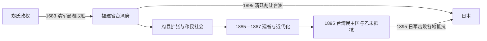

# 清代台湾

## 时间

1683—1895年；清廷1684年正式设府。

## 建立背景

郑氏政权在1683年澎湖海战失败后降清。清廷内部曾讨论迁民弃地，最终采纳施琅等人的主张保留台湾，1684年设台湾府，隶属福建省。初期政策强调海防、渡台限制与低成本治理；随着人口、土地和市场扩大，行政建制不断增设，国家控制由西南平原向中北部、东部与山地边缘推进。

## 分阶段发展

### 初设府与有限治理（1684—约1750年）

- 台湾府初辖台湾、凤山、诸罗三县，澎湖设巡检等机构；军政中心在台南。
- 清廷以渡台禁令和原汉边界限制移民，但非法渡海、眷属迁入与土地开垦持续发生。
- 官府依靠地方绅士、保甲、番社通事和隘防，直接行政能力有限。
- 1721年朱一贵事件迅速席卷南部，显示驻军、粮饷与地方秩序脆弱。

### 移民社会与行政扩张（约1750—1874年）

- 福建漳泉移民、粤籍客家移民及既有原住民族社会在土地、水利和市场网络中频繁互动。
- 分类械斗、民变和秘密结社反复发生；1786—1788年林爽文事件需跨海增兵才平定。
- 西部平原开发造成土地权利层叠、熟番地流失和原住民族迁徙；山地与东部仍多不受常设官府直接控制。
- 港口贸易、樟脑、糖、米和茶叶使台湾更深进入东亚与世界市场。

### 海防危机、开山抚番与建省（1874—1895年）

- 1874年日本以琉球漂流民遇害为由出兵台湾南部，迫使清廷重估边疆和海防。
- 沈葆桢等推动增设府县、修路、电报与“开山抚番”；政策同时包含军事推进、行政纳入和对原住民族土地的侵夺。
- 1884—1885年中法战争中，基隆、淡水与澎湖成为战场。战后清廷决定建省。
- 刘铭传推动铁路、电报、邮政、海防与财政整顿，但经费、官僚阻力和地理条件限制改革。
- 甲午战争失败后，《马关条约》将台湾、澎湖割让日本；清廷命官员撤离，台湾民主国与地方抗日力量无法阻止日军占领。

## 行政与实际控制

| 阶段 | 主要建制 | 实际控制特点 |
|---|---|---|
| 1684年起 | 福建省台湾府，一府三县 | 主要覆盖西部已设县地区，东部与山地控制有限。 |
| 18—19世纪 | 增设彰化县、淡水厅、噶玛兰厅等 | 随移民、市场与边界冲突扩大行政覆盖。 |
| 1875年以后 | 台北府、恒春县等新建制 | 海防和“开山抚番”使国家向东部、南端与山地边缘推进。 |
| 1885年决定建省，1887年完成主要调整 | 福建台湾省 | 设巡抚，分台北、台湾、台南三府及台东直隶州等，但有效统治仍有地区差异。 |

## 福建台湾巡抚完整序列

| 顺序 | 巡抚 | 任期 | 关键事项 |
|---:|---|---|---|
| 1 | **刘铭传** | 1885—1891年 | 首任；主持建省、铁路、电报、邮政、海防与财政改革，后因财政和政治压力离任。 |
| 2 | 邵友濂 | 1891—1894年 | 缩减部分高成本建设，维持省政与防务。 |
| 3 | **唐景崧** | 1894—1895年 | 末任；甲午战败后参与台湾民主国，日军逼近台北时离台。 |

## 台湾民主国领导与实际权力

台湾民主国存在于《马关条约》签订后、日军完成占领前的约五个月。它宣称“永清”并期待列强干预，既使用共和国职称，又保留对清朝的政治认同；其中央命令对各地义军的约束有限。

| 顺序 | 人物 | 职务与时间 | 权力和继承说明 |
|---:|---|---|---|
| 1 | **唐景崧** | 总统，1895-05-25—1895-06上旬 | 由官绅推举；日军攻取基隆后于6月4日离台，北部中央机构随即瓦解。不同记载以离台日或6月6日作为任期终点。 |
| — | 丘逢甲 | 副总统、全台义军统领等，1895-05—06月 | 职称记载不一；参与筹建和动员，台北失守后离台，未形成独立的总统任期。 |
| 2 | **刘永福** | 先任大将军；6月下旬起在台南主持政权，至1895-10-19 | 唐景崧离台后承继民主国运作，部分文献称其为第二任总统；依靠黑旗军和南部官绅，但对各地抵抗力量的控制有限，日军逼近台南时离台。 |

吴汤兴、徐骧、姜绍祖等义军领袖在中北部独立组织抵抗，并非民主国中央元首；这也说明名义政府与战地实际指挥并不完全重合。

## 重要事件

| 时间 | 事件 | 过程与影响 |
|---|---|---|
| 1683—1684年 | 澎湖海战、郑氏降清与设台湾府 | 清廷取得郑氏控制区，台湾正式纳入福建行政体系。 |
| 1721年 | 朱一贵事件 | 社会矛盾、官府失序和移民武装迅速汇合，清军跨海镇压。 |
| 1786—1788年 | 林爽文事件 | 天地会与地方网络发动大规模反抗，暴露分类治理和驻军弱点。 |
| 1860年代 | 通商口岸开放 | 淡水、打狗等港口贸易扩大，茶、糖、樟脑出口增长。 |
| 1874年 | 日本出兵台湾 | 牡丹社事件后日军进入南部，推动清廷加强海防和东部治理。 |
| 1884—1885年 | 中法战争台湾战事 | 法军攻基隆、淡水并占澎湖，台湾战略地位上升。 |
| 1885—1887年 | 台湾建省 | 刘铭传等推动行政、交通和军事现代化。 |
| 1895年 | 《马关条约》与台湾民主国 | 清廷割让台澎；唐景崧、刘永福先后主持短暂抵抗政权。 |
| 1895年5—10月 | 乙未战争 | 日军由北向南推进，各地官军、义军与民团抵抗后失败。 |

## 统治扩张与终结原因

| 层面 | 分析 |
|---|---|
| 维系统治 | 海峡驻军、府县建制、地方绅士、保甲与市场税收共同维持清代秩序。 |
| 结构矛盾 | 官员轮调、军饷不足、移民土地冲突、分类械斗与原住民族边界使治理成本很高。 |
| 外部压力 | 西方通商、法国军事行动和日本扩张迫使清廷从消极治理转向海防与建省。 |
| 直接终结 | 甲午战争战败和《马关条约》割让，而非岛内行政自然崩溃；台湾民主国和乙未抵抗未能扭转条约与日军优势。 |

## 演变关系

## 前后关系

- 前一阶段：[荷西殖民与郑氏政权](/%E4%BA%BA%E6%96%87%E7%A7%91%E5%AD%A6/%E5%8E%86%E5%8F%B2/%E4%B8%9C%E4%BA%9A/%E4%B8%AD%E5%9B%BD/%E5%8F%B0%E6%B9%BE/%E8%8D%B7%E8%A5%BF%E6%AE%96%E6%B0%91%E4%B8%8E%E9%83%91%E6%B0%8F%E6%94%BF%E6%9D%83.md)。
- 后一阶段：[日本统治时期](/%E4%BA%BA%E6%96%87%E7%A7%91%E5%AD%A6/%E5%8E%86%E5%8F%B2/%E4%B8%9C%E4%BA%9A/%E4%B8%AD%E5%9B%BD/%E5%8F%B0%E6%B9%BE/%E6%97%A5%E6%9C%AC%E7%BB%9F%E6%B2%BB%E6%97%B6%E6%9C%9F.md)。
