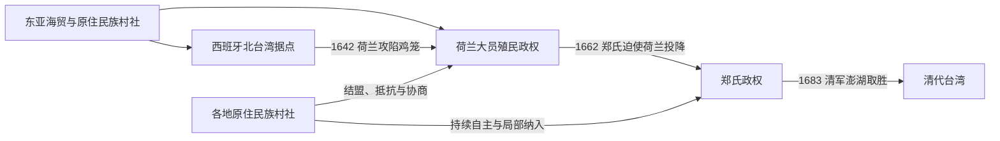

# 荷西殖民与郑氏政权

## 时间

1624—1683年。

## 建立背景

17世纪东亚海贸把福建沿海、日本、马尼拉、巴达维亚和东南亚港口连接起来。荷兰东印度公司（VOC）为进入中国和日本贸易，1622年占据澎湖；在明朝军事压力与谈判后撤至台湾大员，1624年建立热兰遮城。西班牙为保护马尼拉—中国贸易并牵制荷兰，1626年从菲律宾出兵，在鸡笼和淡水建立北部据点。

欧洲政权控制的首先是港口、堡垒和与其结盟的村社，而不是一开始就有效治理全岛。原住民族村社、汉人商民、海盗与日本商人都具有独立行动能力。

## 分阶段过程

### 荷兰与西班牙并立

- VOC以台湾长官和大员评议会为核心，征税、审判、经营贸易并指挥军事；地方治理依靠传教士、政务员和村社长老。
- 1635—1636年荷军对麻豆等村社发动征讨，借武力与联盟扩大西南平原影响；拉美岛行动则造成严重人口损失。
- 荷兰当局招募福建汉人承租土地、种植稻米和甘蔗，鹿皮、糖、米及转口贸易成为财政来源，同时形成沉重的人头税、包税与劳役。
- 西班牙据点受制于补给距离、疾病和马尼拉财政，淡水据点一度放弃；1642年荷军攻下鸡笼，结束西班牙在北台湾的统治。

### 郑氏攻台与政权建设

- 郑成功在中国东南沿海抗清失利后，需要稳定基地和粮源，1661年率军登陆，包围热兰遮城。
- 1662年荷兰长官揆一投降。郑氏设置承天府、天兴县和万年县，以明朝宗室正朔自居，同时以台湾为反清复明和海上贸易基地。
- 郑经击败内部竞争者后继位，发展军屯、农业、教育与海外贸易；他一度参与三藩之乱并重返福建沿海，失败后退回台湾。
- 1681年郑经死后发生继承政变，郑克臧被杀，郑克塽继位，冯锡范、刘国轩等掌握重要军政权力。
- 1683年施琅率清军在澎湖击败刘国轩，郑克塽降清，郑氏政权终结。

## 统治者与实际权力

完整序列见[荷西殖民与郑氏政权统治者表](/%E4%BA%BA%E6%96%87%E7%A7%91%E5%AD%A6/%E5%8E%86%E5%8F%B2/%E4%B8%9C%E4%BA%9A/%E4%B8%AD%E5%9B%BD/%E5%8F%B0%E6%B9%BE/%E8%8D%B7%E8%A5%BF%E6%AE%96%E6%B0%91%E4%B8%8E%E9%83%91%E6%B0%8F%E6%94%BF%E6%9D%83%E7%BB%9F%E6%B2%BB%E8%80%85%E8%A1%A8.md)。

| 政权 | 名义最高层级 | 岛内行政与实际权力 |
|---|---|---|
| 荷兰殖民政权 | VOC巴达维亚总督与公司董事会 | 台湾长官、大员评议会、驻地政务员、传教士及受约束村社长老。 |
| 西班牙北台湾据点 | 西班牙国王、菲律宾总督 | 鸡笼长官、淡水驻军与天主教传教网络；控制集中于北部据点。 |
| 郑氏政权 | 奉南明正朔的延平王系 | 郑氏统治者、咨议参军陈永华、武将刘国轩和外戚冯锡范等权力随时期变化。 |

## 重要事件

| 时间 | 事件 | 过程与影响 |
|---|---|---|
| 1622—1624年 | 荷兰占澎湖后转进大员 | 明军压力迫使VOC离开澎湖，台湾南部成为新贸易基地。 |
| 1626年 | 西班牙进入北台湾 | 在鸡笼建圣萨尔瓦多堡，后在淡水设圣多明哥堡。 |
| 1635—1636年 | 荷兰“地方会议”与征服行动 | VOC以军事、盟约和村社代表会议扩大西南平原影响。 |
| 1642年 | 荷兰攻陷鸡笼 | 西班牙据点补给不足，台湾北部殖民统治被荷兰接收。 |
| 1652年 | 郭怀一起事 | 汉人农民与VOC税收、土地和劳役矛盾爆发，遭荷军及盟村镇压。 |
| 1661—1662年 | 热兰遮城围城 | 郑成功切断补给，揆一投降，VOC统治结束。 |
| 1662年 | 郑氏继承冲突 | 郑成功死后郑袭与郑经争权，郑经最终控制厦门、台湾两地。 |
| 1674—1680年 | 郑经参加三藩战争 | 郑军一度控制福建沿海，后因同盟破裂和清军反攻退回台湾。 |
| 1681年 | 郑克臧遇害、郑克塽继位 | 宫廷政变削弱统治集团凝聚力。 |
| 1683年 | 澎湖海战 | 清军取得制海权，郑克塽投降，台湾进入清代治理。 |

## 崛起、维系统治与衰亡原因

| 政权 | 崛起与维系 | 结构性弱点 | 直接终结 |
|---|---|---|---|
| 荷兰 | 海军、公司资本、港口贸易、村社联盟和汉人农业移民 | 驻军有限、税负冲突、依赖海运与堡垒、低估郑军规模 | 1661—1662年热兰遮城被围，补给中断后投降。 |
| 西班牙 | 马尼拉基地、军事堡垒与传教网络 | 补给遥远、疾病、收益有限、兵力缩减 | 1642年荷军攻陷鸡笼。 |
| 郑氏 | 郑氏海军、南明合法性、移民军屯和跨海贸易 | 大陆基地丧失、财政军事压力、继承冲突、清廷海禁与军事封锁 | 1683年澎湖战败后郑克塽降清。 |

## 演变关系

## 前后关系

- 前一阶段：[史前与原住民族社会](/%E4%BA%BA%E6%96%87%E7%A7%91%E5%AD%A6/%E5%8E%86%E5%8F%B2/%E4%B8%9C%E4%BA%9A/%E4%B8%AD%E5%9B%BD/%E5%8F%B0%E6%B9%BE/%E5%8F%B2%E5%89%8D%E4%B8%8E%E5%8E%9F%E4%BD%8F%E6%B0%91%E6%97%8F%E7%A4%BE%E4%BC%9A.md)。
- 后一阶段：[清代台湾](/%E4%BA%BA%E6%96%87%E7%A7%91%E5%AD%A6/%E5%8E%86%E5%8F%B2/%E4%B8%9C%E4%BA%9A/%E4%B8%AD%E5%9B%BD/%E5%8F%B0%E6%B9%BE/%E6%B8%85%E4%BB%A3%E5%8F%B0%E6%B9%BE.md)。
