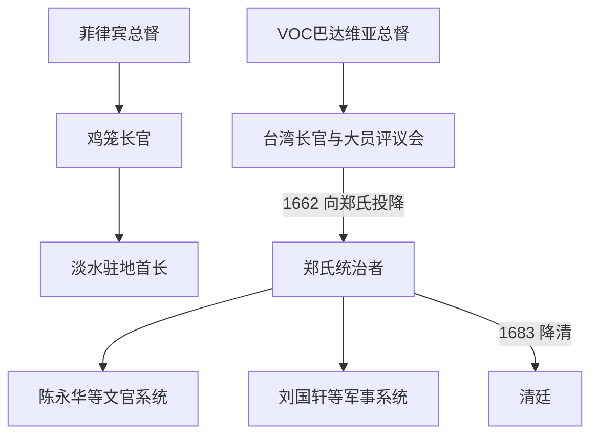

# 荷西殖民与郑氏政权统治者表

## 时间与口径

1624—1683年。荷兰长官按实际到任序列列出12人；哈门·克伦克虽获任命，却在热兰遮城围城期间拒绝登陆，未计为实际长官。西班牙在鸡笼与淡水设有不同层级的驻地首长，表中分列，年代只能精确至年者不虚构日期。郑氏部分把短暂的争位、未稳固继承和实际辅政权力写入备注。

## 权力层级图

## 荷兰台湾长官完整序列

| 顺序 | 长官 | 任期 | 继任与关键事项 |
|---:|---|---|---|
| 1 | 马丁努斯·宋克（Martinus Sonck） | 1624—1625年 | 首任；在大员建立VOC统治中心，任内去世。 |
| 2 | 赫里特·弗雷德里克森·德·韦特（Gerrit Frederikszoon de With） | 1625—1627年 | 接续早期堡垒、贸易与村社关系建设。 |
| 3 | 彼得·纳茨（Pieter Nuyts） | 1627—1629年 | 涉及滨田弥兵卫事件，任内日荷关系紧张。 |
| 4 | 汉斯·普特曼斯（Hans Putmans） | 1629—1636年 | 扩大农业移民、征服行动和地方村社会议。 |
| 5 | 约翰·范德堡（Johan van der Burg） | 1636—1640年 | 统治范围与贸易继续扩张，任内去世。 |
| 6 | 保卢斯·特拉迪纽斯（Paulus Traudenius） | 1640—1643年 | 1642年荷军逐出北台湾西班牙势力。 |
| 7 | 马克西米利安·勒梅尔（Maximilian le Maire） | 1643—1644年 | 短任，接手扩张后的殖民行政。 |
| 8 | 弗朗索瓦·卡隆（François Caron） | 1644—1646年 | 经营公司财政、贸易和地方治理。 |
| 9 | 彼得·安东尼斯宗·奥弗特瓦特（Pieter Anthoniszoon Overtwater） | 1646—1649年 | 殖民农业与包税体系延续。 |
| 10 | 尼古拉斯·维堡（Nicolas Verburg） | 1649—1653年 | 任内发生1652年郭怀一起事及其镇压。 |
| 11 | 科内利斯·凯撒（Cornelis Caesar） | 1653—1656年 | 防务与贸易继续运作，郑氏海上力量已构成压力。 |
| 12 | **弗雷德里克·揆一（Frederick Coyett）** | 1656—1662年 | 末任；1661—1662年热兰遮城围城后向郑成功投降。 |
| — | 哈门·克伦克·范·奥德森（Harmen Klenck van Odessen） | 1662年获任命，未就职 | 抵达外海却拒绝登陆，不能算实际第13任长官。 |

## 西班牙鸡笼长官完整序列

| 顺序 | 长官 | 任期 | 说明 |
|---:|---|---|---|
| 1 | 安东尼奥·卡雷尼奥·德·巴尔德斯 | 1626—1629年 | 率军进入北台湾，在鸡笼建立圣萨尔瓦多堡。 |
| 2 | 胡安·德·阿尔卡拉索 | 1629—1634年 | 维持鸡笼、淡水据点和马尼拉补给线。 |
| 3 | 阿隆索·加西亚·罗梅洛 | 1634—1639年 | 任内淡水驻地遭冲突与缩编，北部防务趋弱。 |
| 4 | 佩德罗·帕洛米诺 | 1639—1640年 | 短任，执行菲律宾总督缩减台湾驻防的政策。 |
| 5 | **贡萨洛·波蒂略** | 1640—1642年 | 末任；荷军攻鸡笼后投降。 |

## 西班牙淡水驻地首长

| 顺序 | 首长 | 任期 | 说明 |
|---:|---|---|---|
| 1 | 安东尼奥·卡雷尼奥·德·巴尔德斯 | 1627—1629年 | 鸡笼长官兼顾早期淡水据点。 |
| 2 | 路易斯·德·古兹曼 | 1629—1634年 | 管理圣多明哥堡及淡水驻军。 |
| 3 | 巴托洛梅·迪亚斯·巴雷拉 | 1634—1637年 | 任内与当地村社冲突加剧。 |
| 4 | 弗朗西斯科·埃尔南德斯 | 1637—1642年 | 淡水据点实际在1638年前后撤弃；名义职衔资料延续至西班牙撤离。 |

## 郑氏统治与争议继承

| 顺序 | 统治者或竞争者 | 时间 | 身份、继承与关键事件 |
|---:|---|---|---|
| 1 | **郑成功** | 1661—1662年 | 延平王；率军攻台并迫使荷兰投降，设置承天府。1662年去世。 |
| — | 郑袭 | 1662年 | 郑成功去世后由在台将领拥立的短期竞争者；郑经渡台后失败，未形成稳定统治。 |
| 2 | **郑经** | 1662—1681年 | 郑成功长子；击败郑袭，建立稳定继承，发展军屯、教育和贸易，参加三藩战争。 |
| 3 | 郑克臧 | 1681年 | 郑经指定继承人；继位安排中被冯锡范等发动政变杀害，统治极短且是否正式即位有不同记法。 |
| 4 | **郑克塽** | 1681—1683年 | 郑经次子；在冯锡范、刘国轩等支持下继位，澎湖战败后降清。 |

## 关键辅政与权力关系

| 人物 | 主要时期 | 实际作用 |
|---|---|---|
| 陈永华 | 郑经时期 | 主管文教、行政、屯田与制度建设，是郑氏政权重要文官核心。 |
| 刘国轩 | 郑经晚期至郑克塽时期 | 主要军事统帅，参与大陆战事并在1683年澎湖海战中指挥郑军。 |
| 冯锡范 | 郑经晚期至郑克塽时期 | 参与1681年继承政变，成为郑克塽时期重要权力人物。 |

## 关联笔记

- 主笔记：[荷西殖民与郑氏政权](/%E4%BA%BA%E6%96%87%E7%A7%91%E5%AD%A6/%E5%8E%86%E5%8F%B2/%E4%B8%9C%E4%BA%9A/%E4%B8%AD%E5%9B%BD/%E5%8F%B0%E6%B9%BE/%E8%8D%B7%E8%A5%BF%E6%AE%96%E6%B0%91%E4%B8%8E%E9%83%91%E6%B0%8F%E6%94%BF%E6%9D%83.md)
- 后续：[清代台湾](/%E4%BA%BA%E6%96%87%E7%A7%91%E5%AD%A6/%E5%8E%86%E5%8F%B2/%E4%B8%9C%E4%BA%9A/%E4%B8%AD%E5%9B%BD/%E5%8F%B0%E6%B9%BE/%E6%B8%85%E4%BB%A3%E5%8F%B0%E6%B9%BE.md)
