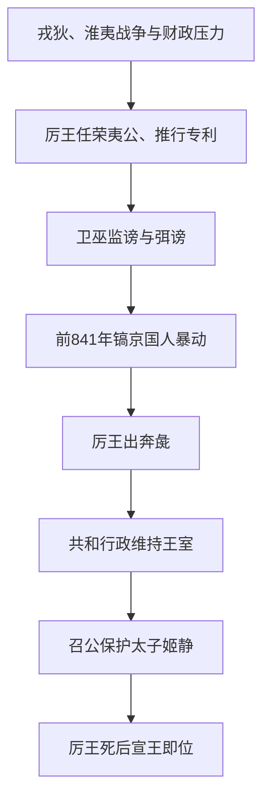

# 国人暴动、共和行政

## 时间

前841年－前828年。前841年周厉王出奔，前828年周厉王死，周宣王即位。

## 概括

国人暴动是西周王权危机的集中爆发。周厉王在外部戎狄、淮夷压力和内部财政匮乏下，推行“专利”“弭谤”等政策，引起国人反抗。厉王出奔后，周室由大臣掌政，太子姬静受保护，形成共和行政。

## 过程图

## 过程、机制与争议

| 环节 | 具体过程 | 影响 |
|---|---|---|
| 结构压力 | 西周晚期对外战争、王畿资源和贵族利益发生紧张，王室需要更多财政与军役。 | 为“专利”等强化控制政策提供背景，但不能把暴动只归因于财政。 |
| 政策激化 | 厉王任用荣夷公，试图垄断山林川泽收益；又以卫巫监谤压制反对。 | 触犯国人和贵族既有利益，也切断正常进谏与协调渠道。 |
| 暴动爆发 | 前841年镐京国人进攻王宫，厉王逃至彘；太子姬静在召公保护下存活。 | 周王没有被新王朝取代，说明反对目标主要是厉王统治及其政策。 |
| 共和行政 | 王位空缺期间，大臣或“共伯和”主持政务，维持宗庙、诸侯关系和太子继承。 | 使周王室渡过十三余年权力中断，并成为可靠编年纪年的起点。 |
| 王权恢复 | 厉王死后，姬静即位为宣王，辅政集团把权力交还王室。 | 暴动没有解决王室财政、边防和诸侯离心等深层问题。 |

- “国人”并非现代意义的全体国民，通常指王都内具有政治和军事资格的贵族、武士及居民群体，具体构成仍有讨论。
- 共和行政传统上解释为周公、召公共同行政；另一说认为由共伯和执政。现有文献形成时代不同，宜并列说明。
- 前841年以后纪年较连续，因此该年常被视为中国传世史料中连续确切纪年的开端；这不表示更早年代完全不可研究。

## 说明

- 周厉王时，东方淮夷侵入伊水、洛水一带，逼近成周。
- 西北𤞤狁直逼镐京周围，周室连年抵御外族。
- 周厉王虽然在征服南方濮国时获胜，并使东南诸国臣服，但周朝国力逐渐匮乏。
- 内政方面，周厉王不听周定公、召穆公劝阻，任用荣夷公，推行“专利”政策，收归山泽之利。
- 为压制国人不满，周厉王推行“弭谤”，命卫巫监视，有谤王者即加杀戮。
- 高压统治使国人“道路以目”，只能以眼神示意。
- 镐京最终爆发国人暴动，又称彘之乱。
- 周厉王出奔到彘（今山西霍州）。
- 周室由掌政大臣管理，太子姬静由召穆公保护，史称共和行政。

## 演变关系

- 前一节点：[成康之治](/%E4%BA%BA%E6%96%87%E7%A7%91%E5%AD%A6/%E5%8E%86%E5%8F%B2/%E4%B8%9C%E4%BA%9A/%E4%B8%AD%E5%9B%BD/%E5%91%A8/%E4%BA%8B%E4%BB%B6/%E6%88%90%E5%BA%B7%E4%B9%8B%E6%B2%BB.md)。
- 后一节点：[宣王中兴](/%E4%BA%BA%E6%96%87%E7%A7%91%E5%AD%A6/%E5%8E%86%E5%8F%B2/%E4%B8%9C%E4%BA%9A/%E4%B8%AD%E5%9B%BD/%E5%91%A8/%E4%BA%8B%E4%BB%B6/%E5%AE%A3%E7%8E%8B%E4%B8%AD%E5%85%B4.md)。
- 相关节点：[周朝](/%E4%BA%BA%E6%96%87%E7%A7%91%E5%AD%A6/%E5%8E%86%E5%8F%B2/%E4%B8%9C%E4%BA%9A/%E4%B8%AD%E5%9B%BD/%E5%91%A8/README.md)、[周王室世系](/%E4%BA%BA%E6%96%87%E7%A7%91%E5%AD%A6/%E5%8E%86%E5%8F%B2/%E4%B8%9C%E4%BA%9A/%E4%B8%AD%E5%9B%BD/%E5%91%A8/%E5%91%A8%E7%8E%8B%E5%AE%A4%E4%B8%96%E7%B3%BB.md)。
