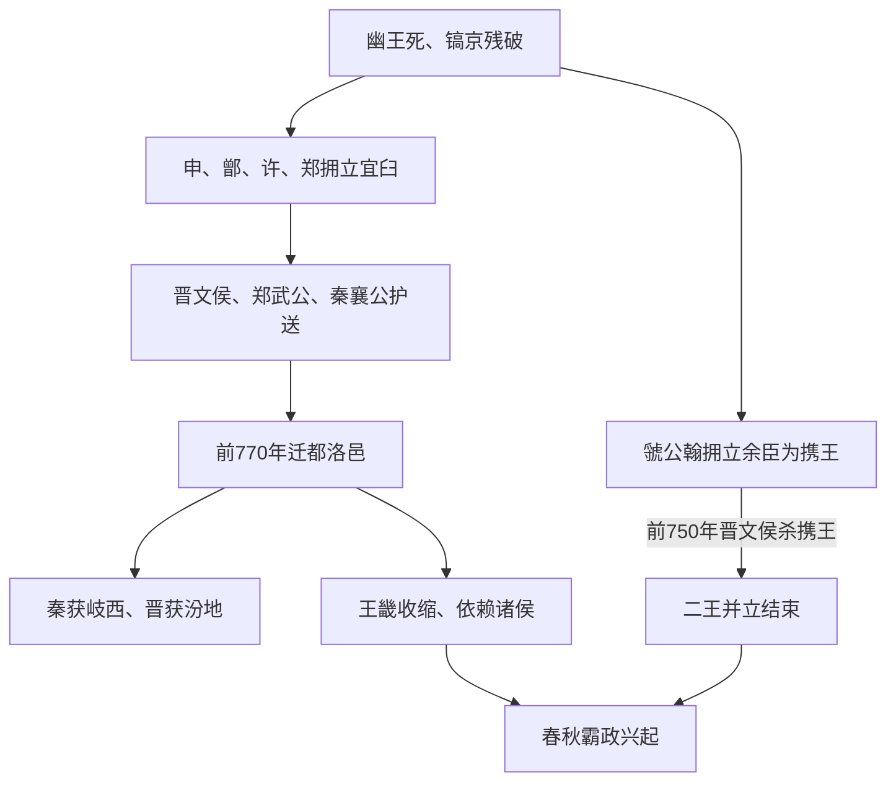

# 平王东迁

## 时间

前770年。

## 概括

平王东迁是东周开始的标志。犬戎之祸后，申侯、鄫侯、许文公、郑武公等立宜臼为周平王；同时虢公翰另立王子余臣为周携王，形成二王并立。前770年周平王在晋文侯、郑武公、秦襄公护送下东迁洛邑，周王室失去关中根基，诸侯政治进入春秋格局。

## 过程图

## 过程、原因与长期影响

| 环节 | 具体过程 | 结果 |
|---|---|---|
| 西都崩溃 | 犬戎与申、缯联军攻破镐京，幽王被杀，宗周人口、府库和宫室遭破坏。 | 周王室失去继续驻守关中的安全和资源条件。 |
| 多方拥立 | 申侯等拥立宜臼为平王，虢公翰另立余臣为携王；拥立阵营体现诸侯对继承合法性的不同判断。 | 东迁不是无争议的自然继承，而是在二王并立背景下完成。 |
| 诸侯护送 | 晋、郑、秦等提供军力与道路保障，平王迁至成周洛邑。 | 王室生存依赖诸侯，护送者获得土地、爵位和政治影响。 |
| 土地重分 | 平王把难以实际控制的岐西许给秦，并以土地酬谢晋等支持者。 | 秦取得进入关中的合法性，晋郑也扩大王室事务中的地位。 |
| 东周格局 | 洛邑王畿较小，周王难以独立调动诸侯；郑、齐、晋、楚等先后组织霸政。 | 天下共主名义延续，实际权力由王室—诸侯关系转向诸侯间联盟和战争。 |

- 东迁的**结构原因**是西周后期边防、财政和诸侯关系长期恶化；犬戎之祸是直接触发。
- 二王并立的年代和携王身份主要依赖传世文献与出土材料重建，细节仍有争议。
- 前770年标志东周开始，但西部周人、王畿遗民和关中政治网络并未在一天内消失。
- 东迁既是王权衰落，也推动秦、晋、郑等国崛起，改变了此后数百年的区域格局。

## 说明

- 周幽王被杀后，西周结束，进入东周前夜。
- 前770年，申侯、鄫侯、许文公、郑武公等拥立宜臼为王，是为周平王。
- 虢公翰可能以周平王称王不正为由，在携地（今陕西西安北）立王子余臣为王，史称周携王。
- 二王分立局面直到前750年晋文侯攻杀周携王才结束。
- 周平王在晋文侯、郑武公、秦襄公护送下东迁成周洛邑，史称平王东迁。
- 秦襄公在犬戎之祸时已从秦邑举兵抗敌，并参与护送平王东迁。
- 周平王把岐周之地封给秦襄公，秦襄公成为诸侯，秦国正式进入诸侯体系。
- 周平王又将汾水之地给予晋文侯。
- 秦襄公、秦文公先后力战犬戎，收复岐周之地，并将岐东地区归还周室。
- 平王东迁后，周王室只保有洛邑周边王畿，失去宗周关中腹地，政治权威显著下降。

## 演变关系

- 前一节点：[犬戎之祸](/%E4%BA%BA%E6%96%87%E7%A7%91%E5%AD%A6/%E5%8E%86%E5%8F%B2/%E4%B8%9C%E4%BA%9A/%E4%B8%AD%E5%9B%BD/%E5%91%A8/%E4%BA%8B%E4%BB%B6/%E7%8A%AC%E6%88%8E%E4%B9%8B%E7%A5%B8.md)。
- 后一节点：[春秋](/%E4%BA%BA%E6%96%87%E7%A7%91%E5%AD%A6/%E5%8E%86%E5%8F%B2/%E4%B8%9C%E4%BA%9A/%E4%B8%AD%E5%9B%BD/%E5%91%A8/%E6%98%A5%E7%A7%8B/README.md)。
- 相关节点：[周朝](/%E4%BA%BA%E6%96%87%E7%A7%91%E5%AD%A6/%E5%8E%86%E5%8F%B2/%E4%B8%9C%E4%BA%9A/%E4%B8%AD%E5%9B%BD/%E5%91%A8/README.md)、[周王室世系](/%E4%BA%BA%E6%96%87%E7%A7%91%E5%AD%A6/%E5%8E%86%E5%8F%B2/%E4%B8%9C%E4%BA%9A/%E4%B8%AD%E5%9B%BD/%E5%91%A8/%E5%91%A8%E7%8E%8B%E5%AE%A4%E4%B8%96%E7%B3%BB.md)、[秦](/%E4%BA%BA%E6%96%87%E7%A7%91%E5%AD%A6/%E5%8E%86%E5%8F%B2/%E4%B8%9C%E4%BA%9A/%E4%B8%AD%E5%9B%BD/%E5%91%A8/%E5%85%88%E7%A7%A6%E8%AF%B8%E4%BE%AF/%E7%A7%A6/README.md)。
