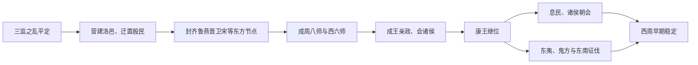

# 成康之治

## 时间

周成王、周康王时期。

## 概括

成康之治是西周早期稳定与扩张的阶段。三监之乱后，周室通过迁徙殷商遗民、经营洛邑、分封东方重镇、设置成周八师与西六师来控制东西两大区域。周成王、周康王时期政局安定、诸侯来朝、对外拓展，成为中国古代史中常被称颂的治世之一。

## 演进图

## 形成机制与阶段评价

| 机制 | 具体做法 | 作用与局限 |
|---|---|---|
| 双都体系 | 镐京维持宗周核心，洛邑承担东方军事、祭祀和政治功能。 | 缩短控制东方距离，但需要长期驻军和物资供给。 |
| 分封网络 | 把宗室、功臣和前代王族分别置于齐、鲁、燕、晋、卫、宋等地。 | 将地方资源纳入周室联盟，也使诸侯获得可世袭的独立基础。 |
| 驻军与征伐 | 西六师守宗周、成周八师经营东方，配合诸侯进攻东夷、鬼方等。 | 维持扩张秩序，战争规模和具体路线仍有金文、传世文献解释差异。 |
| 殷民重组 | 部分殷商贵族和工匠被迁至洛邑等地，微子封宋奉商祀。 | 兼用强制迁徙与礼制安置，降低复商中心再次形成的可能。 |
| 王臣协作 | 周公、召公、毕公等辅政后，成王亲政、康王延续政策。 | 稳定依赖核心贵族合作，并非现代中央官僚对地方的完全直接统治。 |

- “成康之治”是后世对成王、康王时期稳定的概括；“刑措四十余年不用”等说法具有理想化色彩。
- 治世基础不是单纯轻徭薄赋，而是平叛、迁徙、分封、驻军、朝会与礼制共同构成。
- 对外扩张给王室带来资源和威望，也埋下兵力消耗及诸侯势力坐大的长期张力。
- 成康之后周昭王南征受挫，说明早期稳定并未消除边疆和远距离统治的限制。

## 说明

- 三监之乱后，周公旦仍封微子启于宋国，以安抚商人。
- 参与叛乱的商人与殷商贵族被强迁至洛邑，与周民融合。
- 洛邑（成周，今河南洛阳）成为东方政治与军事中心，完成周武王遗愿。
- 周成王到洛邑大会诸侯和四夷，史称“歧阳之蒐”。
- 军事部署上，周室在洛邑设成周八师以征讨东夷、淮夷、南蛮，在镐京设西六师守卫宗周。
- 东方分封中，伯禽建鲁国、太公望吕尚建齐国、召公奭之子克建燕国、叔虞建唐国（后晋国）、康叔建卫国。
- 齐、鲁、燕构成周朝东方防线，卫国掌控商旧都朝歌。
- 周室还封蔡仲于蔡国、霍叔处之子于霍国等，以延续宗室分封网络。
- 周成王亲政后仍有对外征伐，如令大保伐录国。
- 周康王继承成王事业，得召公奭、毕公高辅佐，采取息民安定策略。
- 周康王时期，伯懋父率殷八师平定东夷叛乱，盂率兵西伐鬼方夷狄。
- 周室开拓东南，巡狩到九江，并分封虞侯夨到宜（今江苏丹徒）。
- 周康王在酆宫大会诸侯，史称“酆宫之朝”。

## 演变关系

- 前一节点：[三监之乱](/%E4%BA%BA%E6%96%87%E7%A7%91%E5%AD%A6/%E5%8E%86%E5%8F%B2/%E4%B8%9C%E4%BA%9A/%E4%B8%AD%E5%9B%BD/%E5%91%A8/%E4%BA%8B%E4%BB%B6/%E4%B8%89%E7%9B%91%E4%B9%8B%E4%B9%B1.md)。
- 后一节点：[国人暴动、共和行政](/%E4%BA%BA%E6%96%87%E7%A7%91%E5%AD%A6/%E5%8E%86%E5%8F%B2/%E4%B8%9C%E4%BA%9A/%E4%B8%AD%E5%9B%BD/%E5%91%A8/%E4%BA%8B%E4%BB%B6/%E5%9B%BD%E4%BA%BA%E6%9A%B4%E5%8A%A8%E3%80%81%E5%85%B1%E5%92%8C%E8%A1%8C%E6%94%BF.md)。
- 相关节点：[周朝](/%E4%BA%BA%E6%96%87%E7%A7%91%E5%AD%A6/%E5%8E%86%E5%8F%B2/%E4%B8%9C%E4%BA%9A/%E4%B8%AD%E5%9B%BD/%E5%91%A8/README.md)、[先秦诸侯](/%E4%BA%BA%E6%96%87%E7%A7%91%E5%AD%A6/%E5%8E%86%E5%8F%B2/%E4%B8%9C%E4%BA%9A/%E4%B8%AD%E5%9B%BD/%E5%91%A8/%E5%85%88%E7%A7%A6%E8%AF%B8%E4%BE%AF/README.md)。
