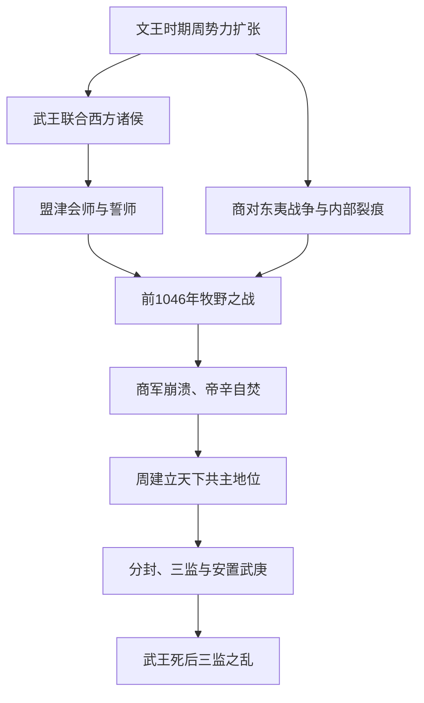

# 武王伐纣

## 时间

前1046年，一说为周武王十一年、克商次年甲子日发生牧野之战。

## 概括

武王伐纣是周取代商的决定性事件。周武王联合西方诸侯东征，趁商军主力长期对东夷作战、商室内政混乱之际，在牧野击败商军，攻入朝歌，商王帝辛自焚，商朝灭亡，周朝建立。

## 过程图

## 战争阶段、胜因与后续

| 阶段 | 具体过程 | 作用 |
|---|---|---|
| 周人积累 | 文王时期周向关中以东扩张，吸收盟国并取得东进通道；武王继承政治和军事联盟。 | 伐商不是一次临时起兵，而是长期实力变化的结果。 |
| 时机选择 | 商军长期在东方作战，王室内部和贵族关系紧张；周联合多支诸侯部队东进。 | 商的多线压力降低其集中防守能力。 |
| 牧野决战 | 周军在牧野击破商军，帝辛退回朝歌自焚；具体兵数和“奴隶倒戈”叙述带有后世夸饰可能。 | 摧毁商王核心，却未立即控制全部商属方国。 |
| 战后扫荡 | 周军及盟军继续进攻商的东方、南方据点，接受部分方国归附。 | 军事胜利由都城政变扩展为王朝更替。 |
| 安置与控制 | 周封武庚管理殷民，又设三监监督；分封宗室功臣，经营镐京与洛邑。 | 兼顾安抚和监控，但多重权力安排在武王死后爆发危机。 |

- **周胜原因**包括长期联盟、正确战机、商军分散和决战崩溃，不能只用帝辛个人失德解释。
- “天命转移”是周人解释战争合法性的政治语言，也成为后世王朝更替的重要范式。
- 牧野年代通常采用前1046年，但克商年仍有不同推算；笔记应标明纪年方案而非宣称绝对无争议。
- 武王伐纣结束商王朝核心统治，却未一次性消灭商遗民与东方势力，三监之乱正说明战后整合尚未完成。

## 说明

- 周武王以吕尚（太公望）为师，以周公旦、召公奭、毕公高、荣伯为辅佐。
- 商王帝辛杀比干、囚箕子，微子准备出走；商朝对淮水、东夷人方战争消耗国力，为周人东征创造条件。
- 武王伐纣时，吕尚为太师，周六师出潼关，与西夷诸侯会师盟津并誓师，史称“盟津之誓”。
- 周军东征朝歌，在牧野袭击商军殷八师；商朝临时以奴隶组成军队迎战，仍被周师击溃。
- 商将蜚廉、恶来奋力作战，但周军攻入朝歌，帝辛于鹿台自焚。
- 灭商后，周武王命吕尚等分路扫荡商朝东方与南方方国，降伏商朝遗民与属国。
- 周武王在牧野举行告捷礼，在商都举行社祭，强调克商源于天命，并告诫殷商遗民服从周室。
- 周武王在沣水东岸建立镐京（宗周），并开始营建洛邑（成周），作为关东政治、军事中心。
- 为控制关东，周武王分封宗室功臣：封吕尚、周公旦、召公奭分别于吕、鲁、匽一带，以拱卫洛邑。
- 周武王设置三监：管叔鲜于管、蔡叔度于蔡、霍叔处于霍，并将殷商故地分为邶、鄘、卫三地监管。
- 为安抚商人，周武王封帝辛之子武庚于朝歌，仍为殷；复位微子启于微，后迁封至宋。
- 周武王克商后不久去世，幼子姬诵继位，是为周成王。

## 演变关系

- 前一节点：商末帝辛统治与周人崛起。
- 后一节点：[三监之乱](/%E4%BA%BA%E6%96%87%E7%A7%91%E5%AD%A6/%E5%8E%86%E5%8F%B2/%E4%B8%9C%E4%BA%9A/%E4%B8%AD%E5%9B%BD/%E5%91%A8/%E4%BA%8B%E4%BB%B6/%E4%B8%89%E7%9B%91%E4%B9%8B%E4%B9%B1.md)。
- 相关节点：[周朝](/%E4%BA%BA%E6%96%87%E7%A7%91%E5%AD%A6/%E5%8E%86%E5%8F%B2/%E4%B8%9C%E4%BA%9A/%E4%B8%AD%E5%9B%BD/%E5%91%A8/README.md)、[成康之治](/%E4%BA%BA%E6%96%87%E7%A7%91%E5%AD%A6/%E5%8E%86%E5%8F%B2/%E4%B8%9C%E4%BA%9A/%E4%B8%AD%E5%9B%BD/%E5%91%A8/%E4%BA%8B%E4%BB%B6/%E6%88%90%E5%BA%B7%E4%B9%8B%E6%B2%BB.md)、[周王室世系](/%E4%BA%BA%E6%96%87%E7%A7%91%E5%AD%A6/%E5%8E%86%E5%8F%B2/%E4%B8%9C%E4%BA%9A/%E4%B8%AD%E5%9B%BD/%E5%91%A8/%E5%91%A8%E7%8E%8B%E5%AE%A4%E4%B8%96%E7%B3%BB.md)。
