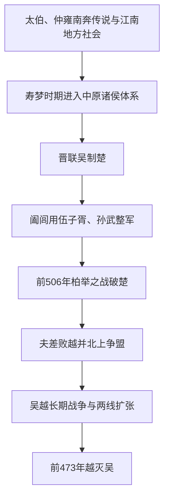

# 吴国（先秦）

## 时间

- 周代：吴国在江南地区逐渐进入中原诸侯视野。
- 前585年左右：吴与中原诸侯交往明显增多。
- 前473年：越灭吴。

## 别称

- 句吴
- 吴国

## 概括

吴是长江下游地区的重要诸侯国，春秋晚期迅速崛起。吴王阖闾任用伍子胥、孙武等人，攻破楚都郢；吴王夫差又北上争霸，与晋争盟。但吴长期与越对抗，夫差未能彻底消灭越，最终被越王勾践所灭。

## 演进图

## 历史分期与关键过程

| 阶段 | 主要过程 | 结果 |
|---|---|---|
| 早期形成 | 吴王室以太伯、仲雍南奔叙事连接周族谱系，但吴国早期世系、都邑和周王朝册封过程仍有传说与文献层累。 | 江南地方政治传统逐渐被纳入周代诸侯叙事。 |
| 进入争霸体系 | 寿梦时期吴与中原往来增多；晋国为牵制楚国，向吴提供外交和军事合作。 | 吴利用长江水网与楚国东南压力迅速崛起。 |
| 阖闾扩张 | 公子光夺位为阖闾，任用伍子胥、孙武；前506年吴军经柏举之战攻入楚都郢。 | 吴达到军事高峰，但长期占领楚地能力有限。 |
| 夫差争霸 | 夫差击败越并迫使勾践臣服，继而北上与齐、晋争夺盟主地位。 | 国力投入北方争霸，未能彻底消除越国的复兴能力。 |
| 越灭吴 | 越长期休养、乘吴军北上时反攻；吴在多次战争与外交孤立中耗尽资源。 | 前473年夫差兵败，吴国被越吞并。 |

## 崛起与灭亡原因

- **区位与技术**：长江下游水网、舟师和区域人口资源，使吴能够以水陆机动打击楚国腹地。
- **人才和制度整合**：阖闾吸纳伍子胥、孙武等外来人才，把江南力量与中原军政经验结合。
- **外部机会**：晋楚争霸让吴获得盟友、训练和进入中原秩序的通道。
- **扩张过度**：对楚、越、齐、晋多方向用兵，超过吴长期补给和占领能力。
- **未解决越患**：夫差接受越国臣服后转向北方，勾践得以重建人口、财政和军队。
- **直接触发**：越趁吴精锐外出和国内疲敝连续进攻，最终围困国都并迫使夫差自尽。

## 说明

- 吴国早期传说与太伯、仲雍南奔有关，后世常将其与周族姬姓传统相连。
- 春秋中期以后，晋国为牵制楚国，推动与吴结盟，吴逐渐进入中原争霸体系。
- 吴王阖闾时期，伍子胥、孙武辅佐吴国强盛。
- 前506年，吴在柏举之战击败楚国，攻入郢都，楚国几近灭亡。
- 阖闾在与越作战中受伤而死，夫差继位后击败越国，迫使越王勾践臣服。
- 夫差北上争霸，在黄池会盟中与晋争盟，但对越防范不足。
- 前473年，越王勾践灭吴。

## 演变关系

| 关系 | 说明 |
|---|---|
| 前一节点 | 江南地区方国，后进入周代诸侯体系。 |
| 并列关系 | 春秋晚期与楚、越、晋争雄。 |
| 后一节点 | 前473年被越灭。 |

## 下级笔记

- [吴国世系](/%E4%BA%BA%E6%96%87%E7%A7%91%E5%AD%A6/%E5%8E%86%E5%8F%B2/%E4%B8%9C%E4%BA%9A/%E4%B8%AD%E5%9B%BD/%E5%91%A8/%E5%85%88%E7%A7%A6%E8%AF%B8%E4%BE%AF/%E5%90%B4/%E5%90%B4%E5%9B%BD%E4%B8%96%E7%B3%BB.md)

## 直接上级

- [先秦诸侯](/%E4%BA%BA%E6%96%87%E7%A7%91%E5%AD%A6/%E5%8E%86%E5%8F%B2/%E4%B8%9C%E4%BA%9A/%E4%B8%AD%E5%9B%BD/%E5%91%A8/%E5%85%88%E7%A7%A6%E8%AF%B8%E4%BE%AF/README.md)
